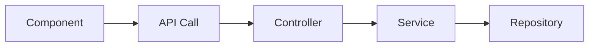
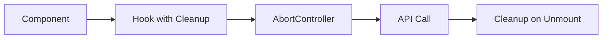

# Tech Spec: [Nome da Feature/Fix]

**PRD:** [Link para PRD]
**Issue:** #XXX
**Arquiteto:** [Nome]
**Data:** YYYY-MM-DD

---

## 1. Problem Statement

### 1.1 Current State

<!-- Descreva o estado atual do sistema -->

### 1.2 Problem Description

<!-- Descreva o problema técnico em detalhes -->

- **Sintomas:**
- **Causa raiz:**
- **Impacto técnico:**

---

## 2. Current Implementation

### 2.1 Código Afetado

```
Arquivos envolvidos:
- backend/src/path/to/file.ts
- frontend/src/path/to/component.tsx
```

### 2.2 Fluxo Atual

<!-- Descreva o fluxo técnico atual (diagrama se necessário) -->



### 2.3 Problemas Identificados

- [ ] **Problema 1:** [Descrição técnica]
- [ ] **Problema 2:** [Descrição técnica]

---

## 3. Proposed Solution

### 3.1 Architecture Decision

<!-- Decisão arquitetural principal -->

**Escolha:** [Opção A / B / C]

**Justificativa:**

- Razão 1
- Razão 2
- Trade-offs considerados

### 3.2 Technical Approach

#### Backend Changes

```typescript
// Exemplo de mudança proposta
interface NewInterface {
  // ...
}

class UpdatedService {
  // ...
}
```

#### Frontend Changes

```typescript
// Exemplo de mudança proposta
const useCustomHook = () => {
  // ...
};
```

### 3.3 Novo Fluxo

<!-- Descreva o fluxo técnico proposto -->



---

## 4. Implementation Plan

### 4.1 Fase 1: Preparação

- [ ] Task 1.1: [Descrição]
- [ ] Task 1.2: [Descrição]

### 4.2 Fase 2: Core Implementation

- [ ] Task 2.1: [Descrição]
  - **File:** `path/to/file.ts`
  - **Changes:** [Resumo das mudanças]

- [ ] Task 2.2: [Descrição]
  - **File:** `path/to/component.tsx`
  - **Changes:** [Resumo das mudanças]

### 4.3 Fase 3: Testing & Validation

- [ ] Task 3.1: Unit tests
- [ ] Task 3.2: Integration tests
- [ ] Task 3.3: E2E tests (se aplicável)

### 4.4 Fase 4: Documentation

- [ ] Task 4.1: Atualizar README/docs
- [ ] Task 4.2: Atualizar ROADMAP.md
- [ ] Task 4.3: Criar ADR (se decisão arquitetural significativa)

---

## 5. API Changes

### 5.1 Endpoints Afetados

<!-- Liste endpoints que serão modificados -->

#### PATCH /api/resource/:id

**Antes:**

```json
{
  "field": "value"
}
```

**Depois:**

```json
{
  "field": "value",
  "newField": "newValue"
}
```

### 5.2 Breaking Changes

- [ ] **BC1:** [Descrição da breaking change]
  - **Mitigação:** [Como lidar]

### 5.3 Backward Compatibility

- [ ] Mantida
- [ ] Quebrada (requer migration)

---

## 6. Database Changes

### 6.1 Schema Modifications

```sql
-- Migration YYYYMMDDHHMMSS-NomeDaMigration.ts

ALTER TABLE table_name
ADD COLUMN new_column VARCHAR(255);

CREATE INDEX idx_name ON table_name(column_name);
```

### 6.2 Data Migrations

- [ ] **DM1:** [Descrição da data migration]
  - **Script:** `backend/migrations/YYYYMMDDHHMMSS-Name.ts`
  - **Idempotent:** Sim / Não
  - **Rollback:** [Procedimento]

### 6.3 Performance Impact

- **Indexes:** [Novos indexes criados]
- **Query Optimization:** [Mudanças em queries]
- **Estimated Impact:** [Positivo/Negativo/Neutro]

---

## 7. Testing Strategy

### 7.1 Unit Tests

#### Backend

```typescript
// backend/src/path/__tests__/service.spec.ts
describe('ServiceName', () => {
  it('should handle scenario X', async () => {
    // Test implementation
  });
});
```

**Coverage Target:** 100% para novo código

#### Frontend

```typescript
// frontend/src/path/__tests__/component.test.tsx
describe('ComponentName', () => {
  it('should render correctly', () => {
    // Test implementation
  });
});
```

**Coverage Target:** 100% para novo código

### 7.2 Integration Tests

- [ ] **IT1:** [Descrição do teste de integração]
  - **Scope:** [Backend/Frontend/Full-stack]

### 7.3 E2E Tests

- [ ] **E2E1:** [Descrição do teste E2E]
  - **Tool:** Playwright
  - **Scenario:** [Descrição do cenário]

### 7.4 Manual Testing

- [ ] **MT1:** [Cenário de teste manual]
- [ ] **MT2:** [Cenário de teste manual]

---

## 8. Performance Considerations

### 8.1 Expected Performance Impact

- **Latency:** [Melhora/Piora de X ms]
- **Throughput:** [Melhora/Piora de X req/s]
- **Memory:** [Impacto de memória]

### 8.2 Optimization Opportunities

- [ ] **OPT1:** [Oportunidade de otimização]
- [ ] **OPT2:** [Oportunidade de otimização]

### 8.3 Performance Tests

- [ ] Load test (se aplicável)
- [ ] Stress test (se aplicável)

---

## 9. Security Considerations

### 9.1 OWASP Top 10

- [ ] **A01:2021 – Broken Access Control:** [Como mitigado]
- [ ] **A03:2021 – Injection:** [Como mitigado]
- [ ] **A07:2021 – Identification and Authentication Failures:** [Como mitigado]

### 9.2 Input Validation

```typescript
// Exemplo de validação
class DtoName {
  @IsString()
  @MaxLength(255)
  field: string;
}
```

### 9.3 Security Tests

- [ ] SQL Injection tests
- [ ] XSS tests
- [ ] CSRF tests (se aplicável)

---

## 10. Accessibility Considerations

### 10.1 WCAG 2.1 AA Compliance

- [ ] **Perceivable:** [Como atendido]
- [ ] **Operable:** [Como atendido]
- [ ] **Understandable:** [Como atendido]
- [ ] **Robust:** [Como atendido]

### 10.2 Accessibility Tests

- [ ] Keyboard navigation
- [ ] Screen reader compatibility (NVDA/JAWS)
- [ ] Color contrast ratio (4.5:1 mínimo)
- [ ] Axe-core automated tests

---

## 11. Migration Plan

### 11.1 Pre-Deployment

- [ ] Backup database
- [ ] Run migrations in staging
- [ ] Validate migrations

### 11.2 Deployment

- [ ] Blue-green deployment Railway
- [ ] Health check validation
- [ ] Smoke tests post-deploy

### 11.3 Post-Deployment

- [ ] Monitor Sentry for 24h
- [ ] Review Railway logs
- [ ] Performance metrics validation

### 11.4 Rollback Procedure

```bash
# If deployment fails
git revert <COMMIT_HASH>
railway redeploy

# If database migration fails
npm run migration:revert
```

---

## 12. Risks & Mitigations

| Risco             | Probabilidade    | Impacto          | Mitigação   |
| ----------------- | ---------------- | ---------------- | ----------- |
| [Risco técnico 1] | Alta/Média/Baixa | Alto/Médio/Baixo | [Mitigação] |
| [Risco técnico 2] | ...              | ...              | ...         |

---

## 13. Alternatives Considered

### Alternative A: [Nome]

**Pros:**

- Pro 1
- Pro 2

**Cons:**

- Con 1
- Con 2

**Decision:** ✅ Selected / ❌ Rejected

### Alternative B: [Nome]

**Pros:**

- ...

**Cons:**

- ...

**Decision:** ✅ Selected / ❌ Rejected

---

## 14. Dependencies & Prerequisites

### 14.1 External Dependencies

- [ ] **DEP1:** [Biblioteca/Serviço externo]
  - **Version:** X.Y.Z
  - **Reason:** [Por que necessário]

### 14.2 Internal Dependencies

- [ ] Issue #XXX must be resolved first
- [ ] Feature ABC must be deployed

---

## 15. Rollout Plan

### 15.1 Phased Rollout

- [ ] **Phase 1:** Deploy to staging (validation)
- [ ] **Phase 2:** Deploy to production (monitoring)
- [ ] **Phase 3:** Feature flag enable (gradual rollout)

### 15.2 Feature Flags (se aplicável)

```typescript
const isFeatureEnabled = process.env.FEATURE_FLAG_NAME === 'true';
```

### 15.3 Monitoring & Alerts

- [ ] Sentry alerts configured
- [ ] Performance metrics dashboard
- [ ] Error rate threshold alerts

---

## 16. Documentation Updates

- [ ] README.md
- [ ] ARCHITECTURE.md
- [ ] ROADMAP.md
- [ ] API docs (Swagger)
- [ ] ADR (Architecture Decision Record)

---

## 17. Approval

**System Architect:** [ ] Aprovado
**Tech Lead:** [ ] Aprovado
**Security Lead:** [ ] Aprovado (se P0 Security)

**Data de Aprovação:** ******\_\_\_******

---

## Anexos

- [PRD Link]
- [Story Link]
- [ADR Link]
- [Diagrams/Flowcharts]

---

**Template Version:** 1.0
**BMAD Method:** v6.0.0-alpha
**Projeto:** ETP Express
