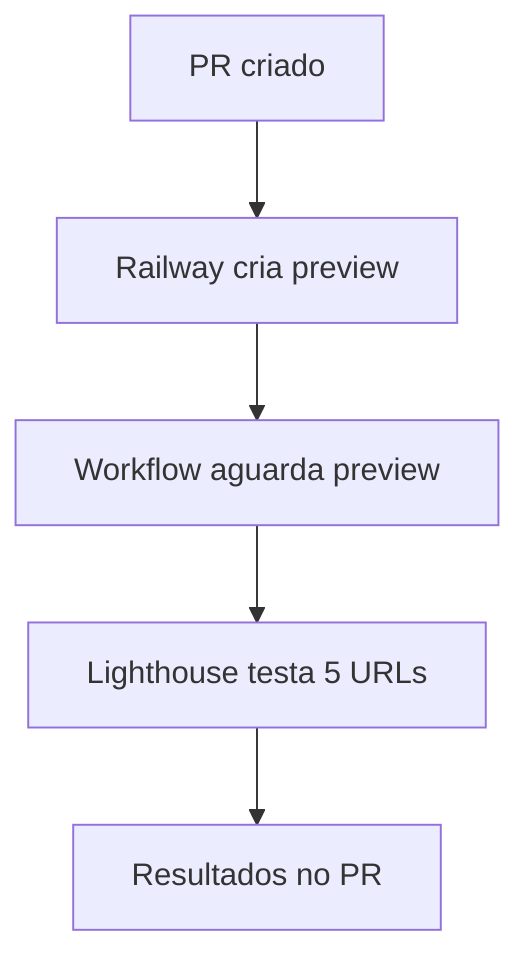

# Lighthouse CI - Railway Preview Deployments

## Visão Geral

O workflow Lighthouse CI executa auditorias automáticas de acessibilidade (WCAG 2.1 AA) em PRs, testando contra **Railway preview deployments** ao invés de localhost.

## Por que Railway Preview Deployments?

**Problema anterior:** Lighthouse falhava com `NO_FCP` (No First Contentful Paint) porque:
- React app requer autenticação
- Backend API não disponível em CI (localhost)
- Chrome headless não conseguia renderizar a aplicação

**Solução:** Testar contra Railway preview deployments que possuem:
- ✅ Backend completo funcionando
- ✅ Banco de dados configurado
- ✅ Autenticação disponível
- ✅ Ambiente idêntico à produção

## Como Funciona



### Fluxo Detalhado

1. **PR é criado** com mudanças em `frontend/` ou `backend/`
2. **Railway automaticamente cria preview deployment** (via GitHub integration)
3. **Workflow detecta preview URL** usando GitHub Deployments API
4. **Aguarda preview estar pronto** (timeout 3min)
5. **Lighthouse CI executa 3 runs** em cada uma das 5 URLs:
   - `/` (Home)
   - `/login`
   - `/dashboard`
   - `/etps`
   - `/etps/new`
6. **Resultados são comentados no PR** com:
   - Score de acessibilidade
   - Links para relatórios detalhados
   - Instruções caso preview não exista

## Configuração Railway

### railway.json

```json
{
  "environments": {
    "production": {
      "deploy": {
        "numReplicas": 2
      }
    },
    "pr": {
      "deploy": {
        "numReplicas": 1
      }
    }
  }
}
```

### GitHub Integration

Railway cria preview deployments automaticamente quando:
- ✅ Railway GitHub App está instalado no repositório
- ✅ Preview deployments habilitados no dashboard Railway
- ✅ PR é criado com mudanças no código

## Critérios de Aceitação

### lighthouserc.json

```json
{
  "ci": {
    "assert": {
      "assertions": {
        "categories:accessibility": ["error", { "minScore": 0.9 }]
      }
    }
  }
}
```

**Score mínimo:** 90/100 (WCAG 2.1 AA compliance)

### Assertions WCAG

O Lighthouse CI valida:

- ✅ `button-name`: Botões com nomes acessíveis (error)
- ✅ `link-name`: Links com nomes descritivos (error)
- ✅ `html-has-lang`: `<html lang="pt-BR">` presente (error)
- ✅ `meta-viewport`: Viewport meta configurado (error)
- ✅ `aria-*`: ARIA attributes válidos (error)
- ✅ `label`: Todos inputs têm labels (error)
- ✅ `tabindex`: Tab order correto (error)
- ⚠️ `image-alt`: Alt text em imagens (warn)
- ⚠️ `color-contrast`: Contraste >= 4.5:1 (off - Pa11y valida)

## Troubleshooting

### Preview Deployment Não Encontrado

**Sintoma:** Workflow comenta "No Railway preview deployment found"

**Causas possíveis:**
1. Railway GitHub App não instalado
2. Preview deployments desabilitados no Railway
3. Deploy ainda em progresso (aguardar e re-executar)

**Solução:**
1. Verificar Railway dashboard
2. Re-executar workflow após deploy concluir
3. Validar manualmente com axe DevTools

### Lighthouse Timeout

**Sintoma:** Workflow falha com timeout

**Causas possíveis:**
1. Preview deployment não responde (Railway down)
2. App trava no boot (verificar logs Railway)

**Solução:**
1. Verificar logs do Railway
2. Testar preview URL manualmente
3. Re-executar workflow

### Score Baixo (<90)

**Sintoma:** Lighthouse CI falha porque score < 90

**Solução:**
1. Ver relatórios detalhados nos artifacts
2. Corrigir violações específicas
3. Re-executar CI após correções
4. Consultar [ACCESSIBILITY.md](../../docs/ACCESSIBILITY.md)

## Ferramentas Complementares

O Lighthouse CI faz parte de um ecossistema de testes:

| Ferramenta        | Escopo                  | Quando Executa    |
| ----------------- | ----------------------- | ----------------- |
| **Lighthouse CI** | Auditorias WCAG gerais  | PRs (preview)     |
| **Pa11y CI**      | Validações específicas  | PRs (localhost)   |
| **Playwright+axe**| Testes E2E a11y         | PRs + master      |
| **axe DevTools**  | Validação manual dev    | Desenvolvimento   |

## Recursos

- [Lighthouse CI Docs](https://github.com/GoogleChrome/lighthouse-ci)
- [Railway Docs - Preview Environments](https://docs.railway.app/deploy/deployments#preview-environments)
- [WCAG 2.1 AA Guidelines](https://www.w3.org/WAI/WCAG21/quickref/?currentsidebar=%23col_customize&levels=aa)
- [ACCESSIBILITY.md](../../docs/ACCESSIBILITY.md)

## Issues Relacionadas

- **#1487:** Implementar Lighthouse CI com Railway Previews (esta issue)
- **#1480:** WCAG 2.1 AA Audit & Documentation (issue parent)
- **#1431:** Implementar Acessibilidade Apple HIG (EPIC)

## Histórico

- **2026-01-14:** Implementado Lighthouse CI com Railway previews (#1487)
- **2026-01-14:** Lighthouse CI removido temporariamente por NO_FCP error (7b85072)
- **2026-01-14:** Lighthouse CI implementado inicialmente (#1480, commit 2c6258f)
