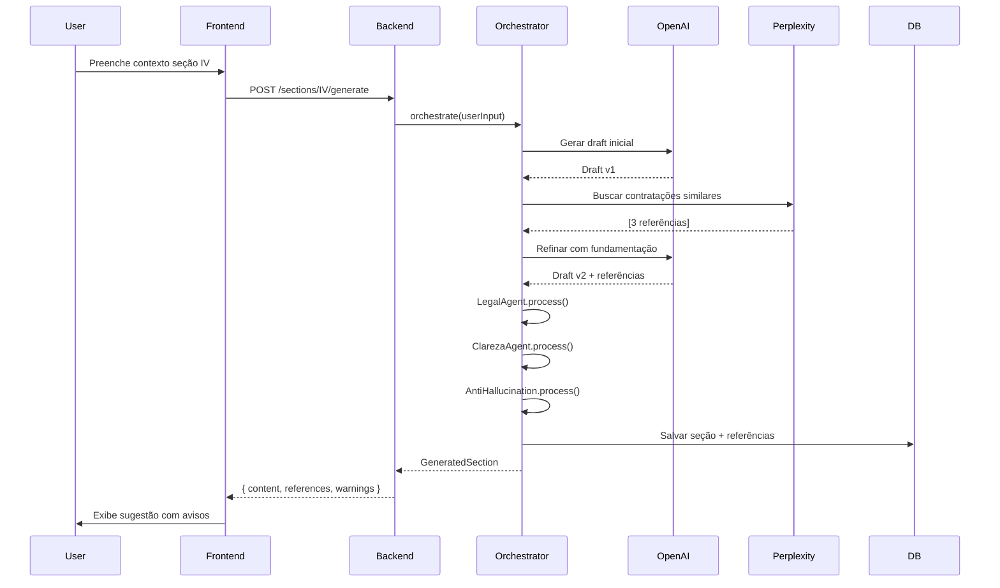

# 🏗️ ARQUITETURA DO ETP EXPRESS

> **⚠️ O ETP Express pode cometer erros. Lembre-se de verificar todas as informações antes de realizar qualquer encaminhamento.**

## 1. VISÃO GERAL

O **ETP Express** é um sistema wrapper de LLM projetado para auxiliar servidores públicos na elaboração de Estudos Técnicos Preliminares (ETP) conforme Lei 14.133/2021, Art. 18 §1º.

### 1.1 Princípios Fundamentais

- **Transparência**: Assume abertamente possibilidade de erros, vieses e imprecisões
- **Assistência**: Natureza preparatória, não substitui responsabilidade administrativa
- **Validação**: Requer conferência humana obrigatória antes de uso oficial
- **Auditabilidade**: Trilha completa de geração, edição e versionamento

### 1.2 Características Principais

```
┌─────────────────────────────────────────────────────────────┐
│                    ETP EXPRESS - FLUXO                       │
├─────────────────────────────────────────────────────────────┤
│                                                               │
│  Usuário Input → Orquestrador → Subagentes → LLM Wrapper    │
│       ↓              ↓              ↓            ↓           │
│  Validação  →  Busca Web  →  Refinamento  →  Normalização  │
│       ↓              ↓              ↓            ↓           │
│  Persistência → Versionamento → Export (PDF/JSON/XML)       │
│                                                               │
└─────────────────────────────────────────────────────────────┘
```

---

## 2. STACK TECNOLÓGICO

### 2.1 Backend

| Componente | Tecnologia | Justificativa |
|------------|-----------|---------------|
| Framework | NestJS | Arquitetura modular, TypeScript nativo, decorators |
| Runtime | Node.js 20 LTS | Performance, ecossistema maduro |
| Database | PostgreSQL 15 | ACID, jsonb, versionamento eficiente |
| ORM | TypeORM | Migrations robustas, relations |
| Validação | class-validator | Validação declarativa, pipes NestJS |
| Auth | Passport + JWT | Padrão industry, extensível |
| Docs API | Swagger/OpenAPI | Auto-documentação, testing |

### 2.2 Frontend

| Componente | Tecnologia | Justificativa |
|------------|-----------|---------------|
| Framework | React 18 | Virtual DOM, hooks, ecossistema |
| Language | TypeScript 5 | Type safety, refatoração segura |
| UI Library | Tailwind CSS + shadcn/ui | Componentes acessíveis, customizáveis |
| Forms | React Hook Form + Zod | Performance, validação schema |
| State | Zustand | Simples, performático, DevTools |
| HTTP | Axios | Interceptors, cancelation |
| Build | Vite | Fast HMR, tree-shaking |

### 2.3 Integrações Externas

- **OpenAI API** (GPT-4-turbo): Geração de conteúdo, refinamento
- **Perplexity API**: Busca web + síntese de contratações similares
- **PDF Generation**: Puppeteer (headless Chrome)
- **Analytics**: Mixpanel ou PostHog (self-hosted Railway)

### 2.4 Infraestrutura (Railway)

```
Railway Stack:
├── Service: etp-express-backend (NestJS)
├── Service: etp-express-frontend (React/Vite)
├── Database: PostgreSQL 15
└── Env Variables: API_KEYS, JWT_SECRET, DATABASE_URL
```

---

## 3. ARQUITETURA DE SUBAGENTES

### 3.1 Orquestrador Central

```typescript
class ETOrchestratorService {
  async generateSection(
    sectionId: string,
    userContext: UserInput,
    etpDraft: ETPDraft
  ): Promise<GeneratedSection> {

    // Chain de subagentes
    const chain = [
      this.legalAgent,           // Valida coerência legal superficial
      this.fundamentacaoAgent,   // Busca contratações similares
      this.clarezaAgent,         // Revisa clareza textual
      this.simplificacaoAgent,   // Simplifica linguagem jurídica
      this.antiHallucinationAgent // Mitiga alucinações
    ];

    let result = await this.llmWrapper.generate(userContext);

    for (const agent of chain) {
      result = await agent.process(result);
    }

    return this.normalizer.format(result);
  }
}
```

### 3.2 Subagentes Especializados

#### 🔹 Agente Legal
```typescript
@Injectable()
export class LegalAgent {
  async process(draft: string): Promise<ProcessedDraft> {
    // Valida menções à Lei 14.133/2021
    // Verifica consistência de incisos citados
    // Injeta avisos "Confirme se esta interpretação se aplica ao seu órgão"
  }
}
```

#### 🔹 Agente de Fundamentação
```typescript
@Injectable()
export class FundamentacaoAgent {
  constructor(private perplexityService: PerplexityService) {}

  async process(draft: string): Promise<ProcessedDraft> {
    // Extrai objeto da contratação
    // Busca contratações similares via Perplexity
    // Anexa referências com aviso "verifique a fonte antes de utilizar"
  }
}
```

#### 🔹 Agente de Clareza
```typescript
@Injectable()
export class ClarezaAgent {
  async process(draft: string): Promise<ProcessedDraft> {
    // Identifica jargão excessivo
    // Sugere simplificações
    // Valida Flesch Reading Ease > 50
  }
}
```

#### 🔹 Agente de Mitigação de Alucinação
```typescript
@Injectable()
export class AntiHallucinationAgent {
  async process(draft: string): Promise<ProcessedDraft> {
    // Injeta prompts defensivos
    // Valida afirmações factuais contra base de conhecimento
    // Marca trechos de baixa confiança para revisão humana
  }
}
```

---

## 4. MODELO DE DADOS

### 4.1 Schema Principal

```sql
-- Usuários e Autenticação
CREATE TABLE users (
  id UUID PRIMARY KEY DEFAULT gen_random_uuid(),
  email VARCHAR(255) UNIQUE NOT NULL,
  name VARCHAR(255) NOT NULL,
  orgao VARCHAR(255),
  role VARCHAR(50) DEFAULT 'user',
  created_at TIMESTAMP DEFAULT NOW()
);

-- ETPs
CREATE TABLE etps (
  id UUID PRIMARY KEY DEFAULT gen_random_uuid(),
  user_id UUID REFERENCES users(id),
  title VARCHAR(500) NOT NULL,
  object TEXT,
  status VARCHAR(50) DEFAULT 'draft', -- draft, complete, exported
  current_version INT DEFAULT 1,
  created_at TIMESTAMP DEFAULT NOW(),
  updated_at TIMESTAMP DEFAULT NOW()
);

-- Seções do ETP (Incisos da Lei)
CREATE TABLE etp_sections (
  id UUID PRIMARY KEY DEFAULT gen_random_uuid(),
  etp_id UUID REFERENCES etps(id) ON DELETE CASCADE,
  section_code VARCHAR(10) NOT NULL, -- I, II, III, IV... XIII
  section_title VARCHAR(255) NOT NULL,
  content JSONB, -- { draft, suggestions, references, metadata }
  is_mandatory BOOLEAN DEFAULT false,
  is_complete BOOLEAN DEFAULT false,
  created_at TIMESTAMP DEFAULT NOW(),
  updated_at TIMESTAMP DEFAULT NOW(),
  UNIQUE(etp_id, section_code)
);

-- Versionamento
CREATE TABLE etp_versions (
  id UUID PRIMARY KEY DEFAULT gen_random_uuid(),
  etp_id UUID REFERENCES etps(id) ON DELETE CASCADE,
  version_number INT NOT NULL,
  snapshot JSONB NOT NULL, -- Full ETP snapshot
  changed_sections TEXT[], -- ['I', 'IV', 'VIII']
  user_id UUID REFERENCES users(id),
  created_at TIMESTAMP DEFAULT NOW(),
  UNIQUE(etp_id, version_number)
);

-- Auditoria
CREATE TABLE audit_logs (
  id UUID PRIMARY KEY DEFAULT gen_random_uuid(),
  etp_id UUID REFERENCES etps(id) ON DELETE CASCADE,
  user_id UUID REFERENCES users(id),
  action VARCHAR(100) NOT NULL, -- created, edited_section, exported, etc
  section_code VARCHAR(10),
  metadata JSONB,
  created_at TIMESTAMP DEFAULT NOW()
);

-- Referências de Contratações Similares
CREATE TABLE similar_contracts (
  id UUID PRIMARY KEY DEFAULT gen_random_uuid(),
  etp_id UUID REFERENCES etps(id) ON DELETE CASCADE,
  section_code VARCHAR(10),
  url TEXT,
  title TEXT,
  summary TEXT,
  source VARCHAR(100), -- 'perplexity', 'manual'
  fetched_at TIMESTAMP DEFAULT NOW()
);

-- Telemetria (Analytics UX)
CREATE TABLE analytics_events (
  id UUID PRIMARY KEY DEFAULT gen_random_uuid(),
  etp_id UUID REFERENCES etps(id) ON DELETE SET NULL,
  user_id UUID REFERENCES users(id) ON DELETE SET NULL,
  event_type VARCHAR(100), -- section_opened, llm_suggestion_accepted, etc
  section_code VARCHAR(10),
  metadata JSONB,
  created_at TIMESTAMP DEFAULT NOW()
);

-- Índices para performance
CREATE INDEX idx_etps_user_id ON etps(user_id);
CREATE INDEX idx_etp_sections_etp_id ON etp_sections(etp_id);
CREATE INDEX idx_etp_versions_etp_id ON etp_versions(etp_id);
CREATE INDEX idx_audit_logs_etp_id ON audit_logs(etp_id);
CREATE INDEX idx_analytics_events_created_at ON analytics_events(created_at);
```

### 4.2 Incisos Obrigatórios (Art. 18 §1º)

| Código | Descrição | Obrigatório |
|--------|-----------|-------------|
| I | Descrição da necessidade da contratação | ✅ SIM |
| II | Demonstração da previsão de recursos orçamentários | ❌ Não |
| III | Estimativa preliminar de despesa | ❌ Não |
| IV | Justificativa da solução escolhida | ✅ SIM |
| V | Descrição da solução como um todo | ❌ Não |
| VI | Requisitos da contratação | ✅ SIM |
| VII | Estimativas de valor da contratação | ❌ Não |
| VIII | Justificativa do parcelamento ou não da contratação | ✅ SIM |
| IX | Contratações correlatas | ❌ Não |
| X | Demonstração de compatibilidade do orçamento | ❌ Não |
| XI | Descrição dos riscos | ❌ Não |
| XII | Providências a serem adotadas | ❌ Não |
| XIII | Declaração de viabilidade | ✅ SIM |

---

## 5. ENDPOINTS REST API

### 5.1 Autenticação

```
POST   /api/auth/register          # Criar conta
POST   /api/auth/login             # Login (retorna JWT)
POST   /api/auth/logout            # Logout
GET    /api/auth/me                # Usuário atual
```

### 5.2 ETPs

```
GET    /api/etps                   # Listar ETPs do usuário
POST   /api/etps                   # Criar novo ETP
GET    /api/etps/:id               # Obter ETP específico
PATCH  /api/etps/:id               # Atualizar metadados
DELETE /api/etps/:id               # Deletar ETP
```

### 5.3 Seções

```
GET    /api/etps/:id/sections                    # Listar seções
GET    /api/etps/:id/sections/:code              # Obter seção específica
POST   /api/etps/:id/sections/:code/generate     # Gerar conteúdo via LLM
PATCH  /api/etps/:id/sections/:code              # Atualizar seção
POST   /api/etps/:id/sections/:code/refine       # Refinar conteúdo existente
POST   /api/etps/:id/sections/:code/alternatives # Gerar alternativas
```

### 5.4 Versionamento

```
GET    /api/etps/:id/versions                 # Histórico de versões
POST   /api/etps/:id/versions                 # Criar snapshot
GET    /api/etps/:id/versions/:version        # Obter versão específica
POST   /api/etps/:id/versions/:version/restore # Restaurar versão
GET    /api/etps/:id/versions/diff/:v1/:v2   # Diff entre versões
```

### 5.5 Export

```
POST   /api/etps/:id/export/pdf      # Gerar PDF (com aviso destacado)
POST   /api/etps/:id/export/json     # Export estruturado JSON
POST   /api/etps/:id/export/xml      # Export estruturado XML
GET    /api/etps/:id/validate        # Validar completude (incisos obrigatórios)
```

### 5.6 Busca e Fundamentação

```
POST   /api/search/similar-contracts    # Buscar via Perplexity
GET    /api/etps/:id/references          # Listar referências anexadas
POST   /api/etps/:id/references          # Adicionar referência manual
DELETE /api/references/:id               # Remover referência
```

### 5.7 Analytics

```
POST   /api/analytics/event              # Registrar evento telemetria
GET    /api/analytics/summary            # Resumo de uso (admin)
```

---

## 6. FLUXO DE GERAÇÃO DE CONTEÚDO



---

## 7. MITIGAÇÃO DE ALUCINAÇÃO

### 7.1 Estratégias Implementadas

#### 🔹 Prompts Defensivos
```typescript
const ANTI_HALLUCINATION_PROMPT = `
IMPORTANTE: Você está auxiliando na elaboração de um documento administrativo oficial.

REGRAS OBRIGATÓRIAS:
1. NÃO invente números, valores, datas ou referências legais
2. SE não tiver certeza de uma informação, use placeholder: "[A SER VALIDADO PELO SERVIDOR]"
3. SEMPRE cite a fonte de informações factuais
4. Para interpretações legais, use: "Esta é uma interpretação sugerida, confirme com setor jurídico"
5. Ao sugerir valores estimados, base-se APENAS nas referências de contratações similares fornecidas

Seu objetivo é AUXILIAR, não decidir. Toda afirmação deve ser auditável.
`;
```

#### 🔹 Validação Pós-Geração
```typescript
class AntiHallucinationAgent {
  private readonly FORBIDDEN_PATTERNS = [
    /\bgaranto\b/i,
    /\bcom certeza\b/i,
    /\bsempre\b/i,
    /\bnunca\b/i,
    /\bdefinitivamente\b/i
  ];

  async process(draft: string): Promise<ProcessedDraft> {
    // Detecta afirmações absolutas
    // Injeta disclaimers em citações legais
    // Marca valores numéricos sem fonte
    // Sugere revisão humana em trechos de baixa confiança
  }
}
```

### 7.2 Avisos Visuais no Frontend

```tsx
// Componente de aviso persistente
<WarningBanner variant="critical" sticky>
  ⚠️ O ETP Express pode cometer erros. Lembre-se de verificar todas as
  informações antes de realizar qualquer encaminhamento.
</WarningBanner>

// Tooltips contextuais em sugestões LLM
<Tooltip>
  💡 Esta é uma sugestão gerada por IA. Revise criticamente antes de aceitar.
</Tooltip>

// Badges em referências externas
<Badge variant="warning">
  🔍 Verifique a fonte antes de utilizar
</Badge>
```

---

## 8. UX E ACESSIBILIDADE

### 8.1 Heurísticas de Nielsen Aplicadas

1. **Visibilidade de Estado**: Barra de progresso, status de seções, indicador de salvamento
2. **Correspondência com Mundo Real**: Linguagem simples, tooltips explicativos
3. **Controle e Liberdade**: Desfazer/refazer, múltiplas versões, draft lateral
4. **Consistência**: Design system unificado (shadcn/ui)
5. **Prevenção de Erros**: Validação em tempo real, confirmações antes de ações críticas
6. **Reconhecimento vs Memória**: Sugestões contextuais, templates preenchidos
7. **Flexibilidade**: Atalhos de teclado, modos de visualização
8. **Design Minimalista**: Foco no essencial, progressive disclosure
9. **Recuperação de Erros**: Mensagens claras, sugestões de correção
10. **Ajuda e Documentação**: Tooltips, modal de ajuda, exemplos inline

### 8.2 WCAG 2.1 AA Compliance

- **Contraste**: Mínimo 4.5:1 para texto normal, 3:1 para texto grande
- **Navegação por Teclado**: Tab order lógico, focus visible
- **Screen Readers**: ARIA labels, landmarks semânticos
- **Responsivo**: Suporta zoom até 200%, layout adaptável
- **Formulários**: Labels explícitos, mensagens de erro associadas

---

## 9. DEPLOY NA RAILWAY

### 9.1 Estrutura de Serviços

```yaml
# railway.json (monorepo)
{
  "$schema": "https://railway.app/railway.schema.json",
  "build": {
    "builder": "NIXPACKS"
  },
  "deploy": {
    "numReplicas": 1,
    "restartPolicyType": "ON_FAILURE",
    "restartPolicyMaxRetries": 10
  }
}
```

### 9.2 Variáveis de Ambiente

```bash
# Backend
NODE_ENV=production
DATABASE_URL=${{Postgres.DATABASE_URL}}
JWT_SECRET=${{secrets.JWT_SECRET}}
OPENAI_API_KEY=${{secrets.OPENAI_API_KEY}}
PERPLEXITY_API_KEY=${{secrets.PERPLEXITY_API_KEY}}
FRONTEND_URL=https://etp-express.up.railway.app
CORS_ORIGINS=https://etp-express.up.railway.app

# Frontend
VITE_API_URL=https://etp-express-backend.up.railway.app
VITE_APP_NAME="ETP Express"
```

### 9.3 Scripts de Deploy

```json
// package.json (backend)
{
  "scripts": {
    "build": "nest build",
    "start:prod": "node dist/main",
    "migration:run": "typeorm migration:run -d dist/config/typeorm.config.js"
  }
}

// package.json (frontend)
{
  "scripts": {
    "build": "vite build",
    "preview": "vite preview --port 3000"
  }
}
```

---

## 10. ROADMAP INCREMENTAL

### Fase 1: MVP Core (Semanas 1-2)
- ✅ Auth básica (JWT)
- ✅ CRUD de ETPs
- ✅ Orquestrador + wrapper OpenAI
- ✅ Formulário guiado (seções I, IV, VI, VIII, XIII)
- ✅ Export PDF com avisos
- ✅ Deploy Railway

### Fase 2: Busca e Fundamentação (Semana 3)
- ✅ Integração Perplexity
- ✅ Agente de fundamentação
- ✅ Painel de referências

### Fase 3: Versionamento e Auditoria (Semana 4)
- ✅ Sistema de versões
- ✅ Diff textual
- ✅ Trilha de auditoria

### Fase 4: UX Avançado (Semana 5)
- 🔄 Telemetria analytics
- 🔄 Tooltips contextuais
- 🔄 Microinterações
- 🔄 Loading states elegantes

### Fase 5: Otimizações (Semana 6)
- 🔄 Cache de sugestões LLM
- 🔄 Rate limiting
- 🔄 Testes E2E
- 🔄 Documentação completa

### Fase Futura (Pós-MVP)
- 🔮 Suporte a modelos on-premise (Llama, Mistral)
- 🔮 IA híbrida (modelo local + cloud fallback)
- 🔮 Integração com COMPRASNET
- 🔮 Templates por órgão/setor
- 🔮 Modo colaborativo (múltiplos usuários)

---

## 11. SEGURANÇA

### 11.1 Proteções Implementadas

- **OWASP Top 10**:
  - ✅ Sanitização de inputs (class-validator)
  - ✅ Prepared statements (TypeORM protege contra SQL Injection)
  - ✅ CORS configurado
  - ✅ Helmet.js (headers de segurança)
  - ✅ Rate limiting (express-rate-limit)
  - ✅ JWT com expiração
  - ✅ Bcrypt para senhas
  - ✅ HTTPS obrigatório (Railway)

### 11.2 Privacidade

- Dados sensíveis (API keys) em variáveis de ambiente
- Analytics anonimizado (sem PII)
- Logs sanitizados (sem tokens, senhas)
- LGPD-friendly: usuário pode exportar/deletar dados

---

## 12. TESTES

```typescript
// Estrutura de testes
src/
├── modules/
│   └── etp/
│       ├── etp.service.spec.ts           # Unit tests
│       ├── etp.controller.spec.ts        # Integration tests
│       └── e2e/
│           └── etp.e2e-spec.ts           # End-to-end tests
```

### 12.1 Cobertura Mínima

- **Unit**: 80%+ (services, agents)
- **Integration**: 70%+ (controllers, endpoints)
- **E2E**: Fluxos críticos (create ETP → generate section → export PDF)

---

## 13. MONITORAMENTO (Produção)

### 13.1 Logs Estruturados

```typescript
import { Logger } from '@nestjs/common';

this.logger.log({
  event: 'etp_section_generated',
  etpId: etp.id,
  sectionCode: 'IV',
  llmProvider: 'openai',
  tokensUsed: 1250,
  latencyMs: 3400
});
```

### 13.2 Alertas

- Latência LLM > 10s
- Taxa de erro > 5%
- Quota OpenAI próxima do limite
- Database connections > 80%

---

**Documento vivo**: Este arquivo será atualizado conforme o desenvolvimento avança.

**Última atualização**: 2025-11-05
**Versão**: 1.0.0-alpha
