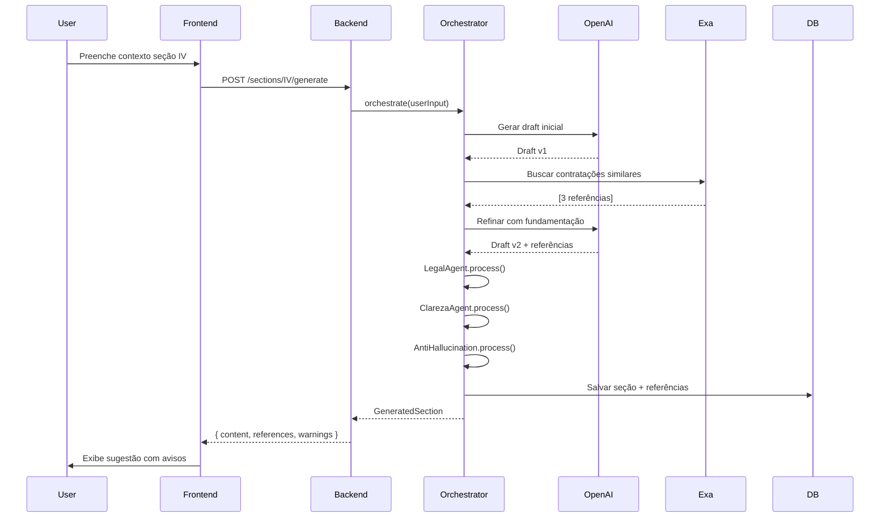

# 🏗️ ARQUITETURA DO ETP EXPRESS

> **⚠️ O ETP Express pode cometer erros. Lembre-se de verificar todas as informações antes de realizar qualquer encaminhamento.**

## 1. VISÃO GERAL

O **ETP Express** é um sistema wrapper de LLM projetado para auxiliar servidores públicos na elaboração de Estudos Técnicos Preliminares (ETP) conforme Lei 14.133/2021, Art. 18 §1º.

### 1.1 Princípios Fundamentais

- **Transparência**: Assume abertamente possibilidade de erros, vieses e imprecisões
- **Assistência**: Natureza preparatória, não substitui responsabilidade administrativa
- **Validação**: Requer conferência humana obrigatória antes de uso oficial
- **Auditabilidade**: Trilha completa de geração, edição e versionamento

### 1.2 Características Principais

```
┌─────────────────────────────────────────────────────────────┐
│                    ETP EXPRESS - FLUXO                       │
├─────────────────────────────────────────────────────────────┤
│                                                               │
│  Usuário Input → Orquestrador → Subagentes → LLM Wrapper    │
│       ↓              ↓              ↓            ↓           │
│  Validação  →  Busca Web  →  Refinamento  →  Normalização  │
│       ↓              ↓              ↓            ↓           │
│  Persistência → Versionamento → Export (PDF/JSON/XML)       │
│                                                               │
└─────────────────────────────────────────────────────────────┘
```

---

## 2. STACK TECNOLÓGICO

### 2.1 Backend

| Componente | Tecnologia      | Justificativa                                      |
| ---------- | --------------- | -------------------------------------------------- |
| Framework  | NestJS          | Arquitetura modular, TypeScript nativo, decorators |
| Runtime    | Node.js 20 LTS  | Performance, ecossistema maduro                    |
| Database   | PostgreSQL 15   | ACID, jsonb, versionamento eficiente               |
| ORM        | TypeORM         | Migrations robustas, relations                     |
| Validação  | class-validator | Validação declarativa, pipes NestJS                |
| Auth       | Passport + JWT  | Padrão industry, extensível                        |
| Docs API   | Swagger/OpenAPI | Auto-documentação, testing                         |

### 2.2 Frontend

| Componente | Tecnologia               | Justificativa                         |
| ---------- | ------------------------ | ------------------------------------- |
| Framework  | React 18                 | Virtual DOM, hooks, ecossistema       |
| Language   | TypeScript 5             | Type safety, refatoração segura       |
| UI Library | Tailwind CSS + shadcn/ui | Componentes acessíveis, customizáveis |
| Forms      | React Hook Form + Zod    | Performance, validação schema         |
| State      | Zustand                  | Simples, performático, DevTools       |
| HTTP       | Axios                    | Interceptors, cancelation             |
| Build      | Vite                     | Fast HMR, tree-shaking                |

### 2.3 Integrações Externas

- **OpenAI API** (GPT-4-turbo): Geração de conteúdo, refinamento
- **Exa API**: Busca web + síntese de contratações similares
  - **Error Handling**: Lança `ServiceUnavailableException` quando API falha
  - **Transparência**: Sem fallback silencioso - usuário sempre sabe quando busca falha
  - **Mensagem**: "Busca externa temporariamente indisponível. Tente novamente em alguns minutos."
- **Government APIs**: Fontes oficiais de licitações e preços (PNCP, Compras.gov.br, SINAPI, SICRO)
- **PDF Generation**: Puppeteer (headless Chrome)
- **Analytics**: Mixpanel ou PostHog (self-hosted Railway)

### 2.4 Infraestrutura (Railway)

```
Railway Stack:
├── Service: etp-express-backend (NestJS)
├── Service: etp-express-frontend (React/Vite)
├── Database: PostgreSQL 15
├── Redis: Job Queue (BullMQ)
└── Env Variables: API_KEYS, JWT_SECRET, DATABASE_URL, REDIS_URL
```

### 2.5 Database Configuration & Performance

**PostgreSQL Connection Pooling (#108, #343)**

Configuração otimizada para Railway Postgres Starter (max 20 connections):

```typescript
// backend/src/app.module.ts
TypeOrmModule.forRootAsync({
  extra: {
    max: 20, // Max connections (Railway limit)
    min: 5, // Min connections (always warm)
    idleTimeoutMillis: 30000, // Close idle connections after 30s
    connectionTimeoutMillis: 5000, // Fail after 5s if pool exhausted
  },
  maxQueryExecutionTime: 3000, // Log slow queries (>3s)
  retryAttempts: 3, // Retry on transient failures
  retryDelay: 1000, // Wait 1s between retries
});
```

**Environment Variables:**

- `DB_POOL_MAX=20` - Maximum pool size (Railway Postgres Starter limit)
- `DB_POOL_MIN=5` - Minimum pool size (warm connections)
- `DB_IDLE_TIMEOUT=30000` - Idle timeout in ms
- `DB_CONNECTION_TIMEOUT=5000` - Acquisition timeout in ms

**Performance Characteristics:**

- Supports 100+ concurrent VUs without connection exhaustion
- Slow query logging (>3s) for performance monitoring
- Automatic retry logic for transient connection failures
- Conservative pool size prevents Railway connection limit errors

**Monitoring:**

- Slow queries logged automatically by TypeORM
- Connection pool metrics available via health checks
- Railway database metrics dashboard

### 2.6 Job Queue & Async Processing (#186, #220, #391)

O ETP Express implementa processamento assíncrono para operações de longa duração usando **BullMQ** com backend Redis.

**Arquitetura:**

```
┌────────────────────────────────────────────────────────────┐
│                 ASYNC SECTION GENERATION                    │
├────────────────────────────────────────────────────────────┤
│                                                              │
│  HTTP Request → Queue Job (jobId) → Return Immediately      │
│       ↓               ↓                    ↓                │
│  Client Polling → Worker Process → Update Progress         │
│       ↓               ↓                    ↓                │
│  Poll Status → AI Generation → Save to DB → Notify         │
│                                                              │
└────────────────────────────────────────────────────────────┘
```

**Tecnologias:**

- **BullMQ**: Redis-backed job queue com retry e scheduling
- **Redis**: Railway Redis service para job storage
- **@nestjs/bullmq**: Integração NestJS com decorators

**Características:**

- **Retry Logic**: 3 tentativas com exponential backoff (5s, 10s, 20s)
- **Timeout**: 5 minutos por job (configurable)
- **Progress Tracking**: Updates em tempo real (0-100%)
- **Job Cleanup**: 100 completed jobs retained, 1000 failed jobs
- **Escalabilidade**: Múltiplos workers podem processar jobs em paralelo

**Endpoints:**

```typescript
// Queue a section generation job
POST /sections/etp/:etpId/generate
Response: { jobId: string, status: 'waiting', ... }

// Poll job status
GET /sections/jobs/:jobId
Response: {
  jobId: string,
  status: 'waiting' | 'active' | 'completed' | 'failed',
  progress: number, // 0-100
  result?: SectionDTO, // Available when completed
  error?: string, // Available when failed
  createdAt: Date,
  completedAt?: Date
}
```

**Fluxo de Geração:**

1. Client envia `POST /sections/etp/:etpId/generate`
2. Backend cria section entity com status `GENERATING`
3. Job enfileirado no BullMQ com jobId retornado
4. Client faz polling de `GET /sections/jobs/:jobId` a cada 2-3s
5. Worker processa job em background:
   - 10%: Valida section exists
   - 10-90%: OrchestratorService gera conteúdo via LLM
   - 90%: Salva conteúdo no database
   - 95%: Atualiza ETP completion percentage
   - 100%: Job completo
6. Client detecta `status: 'completed'` e busca section atualizada

**Configuração (backend/src/app.module.ts):**

```typescript
BullModule.forRootAsync({
  imports: [ConfigModule],
  inject: [ConfigService],
  useFactory: (configService: ConfigService) => {
    const redisConf = configService.get('redis');
    return {
      connection: {
        host: redisConf.host,
        port: redisConf.port,
        password: redisConf.password,
        db: 0,
        maxRetriesPerRequest: null, // Required for BullMQ
        enableReadyCheck: false,
      },
    };
  },
}),
```

**Redis Configuration (backend/src/config/redis.config.ts):**

- Parseia `REDIS_URL` do Railway (formato: `redis://:password@host:port`)
- Fallback para localhost em desenvolvimento
- maxRetriesPerRequest: null (required by BullMQ)
- enableReadyCheck: false (recommended by BullMQ)

**Benefits:**

- ✅ Evita timeouts HTTP (gerações de 30-60s)
- ✅ Melhor UX (feedback de progresso em tempo real)
- ✅ Retry automático em falhas transientes
- ✅ Escalabilidade horizontal (add more workers)
- ✅ Job monitoring e debugging (retained failed jobs)

### 2.7 Health Checks

O ETP Express implementa dois tipos de health checks para garantir zero-downtime deployment (#181):

**GET /api/health** (Liveness Probe)

- **Propósito**: Verifica se a aplicação está viva (não crashou)
- **Comportamento**: Retorna 200 mesmo durante initialization/migrations
- **Uso**: Railway utiliza para detectar crashes e reiniciar containers
- **Response**:
  ```json
  {
    "status": "healthy",
    "timestamp": "2025-11-29T12:00:00.000Z",
    "database": "connected"
  }
  ```

**GET /api/health/ready** (Readiness Probe)

- **Propósito**: Verifica se está pronto para receber tráfego
- **Comportamento**: Retorna 503 durante migrations/initialization
- **Uso**: deploy.sh utiliza para decisão de switch de tráfego
- **Response (ready)**:
  ```json
  {
    "status": "ready",
    "timestamp": "2025-11-29T12:00:00.000Z",
    "database": "connected",
    "migrations": "completed"
  }
  ```
- **Response (starting)**:
  ```json
  {
    "status": "starting",
    "reason": "migrations_in_progress",
    "database": "connected",
    "timestamp": "2025-11-29T12:00:00.000Z"
  }
  ```

**Distinção Liveness vs Readiness:**

- **Liveness**: "A aplicação está respondendo?" (evita restarts desnecessários durante boot)
- **Readiness**: "A aplicação pode processar requests?" (evita rotear tráfego antes de pronta)

**Migration-Aware Design:**

- TypeORM executa migrations síncronas no boot
- Readiness probe detecta migrations pendentes via `DataSource.showMigrations()`
- Deploy script aguarda status `ready` antes de switch de tráfego
- Evita falsos-positivos quando DB está conectado mas migrations pendentes

---

## 3. ARQUITETURA DE SUBAGENTES

### 3.1 Orquestrador Central

```typescript
class ETOrchestratorService {
  async generateSection(
    sectionId: string,
    userContext: UserInput,
    etpDraft: ETPDraft,
  ): Promise<GeneratedSection> {
    // Chain de subagentes
    const chain = [
      this.legalAgent, // Valida coerência legal superficial
      this.fundamentacaoAgent, // Busca contratações similares
      this.clarezaAgent, // Revisa clareza textual
      this.simplificacaoAgent, // Simplifica linguagem jurídica
      this.antiHallucinationAgent, // Mitiga alucinações
    ];

    let result = await this.llmWrapper.generate(userContext);

    for (const agent of chain) {
      result = await agent.process(result);
    }

    return this.normalizer.format(result);
  }
}
```

### 3.2 Subagentes Especializados

#### 🔹 Agente Legal

```typescript
@Injectable()
export class LegalAgent {
  async process(draft: string): Promise<ProcessedDraft> {
    // Valida menções à Lei 14.133/2021
    // Verifica consistência de incisos citados
    // Injeta avisos "Confirme se esta interpretação se aplica ao seu órgão"
  }
}
```

#### 🔹 Agente de Fundamentação

```typescript
@Injectable()
export class FundamentacaoAgent {
  constructor(private exaService: ExaService) {}

  async process(draft: string): Promise<ProcessedDraft> {
    // Extrai objeto da contratação
    // Busca contratações similares via Exa + Government APIs
    // Anexa referências com aviso "verifique a fonte antes de utilizar"
  }
}
```

#### 🔹 Agente de Clareza

```typescript
@Injectable()
export class ClarezaAgent {
  async process(draft: string): Promise<ProcessedDraft> {
    // Identifica jargão excessivo
    // Sugere simplificações
    // Valida Flesch Reading Ease > 50
  }
}
```

#### 🔹 Agente de Mitigação de Alucinação

```typescript
@Injectable()
export class AntiHallucinationAgent {
  async process(draft: string): Promise<ProcessedDraft> {
    // Injeta prompts defensivos
    // Valida afirmações factuais contra base de conhecimento
    // Marca trechos de baixa confiança para revisão humana
  }
}
```

---

## 4. MODELO DE DADOS

### 4.1 Schema Principal

```sql
-- Usuários e Autenticação
CREATE TABLE users (
  id UUID PRIMARY KEY DEFAULT gen_random_uuid(),
  email VARCHAR(255) UNIQUE NOT NULL,
  name VARCHAR(255) NOT NULL,
  orgao VARCHAR(255),
  role VARCHAR(50) DEFAULT 'user',
  created_at TIMESTAMP DEFAULT NOW()
);

-- ETPs
CREATE TABLE etps (
  id UUID PRIMARY KEY DEFAULT gen_random_uuid(),
  user_id UUID REFERENCES users(id),
  title VARCHAR(500) NOT NULL,
  object TEXT,
  status VARCHAR(50) DEFAULT 'draft', -- draft, complete, exported
  current_version INT DEFAULT 1,
  created_at TIMESTAMP DEFAULT NOW(),
  updated_at TIMESTAMP DEFAULT NOW()
);

-- Seções do ETP (Incisos da Lei)
CREATE TABLE etp_sections (
  id UUID PRIMARY KEY DEFAULT gen_random_uuid(),
  etp_id UUID REFERENCES etps(id) ON DELETE CASCADE,
  section_code VARCHAR(10) NOT NULL, -- I, II, III, IV... XIII
  section_title VARCHAR(255) NOT NULL,
  content JSONB, -- { draft, suggestions, references, metadata }
  is_mandatory BOOLEAN DEFAULT false,
  is_complete BOOLEAN DEFAULT false,
  created_at TIMESTAMP DEFAULT NOW(),
  updated_at TIMESTAMP DEFAULT NOW(),
  UNIQUE(etp_id, section_code)
);

-- Versionamento
CREATE TABLE etp_versions (
  id UUID PRIMARY KEY DEFAULT gen_random_uuid(),
  etp_id UUID REFERENCES etps(id) ON DELETE CASCADE,
  version_number INT NOT NULL,
  snapshot JSONB NOT NULL, -- Full ETP snapshot
  changed_sections TEXT[], -- ['I', 'IV', 'VIII']
  user_id UUID REFERENCES users(id),
  created_at TIMESTAMP DEFAULT NOW(),
  UNIQUE(etp_id, version_number)
);

-- Auditoria
CREATE TABLE audit_logs (
  id UUID PRIMARY KEY DEFAULT gen_random_uuid(),
  etp_id UUID REFERENCES etps(id) ON DELETE CASCADE,
  user_id UUID REFERENCES users(id),
  action VARCHAR(100) NOT NULL, -- created, edited_section, exported, etc
  section_code VARCHAR(10),
  metadata JSONB,
  created_at TIMESTAMP DEFAULT NOW()
);

-- Referências de Contratações Similares
CREATE TABLE similar_contracts (
  id UUID PRIMARY KEY DEFAULT gen_random_uuid(),
  etp_id UUID REFERENCES etps(id) ON DELETE CASCADE,
  section_code VARCHAR(10),
  url TEXT,
  title TEXT,
  summary TEXT,
  source VARCHAR(100), -- 'exa', 'gov-api', 'manual'
  fetched_at TIMESTAMP DEFAULT NOW()
);

-- Telemetria (Analytics UX)
CREATE TABLE analytics_events (
  id UUID PRIMARY KEY DEFAULT gen_random_uuid(),
  etp_id UUID REFERENCES etps(id) ON DELETE SET NULL,
  user_id UUID REFERENCES users(id) ON DELETE SET NULL,
  event_type VARCHAR(100), -- section_opened, llm_suggestion_accepted, etc
  section_code VARCHAR(10),
  metadata JSONB,
  created_at TIMESTAMP DEFAULT NOW()
);

-- Índices para performance
CREATE INDEX idx_etps_user_id ON etps(user_id);
CREATE INDEX idx_etp_sections_etp_id ON etp_sections(etp_id);
CREATE INDEX idx_etp_versions_etp_id ON etp_versions(etp_id);
CREATE INDEX idx_audit_logs_etp_id ON audit_logs(etp_id);
CREATE INDEX idx_analytics_events_created_at ON analytics_events(created_at);
```

### 4.2 Incisos Obrigatórios (Art. 18 §1º)

| Código | Descrição                                           | Obrigatório |
| ------ | --------------------------------------------------- | ----------- |
| I      | Descrição da necessidade da contratação             | ✅ SIM      |
| II     | Demonstração da previsão de recursos orçamentários  | ❌ Não      |
| III    | Estimativa preliminar de despesa                    | ❌ Não      |
| IV     | Justificativa da solução escolhida                  | ✅ SIM      |
| V      | Descrição da solução como um todo                   | ❌ Não      |
| VI     | Requisitos da contratação                           | ✅ SIM      |
| VII    | Estimativas de valor da contratação                 | ❌ Não      |
| VIII   | Justificativa do parcelamento ou não da contratação | ✅ SIM      |
| IX     | Contratações correlatas                             | ❌ Não      |
| X      | Demonstração de compatibilidade do orçamento        | ❌ Não      |
| XI     | Descrição dos riscos                                | ❌ Não      |
| XII    | Providências a serem adotadas                       | ❌ Não      |
| XIII   | Declaração de viabilidade                           | ✅ SIM      |

---

## 5. ENDPOINTS REST API

### 5.1 Autenticação

```
POST   /api/auth/register          # Criar conta
POST   /api/auth/login             # Login (retorna JWT)
POST   /api/auth/logout            # Logout
GET    /api/auth/me                # Usuário atual
```

### 5.2 ETPs

```
GET    /api/etps                   # Listar ETPs do usuário
POST   /api/etps                   # Criar novo ETP
GET    /api/etps/:id               # Obter ETP específico
PATCH  /api/etps/:id               # Atualizar metadados
DELETE /api/etps/:id               # Deletar ETP
```

### 5.3 Seções

```
GET    /api/etps/:id/sections                    # Listar seções
GET    /api/etps/:id/sections/:code              # Obter seção específica
POST   /api/etps/:id/sections/:code/generate     # Gerar conteúdo via LLM
PATCH  /api/etps/:id/sections/:code              # Atualizar seção
POST   /api/etps/:id/sections/:code/refine       # Refinar conteúdo existente
POST   /api/etps/:id/sections/:code/alternatives # Gerar alternativas
```

### 5.4 Versionamento

```
GET    /api/etps/:id/versions                 # Histórico de versões
POST   /api/etps/:id/versions                 # Criar snapshot
GET    /api/etps/:id/versions/:version        # Obter versão específica
POST   /api/etps/:id/versions/:version/restore # Restaurar versão
GET    /api/etps/:id/versions/diff/:v1/:v2   # Diff entre versões
```

### 5.5 Export

```
POST   /api/etps/:id/export/pdf      # Gerar PDF (com aviso destacado)
POST   /api/etps/:id/export/json     # Export estruturado JSON
POST   /api/etps/:id/export/xml      # Export estruturado XML
GET    /api/etps/:id/validate        # Validar completude (incisos obrigatórios)
```

### 5.6 Busca e Fundamentação

```
POST   /api/search/similar-contracts    # Buscar via Exa + Government APIs
GET    /api/etps/:id/references          # Listar referências anexadas
POST   /api/etps/:id/references          # Adicionar referência manual
DELETE /api/references/:id               # Remover referência
```

### 5.7 Analytics

```
POST   /api/analytics/event              # Registrar evento telemetria
GET    /api/analytics/summary            # Resumo de uso (admin)
```

---

## 6. FLUXO DE GERAÇÃO DE CONTEÚDO



---

## 7. MITIGAÇÃO DE ALUCINAÇÃO

### 7.1 Estratégias Implementadas

#### 🔹 Prompts Defensivos

```typescript
const ANTI_HALLUCINATION_PROMPT = `
IMPORTANTE: Você está auxiliando na elaboração de um documento administrativo oficial.

REGRAS OBRIGATÓRIAS:
1. NÃO invente números, valores, datas ou referências legais
2. SE não tiver certeza de uma informação, use placeholder: "[A SER VALIDADO PELO SERVIDOR]"
3. SEMPRE cite a fonte de informações factuais
4. Para interpretações legais, use: "Esta é uma interpretação sugerida, confirme com setor jurídico"
5. Ao sugerir valores estimados, base-se APENAS nas referências de contratações similares fornecidas

Seu objetivo é AUXILIAR, não decidir. Toda afirmação deve ser auditável.
`;
```

#### 🔹 Validação Pós-Geração

```typescript
class AntiHallucinationAgent {
  private readonly FORBIDDEN_PATTERNS = [
    /\bgaranto\b/i,
    /\bcom certeza\b/i,
    /\bsempre\b/i,
    /\bnunca\b/i,
    /\bdefinitivamente\b/i,
  ];

  async process(draft: string): Promise<ProcessedDraft> {
    // Detecta afirmações absolutas
    // Injeta disclaimers em citações legais
    // Marca valores numéricos sem fonte
    // Sugere revisão humana em trechos de baixa confiança
  }
}
```

### 7.2 Avisos Visuais no Frontend

```tsx
// Componente de aviso persistente
<WarningBanner variant="critical" sticky>
  ⚠️ O ETP Express pode cometer erros. Lembre-se de verificar todas as
  informações antes de realizar qualquer encaminhamento.
</WarningBanner>

// Tooltips contextuais em sugestões LLM
<Tooltip>
  💡 Esta é uma sugestão gerada por IA. Revise criticamente antes de aceitar.
</Tooltip>

// Badges em referências externas
<Badge variant="warning">
  🔍 Verifique a fonte antes de utilizar
</Badge>
```

---

## 8. UX E ACESSIBILIDADE

### 8.1 Heurísticas de Nielsen Aplicadas

1. **Visibilidade de Estado**: Barra de progresso, status de seções, indicador de salvamento
2. **Correspondência com Mundo Real**: Linguagem simples, tooltips explicativos
3. **Controle e Liberdade**: Desfazer/refazer, múltiplas versões, draft lateral
4. **Consistência**: Design system unificado (shadcn/ui)
5. **Prevenção de Erros**: Validação em tempo real, confirmações antes de ações críticas
6. **Reconhecimento vs Memória**: Sugestões contextuais, templates preenchidos
7. **Flexibilidade**: Atalhos de teclado, modos de visualização
8. **Design Minimalista**: Foco no essencial, progressive disclosure
9. **Recuperação de Erros**: Mensagens claras, sugestões de correção
10. **Ajuda e Documentação**: Tooltips, modal de ajuda, exemplos inline

### 8.2 WCAG 2.1 AA Compliance

- **Contraste**: Mínimo 4.5:1 para texto normal, 3:1 para texto grande
- **Navegação por Teclado**: Tab order lógico, focus visible
- **Screen Readers**: ARIA labels, landmarks semânticos
- **Responsivo**: Suporta zoom até 200%, layout adaptável
- **Formulários**: Labels explícitos, mensagens de erro associadas

---

## 9. DEPLOY NA RAILWAY

### 9.1 Estrutura de Serviços

```yaml
# railway.json (monorepo)
{
  '$schema': 'https://railway.app/railway.schema.json',
  'build': { 'builder': 'NIXPACKS' },
  'deploy':
    {
      'numReplicas': 1,
      'restartPolicyType': 'ON_FAILURE',
      'restartPolicyMaxRetries': 10,
    },
}
```

### 9.2 Variáveis de Ambiente

```bash
# Backend
NODE_ENV=production
DATABASE_URL=${{Postgres.DATABASE_URL}}
JWT_SECRET=${{secrets.JWT_SECRET}}
OPENAI_API_KEY=${{secrets.OPENAI_API_KEY}}
EXA_API_KEY=${{secrets.EXA_API_KEY}}
FRONTEND_URL=https://etp-express.up.railway.app
CORS_ORIGINS=https://etp-express.up.railway.app

# Frontend
VITE_API_URL=https://etp-express-backend.up.railway.app
VITE_APP_NAME="ETP Express"
```

### 9.3 Scripts de Deploy

```json
// package.json (backend)
{
  "scripts": {
    "build": "nest build",
    "start:prod": "node dist/main",
    "migration:run": "typeorm migration:run -d dist/config/typeorm.config.js"
  }
}

// package.json (frontend)
{
  "scripts": {
    "build": "vite build",
    "preview": "vite preview --port 3000"
  }
}
```

---

## 10. ROADMAP INCREMENTAL

### Fase 1: MVP Core (Semanas 1-2)

- ✅ Auth básica (JWT)
- ✅ CRUD de ETPs
- ✅ Orquestrador + wrapper OpenAI
- ✅ Formulário guiado (seções I, IV, VI, VIII, XIII)
- ✅ Export PDF com avisos
- ✅ Deploy Railway

### Fase 2: Busca e Fundamentação (Semana 3)

- ✅ Integração Exa + Government APIs
- ✅ Agente de fundamentação
- ✅ Painel de referências

### Fase 3: Versionamento e Auditoria (Semana 4)

- ✅ Sistema de versões
- ✅ Diff textual
- ✅ Trilha de auditoria

### Fase 4: UX Avançado (Semana 5)

- 🔄 Telemetria analytics
- 🔄 Tooltips contextuais
- 🔄 Microinterações
- 🔄 Loading states elegantes

### Fase 5: Otimizações (Semana 6)

- 🔄 Cache de sugestões LLM
- 🔄 Rate limiting
- 🔄 Testes E2E
- 🔄 Documentação completa

### Fase Futura (Pós-MVP)

- 🔮 Suporte a modelos on-premise (Llama, Mistral)
- 🔮 IA híbrida (modelo local + cloud fallback)
- 🔮 Integração com COMPRASNET
- 🔮 Templates por órgão/setor
- 🔮 Modo colaborativo (múltiplos usuários)

---

## 11. SEGURANÇA

### 11.1 Proteções Implementadas

- **OWASP Top 10**:
  - ✅ Sanitização de inputs (class-validator)
  - ✅ Prepared statements (TypeORM protege contra SQL Injection)
  - ✅ CORS configurado
  - ✅ Helmet.js (headers de segurança)
  - ✅ Rate limiting (express-rate-limit)
  - ✅ JWT com expiração
  - ✅ Bcrypt para senhas
  - ✅ HTTPS obrigatório (Railway)

### 11.2 Privacidade

- Dados sensíveis (API keys) em variáveis de ambiente
- Analytics anonimizado (sem PII)
- Logs sanitizados (sem tokens, senhas)
- LGPD-friendly: usuário pode exportar/deletar dados

---

### 11.3 Secrets Management Strategy (M3 Milestone)

**Status**: Using Railway native secrets management
**Approach**: Manual rotation with documented procedures
**Rationale**: See `docs/SECRETS_MANAGEMENT_EVALUATION.md`

#### Secrets Management Architecture

Railway platform provides integrated environment variable management with sealed variables that are not visible in the UI once set. This is sufficient for ETP Express MVP.

```
┌──────────────────────────────────────────────────────────┐
│         RAILWAY NATIVE SECRETS MANAGEMENT                │
├──────────────────────────────────────────────────────────┤
│                                                            │
│  Developer                                               │
│       ↓                                                  │
│  Railway Dashboard / CLI                                │
│       ↓                                                  │
│  Sealed Environment Variables                           │
│       ↓                                                  │
│  Application @ Runtime                                  │
│       ↓                                                  │
│  GitHub Issues (Audit Trail)                            │
│                                                            │
└──────────────────────────────────────────────────────────┘
```

#### Managed Secrets

| Secret         | Frequency | Method                          |
| -------------- | --------- | ------------------------------- |
| JWT_SECRET     | Monthly   | Manual rotation + documentation |
| SESSION_SECRET | Monthly   | Manual rotation + documentation |
| OPENAI_API_KEY | Quarterly | Manual rotation (provider)      |
| EXA_API_KEY    | Quarterly | Manual rotation (provider)      |
| DATABASE_URL   | On-demand | Manual rotation (DB password)   |

#### Rotation Procedure

Simple 4-step process for manual rotation:

1. Generate new secret value (openssl rand -base64 32)
2. Update in Railway dashboard
3. Trigger auto-redeploy
4. Create GitHub issue to track rotation

No external platforms. No AWS accounts. No bootstrap credentials.

#### Audit Trail (GitHub-based)

Track all rotations via:

- **GitHub Issues**: One per rotation cycle (label: `security`)
- **Railway logs**: Auto-captured deployment logs
- **Git commits**: Signed commits for any automation scripts

Meets LGPD audit trail requirement at MVP scale.

For full strategy: See `docs/SECRETS_MANAGEMENT_EVALUATION.md`

## 12. TESTES

O ETP Express implementa uma estratégia de testes em múltiplas camadas, garantindo qualidade de código e funcionalidade através de testes automatizados e integração contínua.

### 12.1 Pirâmide de Testes

```
                    ╭───────────╮
                   /             \
                  /   E2E Tests   \     ← Playwright + Puppeteer
                 /    (11 tests)   \       (Fluxos críticos)
                ╰─────────────────╯
              ╭─────────────────────╮
             /   Integration Tests   \   ← Jest + Supertest
            /       (150+ tests)      \     (Controllers, APIs)
           ╰─────────────────────────╯
         ╭─────────────────────────────╮
        /        Unit Tests             \  ← Jest + Vitest
       /         (800+ tests)            \    (Services, Components)
      ╰─────────────────────────────────╯
```

**Cobertura Atual:**

- **Backend**: 78%+ (statements), meta 80%
- **Frontend**: 58%+ (statements), meta 65%
- **Total de Testes**: 920+ testes passando

### 12.2 Estrutura de Testes

```
ETP Express/
├── backend/
│   ├── src/
│   │   ├── modules/
│   │   │   ├── auth/
│   │   │   │   ├── auth.service.spec.ts       # Unit tests
│   │   │   │   ├── auth.controller.spec.ts    # Integration tests
│   │   │   │   └── strategies/
│   │   │   │       ├── jwt.strategy.spec.ts
│   │   │   │       └── local.strategy.spec.ts
│   │   │   ├── etps/
│   │   │   │   ├── etps.service.spec.ts
│   │   │   │   ├── etps.controller.spec.ts
│   │   │   │   └── cascade-delete.spec.ts
│   │   │   ├── orchestrator/
│   │   │   │   ├── orchestrator.service.spec.ts
│   │   │   │   └── agents/
│   │   │   │       ├── legal.agent.spec.ts
│   │   │   │       ├── clareza.agent.spec.ts
│   │   │   │       ├── fundamentacao.agent.spec.ts
│   │   │   │       ├── simplificacao.agent.spec.ts
│   │   │   │       └── anti-hallucination.agent.spec.ts
│   │   │   └── sections/
│   │   │       ├── sections.service.spec.ts
│   │   │       ├── sections.controller.spec.ts
│   │   │       └── sections.processor.spec.ts
│   │   └── common/
│   │       ├── guards/
│   │       │   ├── tenant.guard.spec.ts
│   │       │   └── user-throttler.guard.spec.ts
│   │       └── utils/
│   │           └── retry.spec.ts
│   ├── test/
│   │   └── lgpd-compliance.e2e-spec.ts        # E2E Tests (NestJS)
│   └── jest.config.js
├── frontend/
│   ├── src/
│   │   ├── components/
│   │   │   └── **/*.test.tsx                  # Component tests
│   │   ├── hooks/
│   │   │   └── **/*.test.ts                   # Hook tests
│   │   ├── services/
│   │   │   └── **/*.test.ts                   # Service tests
│   │   └── test/
│   │       └── setup.ts                       # Vitest setup
│   └── vitest.config.ts
├── e2e/
│   └── accessibility.spec.ts                  # Playwright Accessibility
├── puppeteer-tests/
│   ├── critical-flow.spec.ts                  # Fluxo crítico completo
│   ├── login.spec.ts
│   └── utils/
│       └── setup.ts
└── playwright.config.ts
```

### 12.3 Testes Unitários

#### Backend (Jest + NestJS Testing)

**Framework**: Jest v29 + ts-jest + @nestjs/testing

**Configuração** (`backend/jest.config.js`):

```javascript
module.exports = {
  moduleFileExtensions: ['js', 'json', 'ts'],
  rootDir: 'src',
  testRegex: '.*\\.spec\\.ts$',
  transform: { '^.+\\.(t|j)s$': 'ts-jest' },
  collectCoverageFrom: ['**/*.(t|j)s', '!**/*.module.ts', '!main.ts'],
  coverageDirectory: '../coverage',
  testEnvironment: 'node',
  moduleNameMapper: { '^src/(.*)$': '<rootDir>/$1' },
};
```

**Padrões de Teste**:

```typescript
// Exemplo: backend/src/modules/auth/auth.service.spec.ts
import { Test, TestingModule } from '@nestjs/testing';
import { AuthService } from './auth.service';
import { UsersService } from '../users/users.service';

describe('AuthService', () => {
  let service: AuthService;
  let usersService: UsersService;

  const mockUsersService = {
    findByEmail: jest.fn(),
    create: jest.fn(),
  };

  beforeEach(async () => {
    const module: TestingModule = await Test.createTestingModule({
      providers: [
        AuthService,
        { provide: UsersService, useValue: mockUsersService },
      ],
    }).compile();

    service = module.get<AuthService>(AuthService);
    jest.clearAllMocks();
  });

  describe('validateUser', () => {
    it('should return user without password when credentials are valid', async () => {
      // Arrange
      mockUsersService.findByEmail.mockResolvedValue(mockUser);
      // Act
      const result = await service.validateUser('test@example.com', 'password');
      // Assert
      expect(result).toBeDefined();
      expect(result?.password).toBeUndefined();
    });
  });
});
```

#### Frontend (Vitest + React Testing Library)

**Framework**: Vitest v4 + @testing-library/react + jsdom

**Configuração** (`frontend/vitest.config.ts`):

```typescript
import { defineConfig } from 'vitest/config';
import react from '@vitejs/plugin-react';

export default defineConfig({
  plugins: [react()],
  test: {
    globals: true,
    environment: 'jsdom',
    setupFiles: './src/test/setup.ts',
    css: true,
    coverage: {
      provider: 'v8',
      reporter: ['text', 'json', 'html'],
      exclude: ['node_modules/', 'src/test/', '**/*.d.ts'],
    },
  },
});
```

**Padrões de Teste**:

```typescript
// Exemplo: frontend/src/components/Button.test.tsx
import { render, screen, fireEvent } from '@testing-library/react';
import { Button } from './Button';

describe('Button', () => {
  it('should render with correct text', () => {
    render(<Button>Click me</Button>);
    expect(screen.getByRole('button')).toHaveTextContent('Click me');
  });

  it('should call onClick when clicked', () => {
    const onClick = vi.fn();
    render(<Button onClick={onClick}>Click</Button>);
    fireEvent.click(screen.getByRole('button'));
    expect(onClick).toHaveBeenCalledTimes(1);
  });
});
```

### 12.4 Testes de Integração

#### Backend (Supertest + NestJS)

**Controller Tests**:

```typescript
// Testes de integração validam endpoints HTTP reais
import * as request from 'supertest';
import { Test } from '@nestjs/testing';
import { INestApplication } from '@nestjs/common';

describe('AuthController (e2e)', () => {
  let app: INestApplication;

  beforeEach(async () => {
    const module = await Test.createTestingModule({
      imports: [AppModule],
    }).compile();

    app = module.createNestApplication();
    await app.init();
  });

  it('/auth/login (POST) should return JWT token', () => {
    return request(app.getHttpServer())
      .post('/auth/login')
      .send({ email: 'test@example.com', password: 'password123' })
      .expect(201)
      .expect((res) => {
        expect(res.body).toHaveProperty('accessToken');
      });
  });
});
```

### 12.5 Testes E2E

O ETP Express utiliza duas ferramentas de E2E complementares:

#### Playwright (Acessibilidade + Multi-browser)

**Framework**: Playwright v1.40+ com @axe-core/playwright

**Configuração** (`playwright.config.ts`):

```typescript
import { defineConfig, devices } from '@playwright/test';

export default defineConfig({
  testDir: './e2e',
  fullyParallel: true,
  forbidOnly: !!process.env.CI,
  retries: process.env.CI ? 2 : 0,
  workers: process.env.CI ? 1 : undefined,
  reporter: 'html',
  use: {
    baseURL: process.env.E2E_BASE_URL || 'http://localhost:5173',
    trace: 'on-first-retry',
    screenshot: 'only-on-failure',
  },
  projects: [
    { name: 'chromium', use: { ...devices['Desktop Chrome'] } },
    { name: 'firefox', use: { ...devices['Desktop Firefox'] } },
    { name: 'webkit', use: { ...devices['Desktop Safari'] } },
  ],
  webServer: {
    command: 'cd frontend && npm run dev',
    url: 'http://localhost:5173',
    reuseExistingServer: !process.env.CI,
  },
});
```

**Testes de Acessibilidade** (WCAG 2.1 AA):

```typescript
// e2e/accessibility.spec.ts
import { test, expect } from '@playwright/test';
import AxeBuilder from '@axe-core/playwright';

test.describe('WCAG 2.1 AA Compliance', () => {
  const pages = [
    { path: '/login', name: 'Login' },
    { path: '/register', name: 'Register' },
    { path: '/dashboard', name: 'Dashboard' },
  ];

  for (const page of pages) {
    test(`${page.name} should be WCAG 2.1 AA compliant`, async ({
      page: p,
    }) => {
      await p.goto(page.path);
      await p.waitForLoadState('networkidle');

      const results = await new AxeBuilder({ page: p })
        .withTags(['wcag2a', 'wcag2aa', 'wcag21a', 'wcag21aa'])
        .analyze();

      expect(results.violations).toEqual([]);
    });
  }
});
```

#### Puppeteer (Critical Flow)

**Framework**: Puppeteer v24 para testes de fluxo crítico com mocking de APIs

**Fluxo Crítico Testado**:

1. Login → Dashboard
2. Criar novo ETP (modal)
3. Abrir ETP no editor
4. Gerar seção com IA (mockado)
5. Salvar seção
6. Exportar PDF

```typescript
// puppeteer-tests/critical-flow.spec.ts
describe('Critical Flow E2E', () => {
  beforeEach(async () => {
    const setup = await setupBrowser();
    browser = setup.browser;
    page = setup.page;

    // Mock API calls (evita custos OpenAI)
    await page.setRequestInterception(true);
    page.on('request', (request) => {
      if (
        request.url().includes('/api/sections/') &&
        request.url().includes('/generate')
      ) {
        request.respond({
          status: 201,
          contentType: 'application/json',
          body: JSON.stringify({
            content: '# Seção Gerada (Mock)',
            status: 'completed',
          }),
        });
      } else {
        request.continue();
      }
    });
  });

  test('deve completar fluxo crítico', async () => {
    await login(page, testUser.email, testUser.password);
    expect(page.url()).toContain('/dashboard');
    // ... resto do fluxo
  }, 90000);
});
```

### 12.6 CI/CD Pipeline de Testes

O ETP Express utiliza GitHub Actions para CI/CD com otimizações de cache.

#### Workflows de Testes

**1. ci-tests.yml** - Testes Unitários + Cobertura:

```yaml
name: CI - Tests
on:
  push:
    branches: [master]
    paths:
      - 'backend/**/*.ts'
      - 'frontend/**/*.{ts,tsx}'
      - '.github/workflows/ci-tests.yml'
  pull_request:
    branches: [master]

jobs:
  test-backend:
    runs-on: ubuntu-latest
    steps:
      - uses: actions/checkout@v6
      - uses: actions/setup-node@v6
        with:
          node-version: '20'
          cache: 'npm'
      - run: npm ci
      - run: npm run test:cov
        working-directory: backend
      - name: Check coverage threshold (70%)
        run: |
          COVERAGE=$(cat coverage/coverage-summary.json | jq '.total.lines.pct')
          if (( $(echo "$COVERAGE < 70" | bc -l) )); then
            exit 1
          fi

  test-frontend:
    runs-on: ubuntu-latest
    steps:
      - uses: actions/checkout@v6
      - uses: actions/setup-node@v6
        with:
          node-version: '20'
          cache: 'npm'
      - run: npm ci
      - run: npm run test:coverage
        working-directory: frontend
```

**2. ci-lint.yml** - ESLint + TypeScript:

```yaml
name: CI - Lint
on:
  push:
    branches: [master]
  pull_request:
    branches: [master]

jobs:
  lint-backend:
    runs-on: ubuntu-latest
    steps:
      - run: npm run lint
        working-directory: backend

  lint-frontend:
    runs-on: ubuntu-latest
    steps:
      - run: npm run lint
        working-directory: frontend
```

**3. playwright.yml** - Testes E2E:

```yaml
name: Playwright Tests
on:
  push:
    branches: [master]
    paths:
      - 'e2e/**/*'
      - 'playwright.config.ts'

jobs:
  test:
    timeout-minutes: 60
    runs-on: ubuntu-latest
    steps:
      - uses: actions/checkout@v4
      - uses: actions/setup-node@v4
        with:
          node-version: lts/*
          cache: 'npm'
      - run: npm ci
      - name: Cache Playwright browsers
        uses: actions/cache@v4
        with:
          path: ~/.cache/ms-playwright
          key: playwright-${{ hashFiles('package-lock.json') }}
      - run: npx playwright install --with-deps
      - run: npx playwright test
      - uses: actions/upload-artifact@v4
        if: ${{ !cancelled() }}
        with:
          name: playwright-report
          path: playwright-report/
```

#### Otimizações CI/CD

| Otimização          | Economia                         |
| ------------------- | -------------------------------- |
| Cache NPM           | ~60% tempo de build              |
| Cache Playwright    | ~3-4 min por run                 |
| Path Filters        | Commits docs-only não acionam CI |
| Codecov Integration | Tracking automático de coverage  |

### 12.7 Rodando Testes Localmente

#### Backend

```bash
cd backend

# Testes unitários
npm test

# Testes com watch mode
npm run test:watch

# Testes com cobertura
npm run test:cov

# Testes E2E (requer banco de dados)
npm run test:e2e

# Debug de testes (Node Inspector)
npm run test:debug
```

#### Frontend

```bash
cd frontend

# Testes unitários (watch mode por padrão)
npm test

# Testes com UI interativa
npm run test:ui

# Testes com cobertura
npm run test:coverage
```

#### E2E (Playwright)

```bash
# Na raiz do projeto

# Instalar browsers (primeira vez)
npx playwright install

# Rodar todos os testes E2E
npx playwright test

# Rodar em um browser específico
npx playwright test --project=chromium

# Modo UI (interativo)
npx playwright test --ui

# Gerar relatório HTML
npx playwright show-report
```

#### E2E (Puppeteer - Critical Flow)

```bash
cd puppeteer-tests

# Rodar testes de fluxo crítico
npm test

# Com debug visual (headful)
PUPPETEER_HEADLESS=false npm test
```

### 12.8 Debugging de Testes

#### VS Code Launch Configurations

```json
// .vscode/launch.json
{
  "version": "0.2.0",
  "configurations": [
    {
      "type": "node",
      "request": "launch",
      "name": "Debug Jest Backend",
      "program": "${workspaceFolder}/backend/node_modules/.bin/jest",
      "args": ["--runInBand", "--watchAll=false"],
      "cwd": "${workspaceFolder}/backend",
      "console": "integratedTerminal"
    },
    {
      "type": "node",
      "request": "launch",
      "name": "Debug Vitest Frontend",
      "runtimeExecutable": "npx",
      "runtimeArgs": ["vitest", "--no-coverage"],
      "cwd": "${workspaceFolder}/frontend",
      "console": "integratedTerminal"
    }
  ]
}
```

#### Dicas de Debug

**Jest (Backend)**:

```bash
# Rodar apenas um arquivo
npm test -- auth.service.spec.ts

# Rodar apenas um teste específico
npm test -- -t "should return user without password"

# Debug com Node Inspector
node --inspect-brk node_modules/.bin/jest --runInBand
```

**Vitest (Frontend)**:

```bash
# Rodar apenas um arquivo
npx vitest Button.test.tsx

# Rodar com filtro de nome
npx vitest -t "should render"

# Modo UI para debug visual
npx vitest --ui
```

**Playwright (E2E)**:

```bash
# Debug visual com pause
npx playwright test --debug

# Gerar screenshots em cada step
npx playwright test --trace on

# Codegen para gerar testes
npx playwright codegen localhost:5173
```

### 12.9 Convenções de Teste

#### Nomenclatura

| Tipo            | Padrão                         | Exemplo                   |
| --------------- | ------------------------------ | ------------------------- |
| Unit (Backend)  | `*.spec.ts`                    | `auth.service.spec.ts`    |
| Unit (Frontend) | `*.test.tsx`                   | `Button.test.tsx`         |
| Integration     | `*.spec.ts`                    | `auth.controller.spec.ts` |
| E2E             | `*.e2e-spec.ts` ou `*.spec.ts` | `critical-flow.spec.ts`   |

#### Estrutura AAA (Arrange-Act-Assert)

```typescript
it('should do something', async () => {
  // Arrange - Setup inicial
  const mockData = { id: 1, name: 'Test' };
  mockService.findOne.mockResolvedValue(mockData);

  // Act - Executar ação
  const result = await service.getById(1);

  // Assert - Verificar resultado
  expect(result).toEqual(mockData);
  expect(mockService.findOne).toHaveBeenCalledWith(1);
});
```

#### Mocking de Dependências

**Backend (NestJS)**:

```typescript
// Mock de serviço injetado
const mockUsersService = {
  findByEmail: jest.fn(),
  create: jest.fn(),
};

// Uso no módulo de teste
const module = await Test.createTestingModule({
  providers: [
    AuthService,
    { provide: UsersService, useValue: mockUsersService },
  ],
}).compile();
```

**Frontend (MSW - Mock Service Worker)**:

```typescript
// frontend/src/test/handlers.ts
import { rest } from 'msw';

export const handlers = [
  rest.post('/api/auth/login', (req, res, ctx) => {
    return res(
      ctx.json({
        accessToken: 'mock-token',
        user: { id: 1, email: 'test@example.com' },
      }),
    );
  }),
];
```

---

## 13. MONITORAMENTO (Produção)

### 13.1 Logs Estruturados

```typescript
import { Logger } from '@nestjs/common';

this.logger.log({
  event: 'etp_section_generated',
  etpId: etp.id,
  sectionCode: 'IV',
  llmProvider: 'openai',
  tokensUsed: 1250,
  latencyMs: 3400,
});
```

### 13.2 Alertas

- Latência LLM > 10s
- Taxa de erro > 5%
- Quota OpenAI próxima do limite
- Database connections > 80%

---

**Documento vivo**: Este arquivo será atualizado conforme o desenvolvimento avança.

**Última atualização**: 2025-12-07
**Versão**: 0.2.0 (Testing Strategy)
