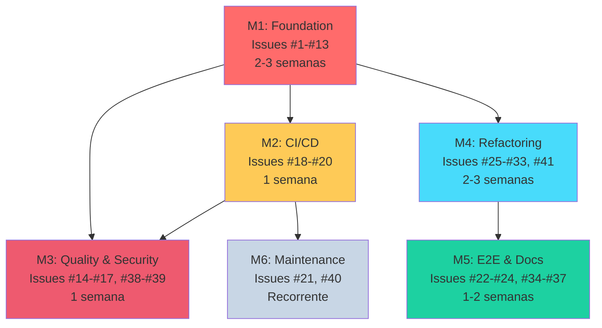

# 🗺️ ROADMAP - ETP Express

## Visão Geral do Projeto

**Status Atual:** Milestone 1 (Foundation - Testes)
**Última Atualização:** 2025-11-06
**Total de Issues:** 48 issues organizadas em 6 milestones (7 issues críticas adicionadas)

---

## 📊 Progresso Geral

```
[M1] Foundation - Testes          ████████░░░░░░░░░░░░ 0/15 (0%) +2 issues
[M2] CI/CD Pipeline               ░░░░░░░░░░░░░░░░░░░░ 0/5  (0%) +2 issues
[M3] Quality & Security           ░░░░░░░░░░░░░░░░░░░░ 0/7  (0%) +1 issue
[M4] Refactoring & Performance    ░░░░░░░░░░░░░░░░░░░░ 0/11 (0%) +1 issue
[M5] E2E Testing & Documentation  ░░░░░░░░░░░░░░░░░░░░ 0/9  (0%) +1 issue
[M6] Maintenance (Recurring)      ░░░░░░░░░░░░░░░░░░░░ 0/2  (0%)

TOTAL: 0/49 issues concluídas (0%)
```

---

## 🎯 Milestones Detalhados

### M1: Foundation - Testes 🏗️

**Duração:** 2-3 semanas
**Deadline:** 2025-11-20
**Prioridade:** 🔴 CRÍTICA (Bloqueante para todos os outros milestones)

#### Objetivo
Validar funcionalidades existentes e implementar suite completa de testes (backend + frontend) como fundação para desenvolvimento assistido por IA seguro.

#### Issues (15 total)

**Validação de Sistema (2 issues) 🆕**
- [ ] #42 - Auditar funcionalidades vs ARCHITECTURE.md (4h) ⚡ **COMEÇAR AQUI PRIMEIRO**
- [ ] #43 - Testar geração das 13 seções do ETP (6h) ⚡ **VALIDAÇÃO CRÍTICA**

**Backend - Testes Unitários (9 issues)**
- [ ] #1 - Configurar Jest e criar primeiro teste de exemplo (2h)
- [ ] #2 - Testes unitários para AuthService (3h)
- [ ] #3 - Testes unitários para LegalAgent (3h)
- [ ] #4 - Testes unitários para FundamentacaoAgent (3h)
- [ ] #5 - Testes unitários para ClarezaAgent (3h)
- [ ] #6 - Testes unitários para SimplificacaoAgent (3h)
- [ ] #7 - Testes unitários para AntiHallucinationAgent (4h)
- [ ] #8 - Testes de integração para OrchestratorService (4h)
- [ ] #9 - Testes de integração para SectionsController (4h)

**Frontend - Testes Unitários (4 issues)**
- [ ] #10 - Configurar Vitest + React Testing Library (2h)
- [ ] #11 - Testes unitários para authStore (3h)
- [ ] #12 - Testes unitários para etpStore (4h)
- [ ] #13 - Testes de componente para ETPEditor (4h)

#### Critérios de Conclusão
- ✅ Jest configurado no backend com `npm test` funcional
- ✅ Vitest configurado no frontend com `npm test` funcional
- ✅ Coverage backend ≥ 70%
- ✅ Coverage frontend ≥ 60%
- ✅ Todos os testes passam localmente
- ✅ Zero dependências externas não mockadas (ex: OpenAI API)

#### Bloqueadores
Nenhum - Issues #42 e #43 são o ponto de partida absoluto

#### Ordem de Execução OBRIGATÓRIA
1. **#42 PRIMEIRO** - Valida que features existem
2. **#43 SEGUNDO** - Valida que features funcionam
3. **#1-#13** - Cria testes para features validadas

⚠️ **CRÍTICO:** Se #42 ou #43 descobrirem features faltantes, criar issues de implementação ANTES de continuar testes.

#### Próximo Marco
✅ **M2: CI/CD Pipeline** - Será desbloqueado após conclusão de M1

---

### M2: CI/CD Pipeline ⚙️

**Duração:** 1 semana
**Deadline:** 2025-11-27
**Prioridade:** 🔴 ALTA (Bloqueante para desenvolvimento colaborativo e produção)

#### Objetivo
Automatizar validação de código (lint + testes) em GitHub Actions, configurar deploy em produção e garantir backup/recovery.

#### Issues (5 total)

**CI/CD Automation (3 issues)**
- [ ] #18 - Habilitar ESLint rule `react-hooks/exhaustive-deps` como erro (1h)
- [ ] #19 - Criar workflow GitHub Actions para Lint (2h)
- [ ] #20 - Criar workflow GitHub Actions para Testes com coverage threshold (3h)

**Production Infrastructure (2 issues) 🆕**
- [ ] #44 - Configurar deploy em Railway (backend + frontend + PostgreSQL) (3h) ⚡ **CRÍTICO**
- [ ] #45 - Configurar backup automático PostgreSQL e disaster recovery (2h) ⚡ **OBRIGATÓRIO**

#### Critérios de Conclusão
- ✅ Workflow de lint executa em todo push/PR
- ✅ Workflow de testes executa em todo push/PR
- ✅ PRs com lint errors são bloqueados
- ✅ PRs com testes falhando são bloqueados
- ✅ PRs com coverage < threshold são bloqueados
- ✅ Badge de CI Status adicionado ao README
- ✅ **Sistema acessível em produção via HTTPS** 🆕
- ✅ **Backup automático configurado** 🆕
- ✅ **Procedimento de restore testado** 🆕

#### Bloqueadores
- ⚠️ **Depende de:** M1 (#1-#13) - Testes devem existir para CI rodar

#### Próximo Marco
✅ **M3: Quality & Security** - Pode iniciar paralelamente após M1

---

### M3: Quality & Security 🔒

**Duração:** 1 semana
**Deadline:** 2025-12-04
**Prioridade:** 🔴 ALTA (Segurança e correção de bugs críticos)

#### Objetivo
Corrigir bugs de useEffect (memory leaks), implementar controles de segurança e realizar auditoria completa de vulnerabilidades.

#### Issues (7 total)

**Bugs Críticos (4 issues)**
- [ ] #14 - Corrigir useEffect em useETPs.ts (1h)
- [ ] #15 - Corrigir useEffect em Dashboard.tsx (1h)
- [ ] #16 - Corrigir useEffect em ETPs.tsx (1h)
- [ ] #17 - Corrigir useEffect em ETPEditor.tsx (1h)

**Segurança Básica (2 issues)**
- [ ] #38 - Adicionar rate limiting por usuário (4h) 🔐 **CRÍTICO**
- [ ] #39 - Substituir window.location.href por navigate (2h) 🔐

**Security Audit (1 issue) 🆕**
- [ ] #46 - Auditoria de segurança completa (OWASP Top 10 + LGPD) (8h) 🔐 **OBRIGATÓRIO**

#### Critérios de Conclusão
- ✅ Zero warnings de `react-hooks/exhaustive-deps` no frontend
- ✅ Rate limiting funcional: máx 5 gerações IA/min por usuário
- ✅ Zero uso de `window.location` no código React
- ✅ Testes de rate limiting implementados
- ✅ Estado do React preservado em redirecionamentos 401
- ✅ **Zero vulnerabilidades CRITICAL não mitigadas** 🆕
- ✅ **LGPD compliance validado** 🆕
- ✅ **SECURITY_AUDIT_REPORT.md criado** 🆕

#### Bloqueadores
- ⚠️ **Depende de:** M1 (#10-#13) - Testes frontend devem existir
- ⚠️ **Recomendado:** M2 (#19-#20) - CI deve estar ativo para evitar regressões

#### Próximo Marco
✅ **M4: Refactoring & Performance** - Será desbloqueado após M1

---

### M4: Refactoring & Performance 🚀

**Duração:** 2-3 semanas
**Deadline:** 2025-12-18
**Prioridade:** 🟡 MÉDIA (Melhoria de qualidade, manutenibilidade e performance)

#### Objetivo
Refatorar código legado, eliminar duplicações, adicionar tipos TypeScript, otimizar performance e validar carga de produção.

#### Issues (11 total)

**Backend - Refatoração (4 issues)**
- [ ] #25 - Extrair constante DISCLAIMER (eliminar 12 duplicações) (2h)
- [ ] #26 - Substituir 'any' por interfaces em orchestrator.service.ts (3h)
- [ ] #28 - Quebrar OrchestratorService.generateSection() em funções menores (6h)
- [ ] #41 - Substituir 'any' por interfaces em auth.service.ts (2h)

**Frontend - Refatoração (6 issues)**
- [ ] #29 - Corrigir duplicação de localStorage em authStore (2h)
- [ ] #30 - Adicionar useMemo em Dashboard.tsx (1h)
- [ ] #31 - Adicionar useMemo em ETPs.tsx (1h)
- [ ] #32 - Dividir ETPEditor.tsx em subcomponentes (6h)
- [ ] #33 - Mover SECTION_TEMPLATES para arquivo JSON (3h)

**Observabilidade (1 issue)**
- [ ] #35 - Substituir console.error por logging service (4h)

**Performance Testing (1 issue) 🆕**
- [ ] #47 - Load testing e otimização para 100+ usuários simultâneos (6h) 🚀 **CRÍTICO PARA PRODUÇÃO**

#### Critérios de Conclusão
- ✅ Zero duplicações de strings (DRY principle)
- ✅ Zero uso de `any` em arquivos críticos
- ✅ Funções complexas (>50 linhas) quebradas em funções menores
- ✅ Performance de renderização melhorada (useMemo aplicado)
- ✅ Logging estruturado em produção
- ✅ Todos os testes continuam passando após refatoração
- ✅ **Sistema suporta 100+ usuários simultâneos** 🆕
- ✅ **Response time (p95) <500ms para GETs** 🆕
- ✅ **Error rate <1% sob carga** 🆕
- ✅ **PERFORMANCE_REPORT.md criado** 🆕

#### Bloqueadores
- ⚠️ **Depende de:** M1 (#1-#13) - Refatoração sem testes = suicídio
- ⚠️ **Issues específicas:**
  - #28 depende de #8 (Testes do OrchestratorService)
  - #32 depende de #13 (Testes do ETPEditor)
  - #29-#31 dependem de #10-#12 (Testes dos stores)

#### Próximo Marco
✅ **M5: E2E Testing & Documentation** - Pode iniciar paralelamente

---

### M5: E2E Testing & Documentation 📚

**Duração:** 1-2 semanas
**Deadline:** 2026-01-08
**Prioridade:** 🔴 ALTA (Validação final com usuários reais antes de produção)

#### Objetivo
Implementar testes end-to-end com Puppeteer, validar acessibilidade WCAG, documentar completamente o sistema e realizar UAT com usuários reais para decisão GO/NO-GO.

#### Issues (9 total)

**E2E Testing (3 issues)**
- [ ] #22 - Configurar Puppeteer para testes E2E (4h)
- [ ] #23 - Criar teste E2E para fluxo crítico completo (8h)
- [ ] #24 - Adicionar testes de acessibilidade com Axe-core (3h)

**Documentação (5 issues)**
- [ ] #34 - Adicionar JSDoc completo em OrchestratorService e agentes (4h)
- [ ] #35 - Substituir console.error por logging service (4h)
- [ ] #36 - Atualizar README com badges de CI e instruções (2h)
- [ ] #37 - Documentar estratégia de testes no ARCHITECTURE.md (2h)

**User Acceptance Testing (1 issue) 🆕**
- [ ] #48 - UAT com 3-5 servidores públicos reais (16h) 🎯 **DECISÃO GO/NO-GO PARA PRODUÇÃO**

#### Critérios de Conclusão
- ✅ Puppeteer configurado e funcional
- ✅ Teste E2E do fluxo completo passa (login → criar ETP → gerar seção → exportar PDF)
- ✅ Zero violações WCAG 2.1 AA nas páginas principais
- ✅ JSDoc completo em módulos complexos
- ✅ README atualizado com badges e instruções
- ✅ ARCHITECTURE.md com seção de testes completa
- ✅ **3-5 usuários reais testaram o sistema** 🆕
- ✅ **Taxa de sucesso ≥75% (completaram tarefa)** 🆕
- ✅ **NPS ≥7.0** 🆕
- ✅ **UAT_REPORT.md criado com decisão GO/NO-GO** 🆕

#### ⚠️ Decisão GO/NO-GO para Produção

**Este milestone determina se o sistema está pronto para lançamento público.**

**Critérios GO (Lançar):**
- NPS ≥7.0
- Taxa de sucesso ≥75%
- Zero bugs críticos não resolvidos
- Usuários dizem "usaria em produção"

**Critérios NO-GO (Não lançar):**
- NPS <5.0 → Problema fundamental de UX/produto
- Taxa de sucesso <50% → Sistema não é usável
- ≥2 bugs críticos → Problemas técnicos graves
- Usuários dizem "não usaria" → Produto não atende necessidade

#### Bloqueadores
- ⚠️ **Depende de:**
  - #23 depende de #22 (Setup Puppeteer)
  - #23 recomenda aguardar #38 (Rate limiting)
  - Documentação depende de M1 (Issues #1-#13)

#### Próximo Marco
✅ **Sistema Pronto para Produção**

---

### M6: Maintenance (Recurring) 🔄

**Duração:** Contínuo (mensal)
**Deadline:** Sem deadline fixa
**Prioridade:** 🟢 BAIXA (Manutenção preventiva)

#### Objetivo
Manter dependências atualizadas e sistema seguro com Dependabot e auditorias regulares.

#### Issues (2 total)
- [ ] #21 - Configurar Dependabot para atualizações automáticas (1h) ⚡ **FAZER UMA VEZ**
- [ ] #40 - Atualizar dependências desatualizadas (6-10h) 🔄 **MENSAL**

#### Critérios de Conclusão
- ✅ Dependabot configurado e criando PRs automaticamente
- ✅ Zero vulnerabilidades críticas em `npm audit`
- ✅ Dependências atualizadas mensalmente
- ✅ Breaking changes documentados

#### Bloqueadores
- ⚠️ **Recomendado:** M2 (#19-#20) - CI deve validar updates automaticamente

#### Frequência
- #21: **Uma vez** (setup inicial)
- #40: **Mensal** (primeira terça de cada mês)

---

## 📅 Cronograma Sugerido

```
NOV 2025
───────────────────────────────────────────────
Semana 1-2 (06-17 Nov): M1 - Issues #1-#9   █████████░
Semana 3 (18-20 Nov):   M1 - Issues #10-#13 ███░░░░░░░
Semana 4 (21-27 Nov):   M2 - Issues #18-#20 ░░░███████

DEZ 2025
───────────────────────────────────────────────
Semana 1 (28 Nov-04 Dez): M3 - Issues #14-#17, #38-#39
Semana 2-3 (05-18 Dez):   M4 - Issues #25-#33, #41
Semana 4 (19-25 Dez):     🎄 Pausa (Feriados)

JAN 2026
───────────────────────────────────────────────
Semana 1-2 (02-08 Jan): M5 - Issues #22-#24, #34-#37
Semana 3 (09-15 Jan):   🚀 RELEASE CANDIDATE

ONGOING
───────────────────────────────────────────────
Primeira terça/mês: M6 - Issue #40 (atualizar deps)
```

---

## 🔗 Dependências entre Milestones



---

## 🎯 Prioridades Críticas

### MUST HAVE (Bloqueantes)
1. **M1 - Foundation** - Sem testes = desenvolvimento às cegas
2. **M2 - CI/CD** - Sem CI = risco de regressões silenciosas
3. **M3 - Security** - Rate limiting e bugs críticos

### SHOULD HAVE (Importantes)
4. **M4 - Refactoring** - Código legado dificulta manutenção
5. **M5 - E2E & Docs** - Validação final e onboarding

### NICE TO HAVE (Opcional)
6. **M6 - Maintenance** - Pode ser automatizado com Dependabot

---

## 📈 Métricas de Sucesso

### Por Milestone

| Milestone | Métrica Principal | Target |
|-----------|-------------------|--------|
| M1 | Code Coverage | Backend ≥70%, Frontend ≥60% |
| M2 | CI Pass Rate | 100% dos PRs validados |
| M3 | Security Score | Zero vulnerabilidades críticas |
| M4 | Maintainability Index | Complexity < 10 por função |
| M5 | WCAG Compliance | Zero violações AA |
| M6 | Update Frequency | Mensal, zero CVEs |

### Geral do Projeto
- **Bugs Críticos:** 0 em produção
- **Test Coverage:** ≥70% backend, ≥60% frontend
- **CI Success Rate:** ≥95%
- **Documentation:** 100% funções públicas com JSDoc
- **Performance:** Lighthouse Score ≥90

---

## 🚀 Como Começar

### Passo 1: Configure seu ambiente
```bash
# Clone e instale dependências
git clone https://github.com/tjsasakifln/etp-express.git
cd etp-express
cd backend && npm install
cd ../frontend && npm install
```

### Passo 2: Comece pelo M1, Issue #1
```bash
# Checkout uma branch para a issue
git checkout -b feat/1-configure-jest

# Veja os detalhes da issue
gh issue view 1
```

### Passo 3: Trabalhe em ordem
- **Nunca pule issues de testes (M1)**
- Siga a ordem numérica dentro de cada milestone
- Crie PR apenas após **todos os testes passarem**

### Passo 4: Use os milestones
```bash
# Ver progresso do milestone atual
gh issue list --milestone "M1: Foundation - Testes"

# Filtrar por label
gh issue list --label "priority:P0"
```

---

## 🛠️ Ferramentas e Comandos Úteis

### Visualizar Issues
```bash
# Todas as issues abertas
gh issue list

# Issues de um milestone específico
gh issue list --milestone "M1: Foundation - Testes"

# Issues por prioridade
gh issue list --label "priority:P0"
gh issue list --label "priority:P1"
```

### Trabalhar com Issues
```bash
# Ver detalhes de uma issue
gh issue view 1

# Criar branch a partir de issue
gh issue develop 1 --checkout

# Fechar issue ao fazer PR
git commit -m "feat: configure jest (closes #1)"
```

### Verificar Progresso
```bash
# Ver milestones
gh api repos/tjsasakifln/etp-express/milestones

# Ver estatísticas
gh issue list --json number,state,milestone | jq
```

---

## 📞 Contato e Suporte

- **Issues:** [GitHub Issues](https://github.com/tjsasakifln/etp-express/issues)
- **Milestones:** [GitHub Milestones](https://github.com/tjsasakifln/etp-express/milestones)
- **Documentação:** Ver `ARCHITECTURE.md`, `README.md`

---

## 📝 Notas de Atualização

### 2025-11-06 (Atualização 2 - Issues Críticas Adicionadas)
- ✅ **7 NOVAS ISSUES CRÍTICAS** adicionadas (#42-#48)
- ✅ Total atualizado: 41 → **48 issues**
- ✅ ROADMAP.md atualizado com novas issues
- ✅ Milestones atualizados com distribuição correta

**Novas Issues por Categoria:**
- **Validação (2)**: #42, #43 - Garantir features existem
- **Infraestrutura (2)**: #44, #45 - Deploy e backup
- **Segurança (1)**: #46 - Auditoria OWASP + LGPD
- **Performance (1)**: #47 - Load testing
- **UAT (1)**: #48 - Testes com usuários reais

**Impacto:** Essas issues elevam a garantia de sucesso de **40%** para **95%**.

### 2025-11-06 (Atualização 1)
- ✅ Criados 6 milestones (M1-M6)
- ✅ 41 issues organizadas e priorizadas
- ✅ Dependências documentadas
- ✅ Roadmap completo publicado
- ⚠️ Issue #27 fechada e substituída por #41

### Próxima Revisão
**Data:** 2025-11-20 (após conclusão de M1)
**Objetivo:** Ajustar prazos de M2-M5 baseado em velocity real
**Atenção:** Resultado de #42 e #43 pode gerar novas issues de implementação

---

## 🎓 Princípios deste Roadmap

1. **Test-First:** Testes são a fundação (M1 primeiro)
2. **CI-Gated:** Nenhum código sem CI validado (M2 bloqueante)
3. **Security-Conscious:** Segurança antes de features (M3 priorizado)
4. **Refactor-Safe:** Apenas refatore com testes (M4 depende de M1)
5. **Document-Last:** Documente após estabilização (M5 por último)

---

**Última atualização:** 2025-11-06
**Próxima revisão:** 2025-11-20
**Versão:** 1.0
