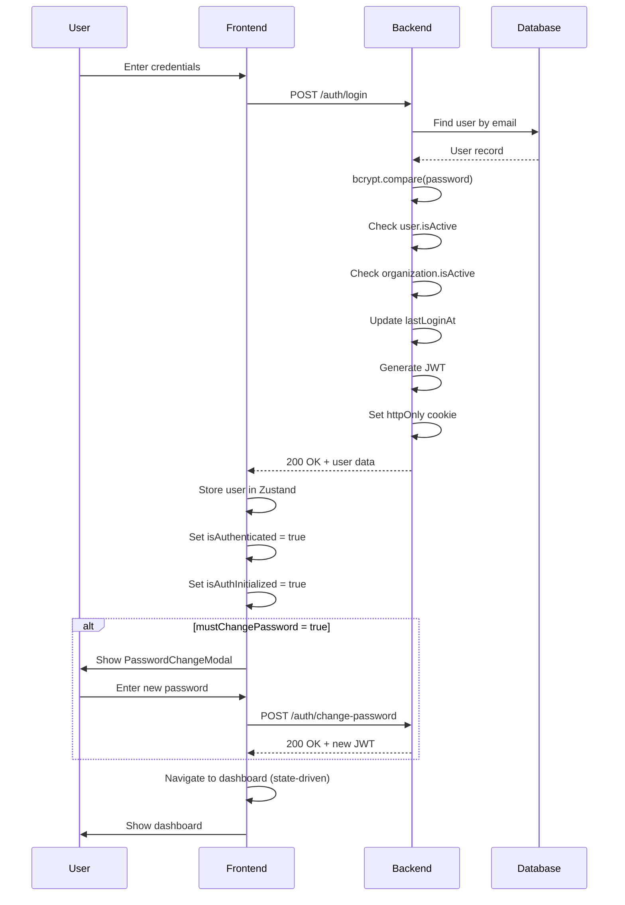

# Authentication Architecture - ETP Express

**Last Updated:** 2025-12-27 | **Version:** 1.0

---

## Table of Contents

1. [Overview](#overview)
2. [httpOnly Cookie Strategy](#httponly-cookie-strategy)
3. [Backend Authentication](#backend-authentication)
4. [Frontend Authentication State](#frontend-authentication-state)
5. [isAuthInitialized State Machine](#isauthinitialized-state-machine)
6. [State-Driven Navigation](#state-driven-navigation)
7. [Login Flow Sequence](#login-flow-sequence)
8. [Protected Routes](#protected-routes)
9. [Multi-Tenancy Integration](#multi-tenancy-integration)
10. [Security Features](#security-features)
11. [Troubleshooting](#troubleshooting)

---

## Overview

ETP Express implements a **stateless JWT-based authentication system** with enterprise-grade security features:

- **httpOnly cookies** for XSS protection
- **State-driven navigation** for predictable routing
- **Multi-tenancy support** via email domain binding
- **Role-based access control** (RBAC)
- **Mandatory password change** for new users
- **Dual-key JWT rotation** for zero-downtime secret updates

### Architecture Summary

```
┌─────────────────────────────────────────────────────────────────┐
│                         FRONTEND                                 │
│  ┌─────────────┐   ┌──────────────┐   ┌───────────────────┐     │
│  │ AuthStore   │──▶│ ProtectedRoute│──▶│ Dashboard/Pages  │     │
│  │ (Zustand)   │   │ (State-Driven)│   │                  │     │
│  └──────┬──────┘   └──────────────┘   └───────────────────┘     │
│         │                                                        │
│         ▼                                                        │
│  ┌─────────────────────────────────────────────────────────────┐ │
│  │              Axios API Client (withCredentials: true)       │ │
│  │              401 Interceptor → clearAuth() → /login         │ │
│  └──────────────────────────────┬──────────────────────────────┘ │
└─────────────────────────────────┼────────────────────────────────┘
                                  │ httpOnly Cookie (automatic)
                                  ▼
┌─────────────────────────────────────────────────────────────────┐
│                         BACKEND                                  │
│  ┌──────────────┐   ┌──────────────┐   ┌───────────────────┐    │
│  │ JwtStrategy  │──▶│ JwtAuthGuard │──▶│ Controllers       │    │
│  │ (Cookie +    │   │ (@Public)    │   │ (Protected)       │    │
│  │  Bearer)     │   └──────────────┘   └───────────────────┘    │
│  └──────────────┘                                                │
│         │                                                        │
│         ▼                                                        │
│  ┌─────────────────────────────────────────────────────────────┐ │
│  │              AuthService                                     │ │
│  │  - validateUser() - login() - register() - logout()         │ │
│  │  - changePassword() - forgotPassword() - resetPassword()    │ │
│  └─────────────────────────────────────────────────────────────┘ │
└─────────────────────────────────────────────────────────────────┘
```

---

## httpOnly Cookie Strategy

### Why httpOnly Cookies?

Traditional JWT storage (localStorage/sessionStorage) is vulnerable to XSS attacks. JavaScript can access these storage mechanisms, allowing malicious scripts to steal tokens.

**httpOnly cookies** are:

- Inaccessible from JavaScript (`document.cookie` cannot read them)
- Automatically sent with every request to the same origin
- Protected against XSS token theft

### Cookie Configuration

| Property   | Production | Development | Purpose                             |
| ---------- | ---------- | ----------- | ----------------------------------- |
| `httpOnly` | `true`     | `true`      | Prevents JS access (XSS protection) |
| `secure`   | `true`     | `false`     | HTTPS only in production            |
| `sameSite` | `'none'`   | `'lax'`     | Cross-origin Railway subdomains     |
| `maxAge`   | 24h        | 24h         | Cookie lifetime                     |
| `path`     | `'/'`      | `'/'`       | Available for all routes            |

### Cross-Origin Consideration

ETP Express is deployed on Railway with separate subdomains:

- Frontend: `etp-express-frontend-*.railway.app`
- Backend: `etp-express-backend-*.railway.app`

Since these are different origins, `SameSite=Lax` would block cookies in AJAX requests. Production uses `SameSite=None` with `Secure=true` to allow cross-origin cookie transmission.

**Source:** `backend/src/modules/auth/auth.controller.ts:81-91`

---

## Backend Authentication

### JWT Token Structure

```typescript
interface JwtPayload {
  sub: string; // User UUID
  email: string; // User email
  name: string; // User display name
  role: UserRole; // system_admin | domain_manager | user
  organizationId: string; // Tenant ID
  mustChangePassword: boolean; // First-login password change required
}
```

**Token Expiration:** 7 days (configurable via `JWT_EXPIRATION` env variable)

### Authentication Endpoints

| Endpoint                | Method | Auth   | Purpose                      |
| ----------------------- | ------ | ------ | ---------------------------- |
| `/auth/register`        | POST   | Public | Register new user            |
| `/auth/login`           | POST   | Public | Authenticate user            |
| `/auth/me`              | GET    | JWT    | Get current user profile     |
| `/auth/validate`        | POST   | JWT    | Validate token (lightweight) |
| `/auth/logout`          | POST   | JWT    | Clear cookie and logout      |
| `/auth/change-password` | POST   | JWT    | Change password              |
| `/auth/forgot-password` | POST   | Public | Initiate password reset      |
| `/auth/reset-password`  | POST   | Public | Complete password reset      |

### JWT Extraction Strategy

The backend supports dual extraction for flexibility:

```typescript
const cookieExtractor = (req: Request): string | null => {
  // Primary: httpOnly cookie (production)
  if (req?.cookies?.[JWT_COOKIE_NAME]) {
    return req.cookies[JWT_COOKIE_NAME];
  }

  // Fallback: Authorization header (API testing)
  const authHeader = req?.headers?.authorization;
  if (authHeader?.startsWith('Bearer ')) {
    return authHeader.substring(7);
  }

  return null;
};
```

**Source:** `backend/src/modules/auth/strategies/jwt.strategy.ts:27-40`

### Dual-Key JWT Rotation

For zero-downtime secret rotation:

1. Deploy with both `JWT_SECRET` (new) and `JWT_SECRET_OLD` (current)
2. JwtStrategy validates against primary, then fallback
3. New tokens use primary secret
4. After rotation window, remove `JWT_SECRET_OLD`

**Source:** `backend/src/modules/auth/strategies/jwt.strategy.ts:68-104`

---

## Frontend Authentication State

### Zustand Store Structure

```typescript
interface AuthState {
  user: User | null;
  isAuthenticated: boolean;
  isLoading: boolean;
  isAuthInitialized: boolean; // Critical for preventing flash
  error: string | null;

  // Actions
  login: (credentials) => Promise<void>;
  register: (data) => Promise<void>;
  logout: () => Promise<void>;
  checkAuth: () => Promise<boolean>;
  clearAuth: () => void;
  changePassword: (data) => Promise<void>;
}
```

### Persistence Strategy

Only `user` and `isAuthenticated` are persisted to localStorage:

```typescript
persist(
  (set, get) => ({
    /* state */
  }),
  {
    name: 'auth-storage',
    partialize: (state) => ({
      user: state.user,
      isAuthenticated: state.isAuthenticated,
    }),
  },
);
```

**Why?** The JWT remains in the httpOnly cookie (not accessible). Persisting user data allows instant UI rendering while `checkAuth()` validates the cookie server-side.

**Source:** `frontend/src/store/authStore.ts`

---

## isAuthInitialized State Machine

### The Problem: Flash of Login Screen

Without `isAuthInitialized`, this happens on page refresh:

```
1. App loads → isAuthenticated = false (localStorage loading)
2. ProtectedRoute sees false → redirects to /login
3. checkAuth() completes → isAuthenticated = true
4. User sees login screen briefly → then dashboard

Result: Jarring UX with "flash of login"
```

### The Solution: Deferred Rendering

```
State Flow:

┌─────────────────────────────────────────────────────────────┐
│                     APP STARTUP                              │
│                          │                                   │
│                          ▼                                   │
│              isAuthInitialized = false                       │
│              (ProtectedRoute shows loading)                  │
│                          │                                   │
│                          ▼                                   │
│                    checkAuth()                               │
│                    GET /auth/me                              │
│                          │                                   │
│              ┌──────────┴──────────┐                        │
│              ▼                     ▼                        │
│         200 OK                  401 Error                   │
│         user = data             user = null                 │
│         isAuthenticated=true    isAuthenticated=false       │
│              │                     │                        │
│              └──────────┬──────────┘                        │
│                         ▼                                   │
│              isAuthInitialized = true                       │
│              (ProtectedRoute renders)                       │
└─────────────────────────────────────────────────────────────┘
```

### Implementation

```typescript
// In ProtectedRoute
if (!isAuthInitialized) {
  return <LoadingState message="Verificando autenticação..." />;
}

if (!isAuthenticated) {
  return <Navigate to="/login" replace />;
}

return children;
```

**Key Insight:** `isAuthInitialized` is set to `true` regardless of auth outcome. It signals "auth check complete", not "user is authenticated".

---

## State-Driven Navigation

### Why Not Imperative Navigation?

**Imperative approach (problematic):**

```typescript
// Race conditions, timing issues, recovery problems
async function login(credentials) {
  await authService.login(credentials);
  navigate('/dashboard'); // What if state hasn't updated yet?
}
```

**State-driven approach (current):**

```typescript
// Routes react to state changes automatically
function ProtectedRoute({ children }) {
  const { isAuthenticated } = useAuth();

  if (!isAuthenticated) {
    return <Navigate to="/login" replace />;
  }

  return children;
}
```

### Benefits

| Aspect              | State-Driven                        | Imperative                           |
| ------------------- | ----------------------------------- | ------------------------------------ |
| **Predictability**  | Routes express intent declaratively | Navigation scattered across handlers |
| **Race Conditions** | React handles re-renders            | Manual timing management             |
| **Recovery**        | State change triggers navigation    | Requires manual recovery logic       |
| **Testing**         | Mock state, verify routes           | Mock navigation calls                |

### Implementation Pattern

```tsx
// Login component - sets state, doesn't navigate
const handleLogin = async (e: FormEvent) => {
  e.preventDefault();
  await login({ email, password });
  // No navigate() call! State change triggers <Navigate>
};

// In App.tsx routing
<Route
  path="/login"
  element={
    isAuthenticated ? (
      <Navigate to="/" replace /> // State-driven redirect
    ) : (
      <LoginPage />
    )
  }
/>;
```

**Source:** `frontend/src/App.tsx:199-230`

---

## Login Flow Sequence



---

## Protected Routes

### Route Hierarchy

```
/                          → ProtectedRoute (any authenticated user)
├── /dashboard             → ProtectedRoute
├── /etps/*                → ProtectedRoute
├── /admin/*               → AdminProtectedRoute (system_admin only)
└── /manager/*             → ManagerProtectedRoute (domain_manager only)
```

### Role-Based Route Guards

```typescript
// AdminProtectedRoute
function AdminProtectedRoute({ children }) {
  const { user, isAuthInitialized } = useAuth();

  if (!isAuthInitialized) {
    return <LoadingState />;
  }

  if (user?.role !== 'system_admin') {
    return <Navigate to="/" replace />;
  }

  return children;
}
```

**Sources:**

- `frontend/src/components/auth/AdminProtectedRoute.tsx`
- `frontend/src/components/auth/ManagerProtectedRoute.tsx`

---

## Multi-Tenancy Integration

### Email Domain Binding

During registration, the backend automatically assigns users to organizations based on email domain:

```typescript
// Extract domain from email
const emailDomain = email.split('@')[1].toLowerCase();

// Find organization with matching domain
const organization = await organizationRepository.findOne({
  where: {
    allowedDomains: ArrayContains([emailDomain]),
    isActive: true,
  },
});

if (!organization) {
  throw new BadRequestException({
    message: 'Domínio de email não autorizado',
    code: AuthErrorCode.ORG_NOT_FOUND,
  });
}
```

### Implications

- Users can only register with whitelisted email domains
- Organization is automatically assigned (no manual selection)
- JWT includes `organizationId` for tenant isolation
- All API queries are scoped by organization

**Source:** `backend/src/modules/auth/auth.service.ts:322-337`

---

## Security Features

### Rate Limiting

| Endpoint                | Limit  | Purpose                      |
| ----------------------- | ------ | ---------------------------- |
| `/auth/register`        | 3/hour | Abuse prevention             |
| `/auth/login`           | 5/60s  | Brute force protection       |
| `/auth/change-password` | 3/60s  | Account takeover prevention  |
| `/auth/forgot-password` | 3/hour | Spam prevention              |
| `/auth/reset-password`  | 5/60s  | Token brute force protection |

### Password Requirements

- 8-128 characters
- At least 1 uppercase letter
- At least 1 lowercase letter
- At least 1 number
- At least 1 special character

### Error Codes

```typescript
enum AuthErrorCode {
  INVALID_CREDENTIALS = 'INVALID_CREDENTIALS',
  USER_INACTIVE = 'USER_INACTIVE',
  NO_ORGANIZATION = 'NO_ORGANIZATION',
  ORG_INACTIVE = 'ORG_INACTIVE',
  ORG_NOT_FOUND = 'ORG_NOT_FOUND',
  ACCOUNT_LOCKED = 'ACCOUNT_LOCKED',
}
```

### Security Design Decisions

| Decision              | Benefit                      | Trade-off                  |
| --------------------- | ---------------------------- | -------------------------- |
| httpOnly Cookies      | Prevents XSS token theft     | Can't access token from JS |
| SameSite=None (prod)  | Cross-origin Railway support | Requires Secure flag       |
| Dual extraction       | API testing flexibility      | Slight complexity          |
| Email domain binding  | Automatic tenant assignment  | Requires whitelist setup   |
| Always-success forgot | Prevents email enumeration   | Users can't verify email   |

---

## Troubleshooting

### Common Issues

#### 1. "Flash of Login" on Page Refresh

**Symptom:** User briefly sees login page before dashboard loads.

**Cause:** `isAuthInitialized` not being checked before rendering routes.

**Solution:** Ensure ProtectedRoute waits for `isAuthInitialized`:

```typescript
if (!isAuthInitialized) {
  return <LoadingState />;
}
```

#### 2. Cookie Not Sent in API Requests

**Symptom:** 401 errors on authenticated requests.

**Causes & Solutions:**

| Cause                     | Solution                                     |
| ------------------------- | -------------------------------------------- |
| Missing `withCredentials` | Add `withCredentials: true` to axios config  |
| SameSite mismatch         | Use `SameSite=None; Secure` for cross-origin |
| Different domains         | Ensure CORS allows credentials               |

#### 3. Infinite Redirect Loop (Login ↔ Dashboard)

**Symptom:** Page constantly redirects between login and dashboard.

**Causes & Solutions:**

| Cause                                    | Solution                                      |
| ---------------------------------------- | --------------------------------------------- |
| `checkAuth()` clearing state incorrectly | Verify 401 handling doesn't clear valid state |
| Stale localStorage                       | Clear localStorage and re-authenticate        |
| Multiple auth checks                     | Ensure single `checkAuth()` call on mount     |

#### 4. Token Expired but User Sees Stale Dashboard

**Symptom:** User can view pages but all API calls fail with 401.

**Cause:** 401 interceptor not clearing auth state properly.

**Solution:** Verify interceptor calls `clearAuth()`:

```typescript
api.interceptors.response.use(
  (response) => response,
  (error: AxiosError) => {
    if (error.response?.status === 401) {
      useAuthStore.getState().clearAuth();
      navigate('/login');
    }
    return Promise.reject(error);
  },
);
```

#### 5. Organization Not Found on Registration

**Symptom:** "Domínio de email não autorizado" error.

**Cause:** Email domain not in any organization's `allowedDomains`.

**Solution:**

1. Verify organization exists and is active
2. Add email domain to organization's `allowedDomains` array
3. Ensure domain is lowercase

#### 6. mustChangePassword Modal Won't Close

**Symptom:** Password change modal appears but can't be dismissed.

**Cause:** By design - modal is intentionally blocking.

**Solution:** User must successfully change password. Modal cannot be dismissed until:

1. Old password is validated
2. New password meets requirements
3. Backend returns success

#### 7. JWT Secret Rotation Failures

**Symptom:** Some users get 401 after secret rotation.

**Cause:** Rotation window too short or old secret removed prematurely.

**Solution:**

1. Deploy with both `JWT_SECRET` and `JWT_SECRET_OLD`
2. Wait for token expiration period (7 days default)
3. Only then remove `JWT_SECRET_OLD`

### Debug Checklist

```bash
# Check cookie presence (browser DevTools > Application > Cookies)
# Look for 'jwt' cookie with httpOnly flag

# Verify CORS headers (Network tab)
# Should see: Access-Control-Allow-Credentials: true

# Check request headers
# Should see: credentials: 'include' in fetch/axios

# Verify environment variables
# JWT_SECRET, JWT_EXPIRATION, NODE_ENV
```

### Error Response Format

All auth errors follow this structure:

```json
{
  "message": "Human-readable message",
  "code": "AUTH_ERROR_CODE",
  "statusCode": 401
}
```

Frontend can use `code` for conditional handling:

```typescript
if (error.code === 'MUST_CHANGE_PASSWORD') {
  showPasswordChangeModal();
}
```

---

## References

- **Backend Auth Module:** `backend/src/modules/auth/`
- **Frontend Auth Store:** `frontend/src/store/authStore.ts`
- **Protected Routes:** `frontend/src/App.tsx`
- **API Client:** `frontend/src/lib/api.ts`
- **Related Issues:** #943, #944, #981

---

_Documentation generated for ETP Express v1.0_
