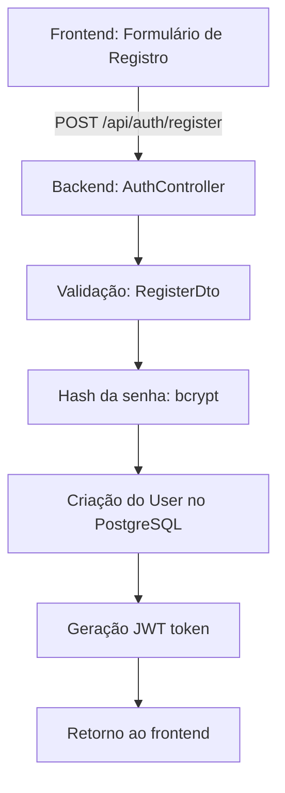
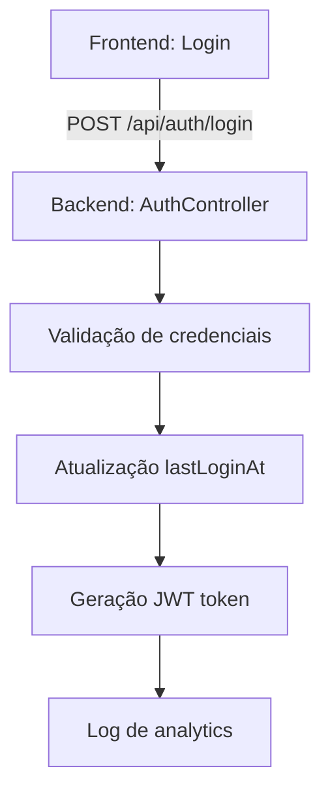
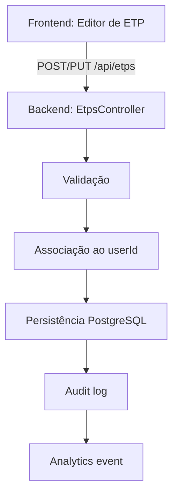
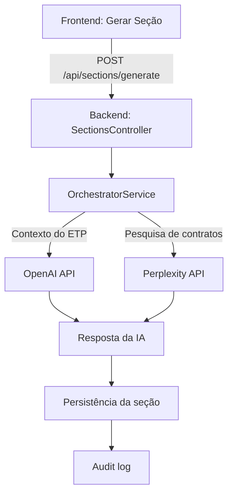
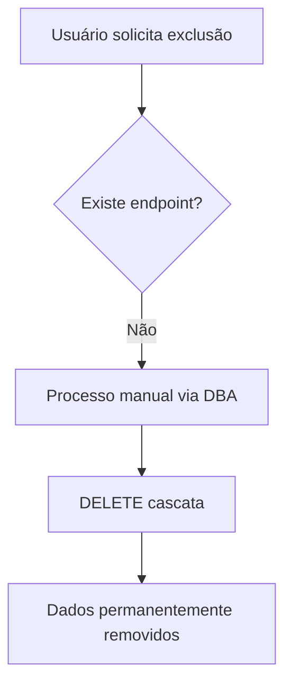
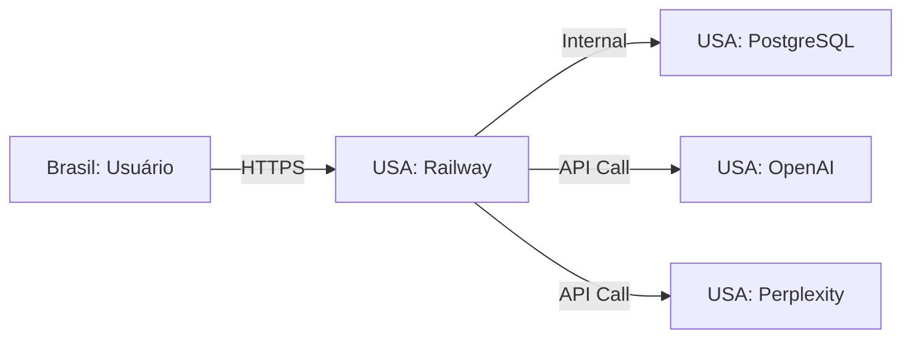

# Mapeamento de Dados Pessoais - LGPD

Este documento mapeia o ciclo de vida completo dos dados pessoais no sistema ETP Express, conforme exigido pela Lei Geral de Proteção de Dados (LGPD - Lei 13.709/2018).

---

## 1. Inventário de Dados Pessoais

### 1.1 Dados Coletados por Categoria

| Categoria | Dado | Tabela/Campo | Classificação | Finalidade |
|-----------|------|--------------|---------------|------------|
| **Identificadores** | Nome completo | `users.name` | Pessoal | Identificação do usuário |
| | Email | `users.email` | Pessoal | Autenticação e comunicação |
| | ID do usuário (UUID) | `users.id` | Identificador | Referência interna |
| **Profissionais** | Orgao/Instituição | `users.orgao` | Pessoal | Contextualização do ETP |
| | Cargo | `users.cargo` | Pessoal | Contextualização do ETP |
| | Papel no sistema | `users.role` | Técnico | Controle de acesso |
| **Autenticação** | Senha (hash bcrypt) | `users.password` | Sensível | Autenticação |
| | Último login | `users.lastLoginAt` | Comportamental | Auditoria |
| **Técnicos/Rede** | Endereço IP | `analytics_events.ipAddress`, `audit_logs.ipAddress` | Pessoal | Segurança/Auditoria |
| | User Agent | `analytics_events.userAgent`, `audit_logs.userAgent` | Técnico | Diagnóstico |
| | Session ID | `analytics_events.sessionId` | Técnico | Rastreamento de sessão |
| | Referer | `analytics_events.referer` | Técnico | Analytics |
| **Conteúdo** | Texto dos ETPs | `etps.*`, `etp_sections.content` | Institucional* | Funcionalidade principal |
| | Input do usuário | `etp_sections.userInput` | Potencial pessoal* | Geração de conteúdo |

> *ETPs podem conter dados pessoais indiretos (nomes de responsáveis técnicos, etc.) dentro do campo `metadata` ou conteúdo das seções.

### 1.2 Dados Derivados/Calculados

| Dado | Origem | Tabela/Campo | Uso |
|------|--------|--------------|-----|
| Data de criação da conta | Sistema | `users.createdAt` | Auditoria |
| Data de atualização | Sistema | `users.updatedAt` | Rastreabilidade |
| Status da conta | Lógica de negócio | `users.isActive` | Controle de acesso |
| Histórico de ações | Tracking | `audit_logs.*` | Compliance/Debug |
| Métricas de uso | Analytics | `analytics_events.*` | Melhoria do serviço |

---

## 2. Fluxo de Coleta de Dados

### 2.1 Registro de Usuário

**Dados coletados:**
- `email` (obrigatório)
- `password` (obrigatório, hasheado com bcrypt)
- `name` (obrigatório)
- `orgao` (opcional)
- `cargo` (opcional)

**Arquivo fonte:** `backend/src/modules/auth/dto/register.dto.ts`

### 2.2 Login/Autenticação

**Dados processados:**
- `email` (verificação)
- `password` (comparação de hash)
- `lastLoginAt` (atualização)
- `ipAddress`, `userAgent` (logging)

### 2.3 Criação/Edição de ETPs

**Dados coletados:**
- Conteúdo do ETP (texto institucional)
- Metadados (`orgao`, `responsavelTecnico`, etc.)
- `createdById` (associação ao usuário)

### 2.4 Geração de Seções com IA

**Dados enviados a terceiros:**
- Contexto do ETP (texto institucional)
- Prompt do sistema (não contém dados pessoais)
- Objeto da contratação

---

## 3. Armazenamento de Dados

### 3.1 Banco de Dados Principal

| Tabela | Dados Pessoais | Retenção | Criptografia |
|--------|----------------|----------|--------------|
| `users` | Nome, email, senha (hash), orgao, cargo | Enquanto ativo | Em repouso: PostgreSQL encryption |
| `etps` | `createdById` (FK) | Enquanto ativo | Em repouso |
| `etp_sections` | Conteúdo pode conter dados indiretos | Enquanto ativo | Em repouso |
| `etp_versions` | `createdByName` | Enquanto ativo | Em repouso |
| `analytics_events` | IP, userId, userAgent | 1 ano (anonimizar) | Em repouso |
| `audit_logs` | userId, IP, userAgent | 90 dias | Em repouso |
| `secret_access_logs` | IP, accessedBy | 90 dias | Em repouso |

### 3.2 Infraestrutura

| Componente | Localização | Provedor | Dados Armazenados |
|------------|-------------|----------|-------------------|
| Aplicação | USA (Railway) | Railway | Logs temporários, variáveis de ambiente |
| Database | USA (Railway) | Railway PostgreSQL | Todos os dados da aplicação |
| Backups | USA (Railway) | Railway | Snapshot do banco |

> **ATENÇÃO:** Dados armazenados fora do Brasil (USA) - verificar se há necessidade de consentimento adicional conforme LGPD Art. 33.

### 3.3 Logs e Caches

| Tipo | Localização | Retenção | Dados |
|------|-------------|----------|-------|
| Logs de aplicação | Railway | 7 dias | Erros, warnings (podem conter dados pessoais) |
| Cache | Memória (local) | Sessão | Não persistente |

---

## 4. Compartilhamento com Terceiros

### 4.1 Provedores de IA (Processamento)

| Provedor | Dados Compartilhados | Finalidade | Base Legal LGPD |
|----------|---------------------|------------|-----------------|
| **OpenAI** | Contexto do ETP, prompt | Geração de texto | Legítimo interesse (Art. 7º, IX) |
| **Perplexity** | Queries de pesquisa, contexto | Pesquisa de contratos similares | Legítimo interesse (Art. 7º, IX) |

**Mitigações implementadas:**
- Dados pessoais diretos (nome, email) NÃO são enviados às APIs
- Contexto é limitado ao necessário para geração
- APIs têm políticas de não-retenção para API calls

### 4.2 Infraestrutura (Armazenamento)

| Provedor | Dados Armazenados | Localização | DPA |
|----------|-------------------|-------------|-----|
| **Railway** | Todos os dados | USA | Verificar ToS |
| **PostgreSQL (via Railway)** | Banco de dados | USA | Verificar ToS |

---

## 5. Fluxo de Processamento

### 5.1 Operações com Dados Pessoais

| Operação | Dados Envolvidos | Base Legal | Finalidade |
|----------|------------------|------------|------------|
| Criar conta | email, nome, senha, orgao, cargo | Execução de contrato (Art. 7º, V) | Acesso ao serviço |
| Login | email, senha, IP | Execução de contrato | Autenticação |
| Criar ETP | userId (FK) | Execução de contrato | Funcionalidade |
| Gerar seção | Contexto (pode ter dados indiretos) | Legítimo interesse | Funcionalidade |
| Analytics | userId, IP, userAgent | Legítimo interesse | Melhoria do serviço |
| Auditoria | userId, IP, ações | Obrigação legal (Art. 7º, II) | Compliance |

### 5.2 Profiling e Decisões Automatizadas

| Tipo | Presente? | Descrição |
|------|-----------|-----------|
| Profiling | Não | Sistema não cria perfis comportamentais |
| Decisões automatizadas | Parcial | IA gera conteúdo, mas usuário revisa |
| Score de crédito | Não | Não aplicável |

---

## 6. Fluxo de Exclusão

### 6.1 Processo Atual

**Status atual:** ❌ Não há endpoint de self-service para exclusão de conta.

### 6.2 Dados Residuais

| Tipo | Status | Risco |
|------|--------|-------|
| Backups | Dados podem persistir por até 30 dias | Médio |
| Logs Railway | Dados podem conter PII por até 7 dias | Baixo |
| Analytics (anonimizados) | userId deveria ser NULL após exclusão | Baixo |
| Audit logs | Mantém userId para compliance | Baixo (justificado) |

---

## 7. Terceiros e Transferências Internacionais

### 7.1 Mapa de Transferências

### 7.2 Conformidade LGPD Art. 33

| Requisito | Status | Ação Necessária |
|-----------|--------|-----------------|
| Consentimento específico | ❌ | Implementar no registro |
| País com proteção adequada | ❌ (USA não é) | Cláusulas contratuais padrão |
| Cláusulas contratuais padrão | ⚠️ | Verificar ToS dos provedores |
| Cooperação jurídica internacional | N/A | Não aplicável |

---

## 8. Resumo de Sensibilidade

### 8.1 Classificação de Dados

| Nível | Dados | Proteção |
|-------|-------|----------|
| **Alto** | Senha (hash) | Bcrypt, nunca em logs, exclusão @Exclude |
| **Médio** | Email, nome, IP | Validação, sanitização, acesso restrito |
| **Baixo** | Orgao, cargo | Validação básica |
| **Institucional** | Conteúdo dos ETPs | Acesso por ownership |

### 8.2 Gaps Identificados

| Gap | Impacto | Prioridade | Issue Relacionada |
|-----|---------|------------|-------------------|
| Sem endpoint de export de dados | Alto | P1 | #113 |
| Sem endpoint de delete de conta | Alto | P1 | #113 |
| Transferência internacional sem consentimento explícito | Médio | P1 | #192 |
| Sem política de retenção automatizada | Médio | P2 | #194 |
| Dados pessoais podem estar em logs | Baixo | P3 | - |

---

## 9. Referências

### 9.1 Arquivos Fonte

- **Entities:** `backend/src/entities/*.entity.ts`
- **DTOs:** `backend/src/modules/*/dto/*.dto.ts`
- **LLM Services:** `backend/src/modules/orchestrator/llm/`, `backend/src/modules/search/perplexity/`

### 9.2 Legislação

- **LGPD:** Lei 13.709/2018
- **Art. 5º:** Definições de dados pessoais
- **Art. 7º:** Bases legais para tratamento
- **Art. 18:** Direitos do titular
- **Art. 33:** Transferência internacional

---

## 10. Histórico de Atualizações

| Data | Versão | Autor | Descrição |
|------|--------|-------|-----------|
| 2025-11-19 | 1.0 | Claude (Engenheiro-Executor) | Versão inicial - mapeamento completo |

---

**Documento criado como parte da auditoria LGPD - Issue #191**

Para próximos passos, consulte:
- #192 - Verificar consentimento
- #193 - Validar criptografia
- #194 - Política de retenção
- #195 - Direitos do titular
- #196 - Política de privacidade
- #197 - Relatório final
