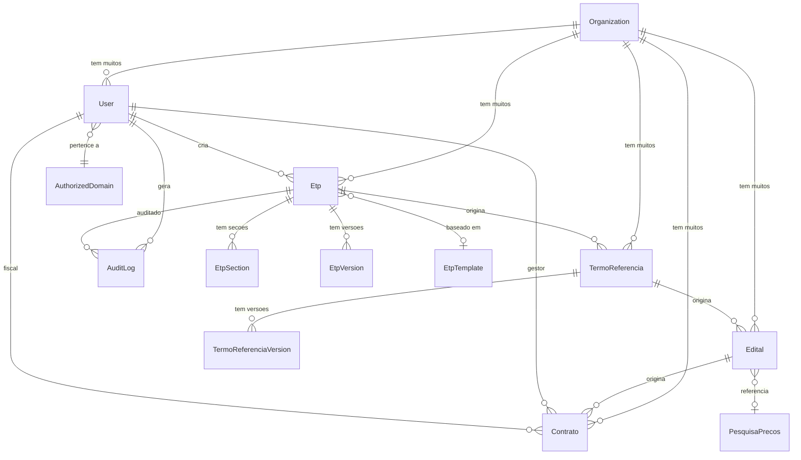
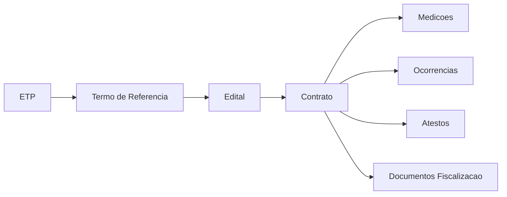
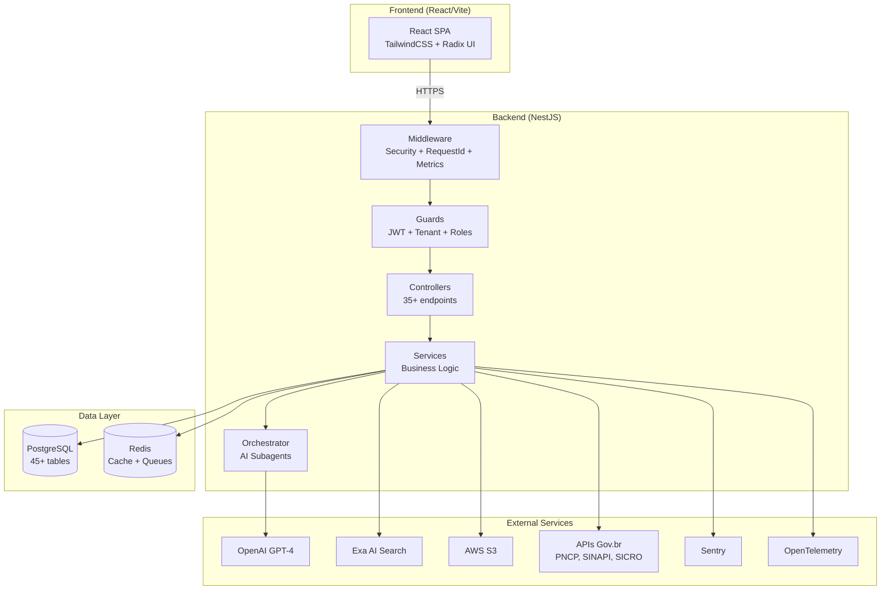

# System Architecture - ETP Express

## Sumario Executivo

O **ETP Express** e um sistema assistivo de elaboracao de **Estudos Tecnicos Preliminares (ETPs)** para contratacoes publicas brasileiras, conforme a Lei 14.133/2021 (Nova Lei de Licitacoes). Trata-se de um wrapper de LLM que utiliza inteligencia artificial para auxiliar servidores publicos na elaboracao de documentos do ciclo completo de contratacao: **ETP -> Termo de Referencia -> Edital -> Contrato**.

O projeto e um **monorepo** composto por backend (NestJS) e frontend (React/Vite), deployado no Railway com banco PostgreSQL e Redis. Implementa multi-tenancy B2G (Business-to-Government) com isolamento por coluna organizationId.

**Disclaimer:** Sistema assistivo -- nao substitui responsabilidade administrativa. Validacao humana obrigatoria.

---

## Tech Stack

### Backend

| Tecnologia | Versao | Funcao |
|---|---|---|
| Node.js | >= 20.0.0 | Runtime |
| NestJS | 11.x | Framework principal |
| TypeScript | 5.3.x | Linguagem |
| TypeORM | 0.3.19 | ORM / Migrations |
| PostgreSQL | - | Banco de dados relacional |
| Redis / ioredis | 5.8.x | Cache, filas (BullMQ) |
| BullMQ | 5.65.x | Filas de jobs asincronos |
| Passport + JWT | 0.7 / 4.0.1 | Autenticacao |
| OpenAI SDK | 6.15.x | Geracao de conteudo via GPT-4 |
| Exa AI (exa-js) | 2.0.x | Busca de contratacoes similares |
| AWS SDK S3 | 3.975.x | Armazenamento de exports |
| Puppeteer | 24.x | Geracao de PDF |
| docx | 9.5.x | Geracao de DOCX |
| ExcelJS | 4.4.x | Geracao de planilhas |
| Nodemailer | 7.x | Envio de emails |
| Handlebars | 4.7.x | Templates de email/documentos |
| Swagger | 11.2.x | Documentacao da API |
| Winston | 3.11.x | Logging estruturado |
| Sentry | 10.25.x | Error tracking e profiling |
| OpenTelemetry | 0.210.x | Tracing distribuido |
| prom-client | 15.1.x | Metricas Prometheus |
| Helmet | 8.x | Seguranca HTTP headers |
| Opossum | 9.x | Circuit breaker |
| Joi | 18.x | Validacao de configuracao |
| class-validator | 0.14.x | Validacao de DTOs |

### Frontend

| Tecnologia | Versao | Funcao |
|---|---|---|
| React | 18.2.x | UI framework |
| Vite | 7.2.x | Build tool |
| TypeScript | 5.3.x | Linguagem |
| TailwindCSS | 3.4.x | Styling |
| Zustand | 4.4.x | Gerenciamento de estado |
| React Query (TanStack) | 5.90.x | Data fetching / cache |
| React Router | 7.1.x | Roteamento |
| React Hook Form + Zod | 7.68 / 3.22 | Formularios e validacao |
| Radix UI | Varias | Componentes acessiveis |
| Recharts | 3.6.x | Graficos/dashboards |
| TipTap | 3.14.x | Editor rich-text |
| Lucide React | 0.556.x | Icones |
| Sentry React | 10.29.x | Error tracking |
| Axios | 1.6.x | HTTP client |
| jsPDF | 4.x | Geracao PDF client-side |

### Infra / DevOps

| Tecnologia | Funcao |
|---|---|
| Railway | Hospedagem (backend, frontend, PostgreSQL, Redis) |
| GitHub Actions | CI/CD |
| Husky + lint-staged | Git hooks (pre-commit) |
| Prettier + ESLint | Formatacao e linting |
| Stryker Mutator | Testes de mutacao |
| Playwright / Pa11y | Testes E2E e acessibilidade |

---

## Estrutura do Projeto

```
etp-express/                    # Monorepo root
├── backend/                    # NestJS backend
│   ├── src/
│   │   ├── main.ts             # Bootstrap, Swagger, CORS, Helmet
│   │   ├── telemetry.ts        # OpenTelemetry (importado primeiro)
│   │   ├── app.module.ts       # Root module
│   │   ├── app.controller.ts   # Health/root endpoint
│   │   ├── app.service.ts
│   │   ├── config/             # Configuracoes (TypeORM, Redis, Sentry, Logger)
│   │   ├── common/             # Compartilhado
│   │   │   ├── guards/         # JWT, Roles, Tenant, API Key, Throttler, Demo limit
│   │   │   ├── middleware/     # RequestId, Metrics, Security (WAF)
│   │   │   ├── interceptors/  # Logging, Audit
│   │   │   ├── filters/       # HttpException, Sentry
│   │   │   ├── decorators/    # @CurrentUser, @Public, @Roles, @ApiKey, etc.
│   │   │   ├── dto/           # DTOs compartilhados
│   │   │   ├── services/      # Winston logger
│   │   │   ├── subscribers/   # Slow query subscriber
│   │   │   ├── constants/     # Mensagens, disclaimers
│   │   │   ├── context/       # Request context
│   │   │   └── utils/         # Utilitarios
│   │   ├── entities/           # 45+ entidades TypeORM
│   │   ├── modules/            # 35+ modulos de feature
│   │   │   ├── auth/           # Autenticacao (JWT, Local, Password Reset)
│   │   │   ├── users/          # Gestao de usuarios
│   │   │   ├── organizations/  # Multi-tenancy
│   │   │   ├── etps/           # ETPs (core do sistema)
│   │   │   ├── sections/       # Secoes dos ETPs
│   │   │   ├── versions/       # Versionamento
│   │   │   ├── export/         # Export (PDF, DOCX, JSON, XML, CSV)
│   │   │   ├── storage/        # S3 storage + signed URLs
│   │   │   ├── search/         # Busca de contratacoes (Exa AI)
│   │   │   ├── orchestrator/   # Orquestrador de subagentes IA
│   │   │   ├── rag/            # RAG (Retrieval Augmented Generation)
│   │   │   ├── chat/           # Chat com IA contextual
│   │   │   ├── analytics/      # Telemetria e analytics
│   │   │   ├── audit/          # Logs de auditoria
│   │   │   ├── compliance/     # Compliance Lei 14.133/2021
│   │   │   ├── templates/      # Templates de ETP por tipo
│   │   │   ├── termo-referencia/ # Termos de Referencia
│   │   │   ├── edital/         # Editais de licitacao
│   │   │   ├── contratos/      # Contratos administrativos
│   │   │   ├── pesquisa-precos/# Pesquisa de precos
│   │   │   ├── gov-api/        # APIs governamentais (PNCP, Compras.gov, SINAPI, SICRO)
│   │   │   ├── gov-data-sync/  # Sincronizacao com dados Gov.br
│   │   │   ├── market-intelligence/ # Inteligencia de mercado + API publica
│   │   │   ├── document-extraction/ # Extracao de documentos (PDF, DOCX)
│   │   │   ├── feature-flags/  # Feature flags
│   │   │   ├── cache/          # Semantic cache
│   │   │   ├── domain-manager/ # Gestao de dominios institucionais
│   │   │   ├── system-admin/   # Administracao do sistema
│   │   │   ├── demo/           # Ambiente demo
│   │   │   ├── email/          # Envio de emails
│   │   │   ├── pageindex/      # Indexacao de paginas + jurisprudencia
│   │   │   ├── privacy/        # LGPD compliance
│   │   │   ├── risk-analysis/  # Analise de riscos
│   │   │   ├── analysis/       # Analise de dados
│   │   │   └── chaos/          # Chaos engineering (testes de resiliencia)
│   │   ├── health/             # Health check + Prometheus metrics
│   │   ├── migrations/         # 57 migrations TypeORM
│   │   ├── scripts/            # Seeds (admin, templates, legislation)
│   │   └── types/              # Type definitions
│   ├── test/                   # Testes E2E
│   └── package.json
├── frontend/                   # React + Vite frontend
│   ├── src/
│   ├── public/
│   └── package.json
├── e2e/                        # Testes E2E cross-project
├── .aios-core/                 # Framework AIOS (AI-Orchestrated System)
├── docs/                       # Documentacao
└── package.json                # Monorepo root (npm workspaces)
```

---

## Padroes de Arquitetura

### 1. Modular Architecture (NestJS)
Cada feature e encapsulada em um modulo NestJS com seus proprios controllers, services, DTOs e entities. O `AppModule` importa todos os feature modules.

### 2. Dependency Injection
Uso extensivo do container DI do NestJS. Services sao injetados via constructors. Guards, pipes, interceptors e filters sao registrados globalmente ou por rota.

### 3. Multi-Tenancy por Coluna (Column-Based Isolation)
Cada entidade principal possui `organizationId` como foreign key. O `TenantGuard` global valida que o usuario so acessa dados da sua organizacao. Kill switch: organizacoes inativas recebem 403.

### 4. Guard Chain
Ordem de execucao dos guards globais:
```
JwtAuthGuard (AuthModule) → TenantGuard → RolesGuard
```

### 5. Middleware Pipeline
```
SecurityMiddleware (WAF) → RequestIdMiddleware → RequestMetricsMiddleware → Guards → Interceptors → Handler
```

### 6. RBAC (Role-Based Access Control)
Hierarquia de roles: `SYSTEM_ADMIN > DOMAIN_MANAGER > ADMIN > USER > VIEWER > DEMO`

### 7. Circuit Breaker (Opossum)
Usado para chamadas a APIs externas (OpenAI, Exa AI, APIs Gov) com fallback e metricas.

### 8. Event-Driven (BullMQ)
Jobs asincronos para operacoes pesadas: geracao de PDF, exports, sincronizacao com APIs Gov.

### 9. API Versioning
URI-based versioning (`/api/v1/...`) como padrao.

### 10. Validation Pipeline
- Joi: validacao de env vars no bootstrap
- class-validator + class-transformer: validacao de DTOs com `ValidationPipe` global
- whitelist + forbidNonWhitelisted: protecao contra mass assignment

---

## Mapa de Modulos

### Core Business

| Modulo | Controller | Funcao |
|---|---|---|
| **EtpsModule** | `etps.controller` | CRUD de ETPs, ciclo de vida draft->completed |
| **SectionsModule** | `sections.controller` | Secoes dos ETPs (geradas por IA) |
| **VersionsModule** | `versions.controller` | Versionamento de ETPs |
| **TermoReferenciaModule** | `termo-referencia.controller` | Termos de Referencia |
| **EditalModule** | `edital.controller` | Editais de licitacao |
| **ContratosModule** | `contratos.controller`, `medicao.controller`, `ocorrencia.controller`, `ateste.controller`, `documento-fiscalizacao.controller` | Contratos e fiscalizacao |
| **PesquisaPrecosModule** | `pesquisa-precos.controller` | Pesquisa de precos |
| **TemplatesModule** | `templates.controller` | Templates por tipo de contratacao |
| **ComplianceModule** | `compliance.controller` | Compliance Lei 14.133/2021 |

### Inteligencia Artificial

| Modulo | Controller | Funcao |
|---|---|---|
| **OrchestratorModule** | - | Orquestrador de subagentes IA (OpenAI) |
| **RAGModule** | `rag.controller` | Retrieval Augmented Generation |
| **ChatModule** | `chat.controller` | Chat contextual com IA |
| **SearchModule** | `search.controller` | Busca de contratacoes similares (Exa AI) |
| **AnalysisModule** | `analysis.controller` | Analise de dados |

### Dados Governamentais

| Modulo | Funcao |
|---|---|
| **GovApiModule** | Umbrella para APIs Gov (PNCP, Compras.gov.br, SINAPI, SICRO) |
| **GovDataSyncModule** | Sincronizacao periodica com APIs Gov |
| **MarketIntelligenceModule** | API publica de precos + normalizacao + benchmarks regionais |
| **PageIndexModule** | Indexacao de paginas + jurisprudencia |

### Infra e Operacoes

| Modulo | Controller | Funcao |
|---|---|---|
| **AuthModule** | `auth.controller` | Login, registro, JWT, password reset |
| **UsersModule** | `users.controller` | CRUD de usuarios |
| **OrganizationsModule** | `organizations.controller` | Multi-tenancy |
| **ExportModule** | `export.controller` | Export PDF/DOCX/JSON/XML/CSV + S3 upload |
| **S3Module** | - | Armazenamento AWS S3 + signed URLs |
| **StorageModule** | - | Abstracoes de storage |
| **EmailModule** | - | Envio de emails (Nodemailer) |
| **AuditModule** | `audit.controller` | Logs de auditoria |
| **AnalyticsModule** | `analytics.controller` | Telemetria de uso |
| **HealthModule** | `health.controller`, `metrics.controller` | Health checks + Prometheus |
| **FeatureFlagsModule** | `feature-flags.controller` | Feature flags |
| **SemanticCacheModule** | - | Cache semantico |
| **DomainManagerModule** | `domain-manager.controller` | Gestao de dominios institucionais |
| **SystemAdminModule** | `system-admin.controller`, `demo-user.controller` | Admin global |
| **DemoModule** | `demo.controller` | Ambiente demo |
| **PrivacyModule** | - | LGPD compliance |
| **DocumentExtractionModule** | `document-extraction.controller` | Extracao de PDF/DOCX |
| **RiskAnalysisModule** | - | Analise de riscos |

---

## API Endpoints

### Autenticacao (`/api/v1/auth`)
- `POST /login` - Login com email/senha
- `POST /register` - Registro de novo usuario
- `POST /forgot-password` - Solicitar reset de senha
- `POST /reset-password` - Resetar senha

### ETPs (`/api/v1/etps`)
- `GET /` - Listar ETPs (paginado, filtrado por organizacao)
- `POST /` - Criar novo ETP
- `GET /:id` - Detalhar ETP
- `PATCH /:id` - Atualizar ETP
- `DELETE /:id` - Remover ETP

### Secoes (`/api/v1/sections`)
- `GET /etp/:etpId` - Listar secoes de um ETP
- `POST /` - Criar secao
- `PATCH /:id` - Atualizar secao
- `POST /:id/generate` - Gerar conteudo por IA

### Versoes (`/api/v1/versions`)
- `GET /etp/:etpId` - Listar versoes
- `POST /` - Criar versao (snapshot)

### Export (`/api/v1/export`)
- `GET /etp/:etpId/pdf` - Exportar PDF
- `GET /etp/:etpId/docx` - Exportar DOCX
- `GET /etp/:etpId/json` - Exportar JSON
- `GET /etp/:etpId/xml` - Exportar XML

### Busca (`/api/v1/search`)
- `POST /similar` - Buscar contratacoes similares (Exa AI)

### Contratos (`/api/v1/contratos`)
- CRUD completo + sub-recursos (medicoes, ocorrencias, atestos, documentos)

### Market Intelligence - API Publica (`/api/v1/prices`)
- Autenticacao via API Key (header X-API-Key)
- Endpoints publicos para consulta de benchmarks de precos

### Health (`/api/health`)
- `GET /` - Health check
- `GET /metrics` - Prometheus metrics

---

## Schema do Banco de Dados

### Entidades Principais e Relacionamentos



### Cadeia de Rastreabilidade (Lei 14.133/2021)



### Entidades Completas (45+)

**Core:** `Etp`, `EtpSection`, `EtpVersion`, `EtpTemplate`, `SectionTemplate`

**Ciclo de Contratacao:** `TermoReferencia`, `TermoReferenciaVersion`, `TermoReferenciaTemplate`, `Edital`, `EditalTemplate`, `Contrato`, `Medicao`, `Ocorrencia`, `Ateste`, `DocumentoFiscalizacao`

**Precos:** `PesquisaPrecos`, `ContractPrice`, `PriceBenchmark`, `OverpriceAlert`, `SinapiItem`, `SicroItem`, `NormalizedContractItem`, `ItemCategory`, `GovContract`, `SimilarContract`

**Usuarios e Org:** `User`, `Organization`, `AuthorizedDomain`, `PasswordReset`

**Compliance:** `ComplianceChecklist`, `ComplianceChecklistItem`, `ComplianceValidationHistory`, `Legislation`

**Auditoria:** `AuditLog`, `AnalyticsEvent`, `SecretAccessLog`, `ContratoSyncLog`

**Outros:** `ChatMessage`, `DocumentTree`

---

## Integracoes Externas

### OpenAI (GPT-4)
- **Uso:** Geracao de conteudo para secoes de ETP, analise de compliance, chat contextual
- **Modelo padrao:** `gpt-4.1-nano` (configuravel via env)
- **Pattern:** Circuit breaker (Opossum) para resiliencia

### Exa AI
- **Uso:** Busca semantica de contratacoes similares, pesquisa de mercado
- **Pattern:** Circuit breaker + fallback

### AWS S3
- **Uso:** Armazenamento de exports (PDF, DOCX)
- **Features:** Upload automatico pos-export, signed URLs para compartilhamento, retencao de 60 dias
- **Opcional:** Funciona sem S3 (download direto)

### APIs Governamentais
- **PNCP** (Portal Nacional de Contratacoes Publicas)
- **Compras.gov.br** (ComprasNet)
- **SINAPI** (Sistema Nacional de Pesquisa de Custos e Indices)
- **SICRO** (Sistema de Custos Referenciais de Obras)
- **Contratos.gov.br** (Sincronizacao de contratos)

### Nodemailer
- **Uso:** Emails transacionais (password reset, notificacoes)

### Sentry
- **Uso:** Error tracking, performance monitoring, profiling

### OpenTelemetry
- **Uso:** Distributed tracing (OTLP exporter)

### Prometheus (prom-client)
- **Uso:** Metricas de request (P50/P95/P99), metricas Node.js

---

## Arquitetura de Seguranca

### Autenticacao
- **JWT** em httpOnly cookie (mitigacao XSS)
- **Local Strategy** (email/senha com bcrypt)
- **JWT Strategy** (validacao de tokens)
- **API Key** para endpoints publicos (header X-API-Key)
- **Password Reset** via email com tokens temporarios

### Autorizacao
- **RBAC** com 6 niveis: SYSTEM_ADMIN, DOMAIN_MANAGER, ADMIN, USER, VIEWER, DEMO
- **TenantGuard** (global): Isolamento multi-tenant, verifica organizationId + isActive
- **RolesGuard** (global): Verifica roles requeridas via decorator @Roles()
- **ResourceOwnershipGuard**: Verifica propriedade do recurso
- **DemoUserEtpLimitGuard**: Limita criacao de ETPs para usuarios demo
- **ApiKeyGuard**: Autenticacao para API publica
- **UserThrottlerGuard**: Rate limiting por usuario
- **ApiKeyThrottlerGuard**: Rate limiting por API key com planos (FREE/PRO/ENTERPRISE)

### Seguranca HTTP
- **Helmet**: Headers de seguranca
- **CORS**: Whitelist configuravel, obrigatorio em producao
- **Rate Limiting**: ThrottlerModule (desabilitavel em staging para E2E)
- **Body Parser**: Limite de 10MB para protecao contra memory exhaustion
- **SecurityMiddleware**: WAF-like, bloqueia requests maliciosos

### Protecao de Dados
- **LGPD Compliance**: Consent tracking (`lgpdConsentAt`, `lgpdConsentVersion`), direito de exclusao (`deletedAt`), transferencia internacional
- **@Exclude()**: Campos sensiveis (password, apiKey) excluidos da serializacao
- **ValidationPipe**: whitelist + forbidNonWhitelisted (previne mass assignment)
- **Audit Trail**: Logs de auditoria completos

### Seguranca de Infraestrutura
- **SSL/TLS**: Ativado em producao para PostgreSQL
- **Env Validation**: Joi schema no bootstrap com requisitos minimos (JWT_SECRET >= 32 chars)
- **Graceful Shutdown**: SIGTERM/SIGINT handlers
- **Gitleaks**: Scan de secrets no repositorio

---

## Diagrama de Arquitetura de Alto Nivel



---

## Inventario de Debito Tecnico

### Severidade Alta

| # | Debito | Descricao | Impacto |
|---|---|---|---|
| 1 | **Eager loading excessivo** | Entidades como Etp, Contrato, Edital usam `eager: true` em multiplas relacoes ManyToOne, incluindo User e Organization. Causa queries N+1 e carregamento desnecessario. | Performance degradada em listagens |
| 2 | **45+ entities no scan global** | `entities: [__dirname + '/**/*.entity{.ts,.js}']` carrega todas as entidades globalmente. Com 45+ entities, o startup fica lento. | Tempo de startup |
| 3 | **57 migrations** | Grande numero de migrations indica schema em evolucao rapida. Pode causar lentidao no startup com `migrationsRun: true`. | Startup em producao |
| 4 | **Monorepo sem Turborepo/Nx** | Usa npm workspaces basico sem orquestracao de build/test. | CI/CD subotimo |

### Severidade Media

| # | Debito | Descricao | Impacto |
|---|---|---|---|
| 5 | **Tipo `string` para campos decimal** | Entidades como Contrato usam `string` para campos de valor (`valorGlobal: string`), inconsistente com Etp que usa `number`. | Conversoes imprevistas |
| 6 | **Body parser duplicado** | `bodyParser: false` no NestFactory + configuracao manual. Funcional mas fragil. | Manutencao |
| 7 | **Guards globais via APP_GUARD** | TenantGuard e RolesGuard sao globais, requerendo `@Public()` decorator em rotas publicas. Erro facil de omitir. | Seguranca |
| 8 | **Feature flags sem persistencia clara** | FeatureFlagsModule existe mas sem indicacao de storage (banco vs env vs config). | Operacional |
| 9 | **Chaos module em src/** | Codigo de chaos engineering dentro do diretorio de producao. | Deploy acidental |

### Severidade Baixa

| # | Debito | Descricao | Impacto |
|---|---|---|---|
| 10 | **tmpfiles no frontend** | 150+ diretorios `tmpclaude-*-cwd` no frontend. | Espaco em disco |
| 11 | **strictBindCallApply: false** | TypeScript config nao usa strict completo. | Type safety |
| 12 | **forceConsistentCasingInFileNames: false** | Pode causar problemas cross-platform. | Portabilidade |

---

## Recomendacoes

### Curto Prazo (Sprint Atual)

1. **Limpar tmpfiles do frontend** - Remover 150+ diretorios `tmpclaude-*-cwd`
2. **Revisar eager loading** - Substituir `eager: true` por `relations` explicitas nos queries que necessitam
3. **Padronizar tipos de valores monetarios** - Decidir entre `number` e `string` para campos `decimal`

### Medio Prazo (1-3 Sprints)

4. **Implementar Turborepo ou Nx** - Orquestrar builds e testes do monorepo
5. **Mover chaos module** - Extrair para diretorio de testes ou habilitar apenas via feature flag
6. **Habilitar strict mode completo no TypeScript** - `strictBindCallApply: true`, `forceConsistentCasingInFileNames: true`
7. **Consolidar migrations** - Squash migrations antigas em uma baseline migration

### Longo Prazo (Roadmap)

8. **Considerar CQRS** - Separar leitura de escrita para queries pesadas (listagens com filtros complexos)
9. **Event Sourcing para Audit Trail** - Substituir tabela de audit por event log imutavel
10. **Cache distribuido** - Avaliar Redis Cluster para alta disponibilidade
11. **API Gateway** - Considerar API Gateway (Kong/Express Gateway) para rate limiting centralizado e API key management

---

*Documento gerado em 29/01/2026 por @architect (Aria) - AIOS v3.10.0*
