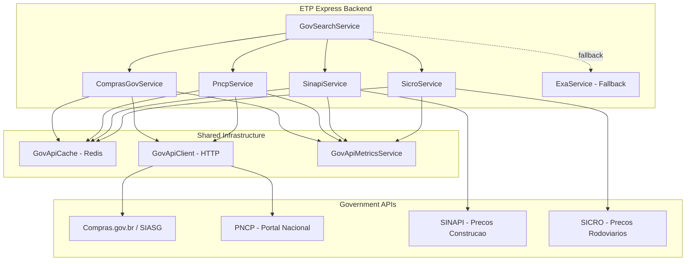
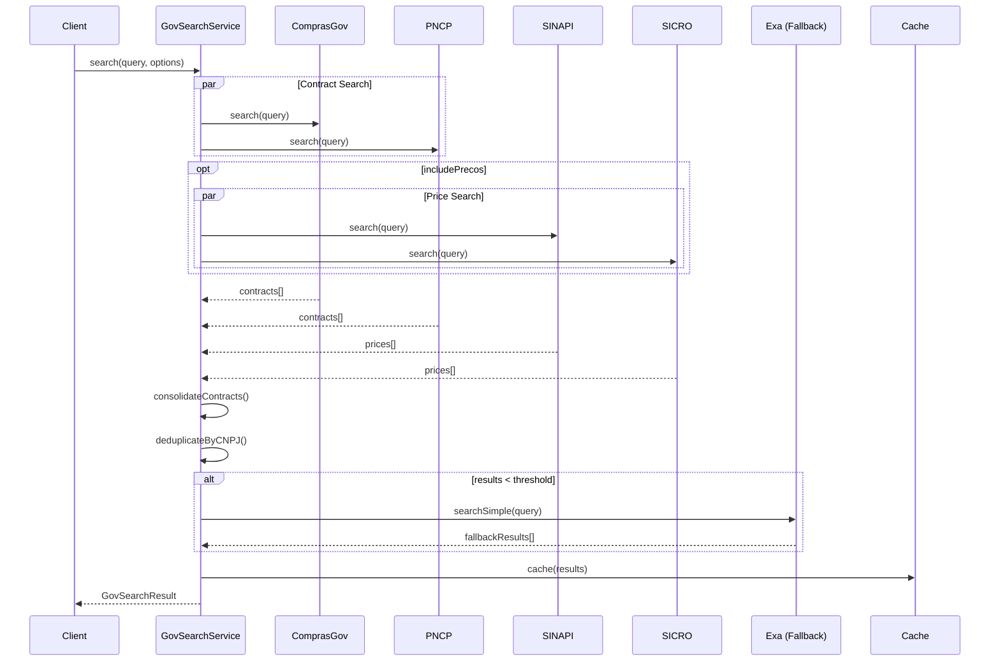

# Government APIs Integration Guide

**Version:** 1.0.0
**Last Updated:** 2025-12-21
**Module:** `backend/src/modules/gov-api`

---

## Overview

ETP Express integrates with Brazilian government APIs to provide real-time procurement data and reference prices for ETP (Estudo Tecnico Preliminar) generation. This document describes the architecture, data flow, and integration patterns used.

## Architecture



## Integrated APIs

### 1. Compras.gov.br (SIASG)

**Purpose:** Federal government procurement data (licitacoes, contratos)

| Attribute        | Value                                                           |
| ---------------- | --------------------------------------------------------------- |
| Base URL         | `https://compras.dados.gov.br`                                  |
| Documentation    | [compras.dados.gov.br/docs](https://compras.dados.gov.br/docs/) |
| Data Type        | Licitacoes, Contratos, CATMAT, CATSER                           |
| Update Frequency | Real-time                                                       |
| Rate Limit       | ~60 req/min (conservative)                                      |
| Cache TTL        | 1 hour                                                          |

**Service:** `ComprasGovService` (`backend/src/modules/gov-api/compras-gov/`)

### 2. PNCP - Portal Nacional de Contratacoes Publicas

**Purpose:** Procurement data under Lei 14.133/2021 (Nova Lei de Licitacoes)

| Attribute        | Value                                                                                         |
| ---------------- | --------------------------------------------------------------------------------------------- |
| Base URL         | `https://pncp.gov.br/api/consulta`                                                            |
| Documentation    | [pncp.gov.br/api/consulta/swagger-ui](https://pncp.gov.br/api/consulta/swagger-ui/index.html) |
| Data Type        | Contratacoes, Contratos, Atas de Registro                                                     |
| Update Frequency | Real-time                                                                                     |
| Rate Limit       | ~60 req/min                                                                                   |
| Cache TTL        | 1 hour                                                                                        |

**Service:** `PncpService` (`backend/src/modules/gov-api/pncp/`)

### 3. SINAPI - Sistema Nacional de Pesquisa de Custos

**Purpose:** Reference prices for civil construction (mandatory for federal public works)

| Attribute        | Value                               |
| ---------------- | ----------------------------------- |
| Source           | CAIXA Economica Federal             |
| Legal Basis      | Decreto 7.983/2013                  |
| Data Type        | Insumos, Composicoes, Precos por UF |
| Update Frequency | Monthly                             |
| Data Format      | Excel spreadsheets                  |
| Cache TTL        | 7 days                              |

**Service:** `SinapiService` (`backend/src/modules/gov-api/sinapi/`)

### 4. SICRO - Sistema de Custos Rodoviarios

**Purpose:** Reference prices for road infrastructure (DNIT)

| Attribute        | Value                                          |
| ---------------- | ---------------------------------------------- |
| Source           | DNIT (Departamento Nacional de Infraestrutura) |
| Data Type        | Insumos, Composicoes, Precos Rodoviarios       |
| Update Frequency | Monthly                                        |
| Data Format      | Excel spreadsheets                             |
| Cache TTL        | 7 days                                         |

**Service:** `SicroService` (`backend/src/modules/gov-api/sicro/`)

## Data Flow

### Unified Search Flow



### Key Features

1. **Parallel Execution:** All API calls are executed in parallel using `Promise.allSettled()`
2. **Deduplication:** Results are deduplicated by CNPJ + objeto similarity (Levenshtein distance >= 0.85)
3. **Fallback:** When results < `EXA_FALLBACK_THRESHOLD`, Exa is used as fallback source
4. **Status Tracking:** Each source reports its status (SUCCESS, TIMEOUT, RATE_LIMITED, SERVICE_UNAVAILABLE)

## Shared Infrastructure

### GovApiClient

HTTP client with built-in resilience patterns:

```typescript
const client = createGovApiClient(configService, {
  baseUrl: 'https://api.example.gov.br',
  source: 'example',
  timeout: 30000,
  circuitBreaker: {
    timeout: 30000,
    errorThresholdPercentage: 50,
    resetTimeout: 60000,
    volumeThreshold: 5,
  },
  retry: {
    maxRetries: 3,
    baseDelay: 2000,
    maxDelay: 15000,
  },
  rateLimit: {
    maxRequests: 60,
    windowMs: 60000,
    throwOnLimit: false,
  },
});
```

**Features:**

- **Circuit Breaker:** Opossum-based, opens at 50% error rate
- **Retry:** Exponential backoff with jitter
- **Rate Limiting:** Token bucket algorithm
- **Health Check:** Built-in endpoint testing

### GovApiCache

Redis-based caching with per-source TTL:

| Source      | TTL    | Prefix           |
| ----------- | ------ | ---------------- |
| PNCP        | 1 hour | `gov:pncp`       |
| Compras.gov | 1 hour | `gov:comprasgov` |
| SINAPI      | 7 days | `gov:sinapi`     |
| SICRO       | 7 days | `gov:sicro`      |

**Features:**

- SHA-256 key hashing
- Graceful degradation on Redis failure
- Per-source statistics (hits, misses, errors)
- Cache invalidation by source

### GovApiMetricsService

Prometheus-compatible metrics:

| Metric                             | Type      | Description              |
| ---------------------------------- | --------- | ------------------------ |
| `gov_api_requests_total`           | Counter   | Total requests by source |
| `gov_api_request_duration_seconds` | Histogram | Request latency          |
| `gov_api_cache_hits_total`         | Counter   | Cache hits by source     |
| `gov_api_circuit_breaker_state`    | Gauge     | Circuit breaker state    |

## Module Structure

```
backend/src/modules/gov-api/
├── gov-api.module.ts          # Base module (global)
├── gov-api-metrics.service.ts # Prometheus metrics
├── interfaces/
│   └── gov-api.interface.ts   # Common interfaces
├── types/
│   └── search-result.ts       # Status types
├── utils/
│   ├── gov-api-cache.ts       # Redis cache
│   └── gov-api-client.ts      # HTTP client
├── compras-gov/
│   ├── compras-gov.module.ts
│   ├── compras-gov.service.ts
│   └── compras-gov.types.ts
├── pncp/
│   ├── pncp.module.ts
│   ├── pncp.service.ts
│   └── pncp.types.ts
├── sinapi/
│   ├── sinapi.module.ts
│   ├── sinapi.service.ts
│   ├── sinapi.types.ts
│   └── sinapi-parser.ts       # Excel parser
├── sicro/
│   ├── sicro.module.ts
│   ├── sicro.service.ts
│   ├── sicro.types.ts
│   └── sicro-parser.ts        # Excel parser
└── gov-search/
    ├── gov-search.module.ts
    ├── gov-search.service.ts  # Unified search
    └── gov-search.types.ts
```

## Usage Examples

### Basic Contract Search

```typescript
import { GovSearchService } from './modules/gov-api/gov-search/gov-search.service';

const results = await govSearchService.search('software gestao publica', {
  startDate: new Date('2024-01-01'),
  endDate: new Date('2024-12-31'),
  uf: 'DF',
  maxPerSource: 50,
});

console.log(`Found ${results.totalResults} results`);
console.log(`Sources: ${results.sources.join(', ')}`);
console.log(`Status: ${results.status}`);
```

### Search with Prices

```typescript
const results = await govSearchService.search('pavimentacao asfaltica', {
  includePrecos: true,
  isInfrastructure: true, // Include SICRO
  isConstrucaoCivil: true, // Include SINAPI
  uf: 'SP',
  mesReferencia: '2024-12',
});

console.log(`Contracts: ${results.contracts.length}`);
console.log(`SINAPI prices: ${results.prices.sinapi.length}`);
console.log(`SICRO prices: ${results.prices.sicro.length}`);
```

### Health Check

```typescript
const health = await govSearchService.healthCheck();

console.log('API Health Status:');
Object.entries(health).forEach(([source, status]) => {
  console.log(`  ${source}: ${status?.healthy ? 'OK' : 'DEGRADED'}`);
});
```

## Error Handling

### Status Codes

| Status                | Description            | Action                                     |
| --------------------- | ---------------------- | ------------------------------------------ |
| `SUCCESS`             | API responded normally | Use data                                   |
| `PARTIAL_SUCCESS`     | Some sources failed    | Use available data, check `sourceStatuses` |
| `TIMEOUT`             | Request timed out      | Retry with shorter timeout                 |
| `RATE_LIMITED`        | Rate limit exceeded    | Wait and retry                             |
| `SERVICE_UNAVAILABLE` | API is down            | Use cached data or fallback                |

### Response Structure

```typescript
interface GovSearchResult {
  contracts: GovApiContract[];
  prices: {
    sinapi: GovApiPriceReference[];
    sicro: GovApiPriceReference[];
  };
  sources: string[];
  fallbackUsed: boolean;
  totalResults: number;
  status: SearchStatus;
  statusMessage: string;
  sourceStatuses: SourceStatus[];
  timestamp: Date;
  cached: boolean;
}
```

## Related Documentation

- [Configuration Guide](./gov-api-configuration.md) - Environment variables and setup
- [Troubleshooting Guide](./gov-api-troubleshooting.md) - Common issues and solutions
- [OPS Runbook](./OPS_RUNBOOK.md) - Operational procedures
- [Monitoring](./MONITORING.md) - Metrics and alerting
