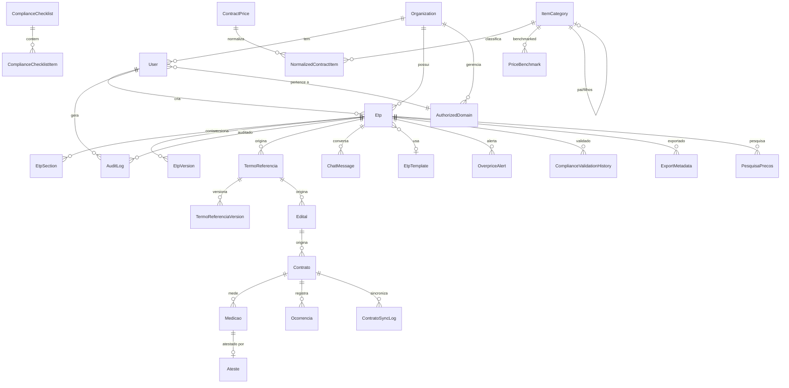

# Database Schema - ETP Express

## Visao Geral

| Item | Detalhe |
|------|---------|
| **Banco de Dados** | PostgreSQL (Railway) |
| **ORM** | TypeORM 0.3.x |
| **Extensoes** | pgvector (embeddings 1536d) |
| **Conexao** | `DATABASE_URL` via ConfigService |
| **Pool** | min=5, max=20 (Railway Starter) |
| **SSL** | Habilitado em producao |
| **Migrations** | Auto-run na inicializacao (`migrationsRun: true`) |
| **Synchronize** | Desabilitado (`false`) - somente migrations |
| **Slow Query Log** | Queries > 1s via SlowQuerySubscriber |
| **Multi-tenancy** | Column-based isolation via `organizationId` |

---

## Mapa de Entidades

### 1. User (`users`)

| Campo | Tipo | Nullable | Descricao |
|-------|------|----------|-----------|
| id | uuid (PK) | N | |
| email | varchar (unique) | N | |
| password | varchar | N | Excluido da serializacao |
| name | varchar | N | |
| organizationId | uuid (FK) | N | FK -> organizations |
| cargo | varchar | S | |
| role | enum(UserRole) | N | system_admin, domain_manager, admin, user, viewer, demo |
| isActive | boolean | N | default: true |
| mustChangePassword | boolean | N | default: false |
| lastLoginAt | timestamp | S | |
| lgpdConsentAt | timestamp | S | LGPD Art. 7 |
| lgpdConsentVersion | varchar | S | |
| internationalTransferConsentAt | timestamp | S | LGPD Art. 33 |
| deletedAt | timestamp | S | Soft delete (LGPD Art. 18) |
| etpLimitCount | int | S | default: 3 (demo users) |
| apiKey | varchar (unique) | S | Excluido da serializacao |
| apiPlan | enum(ApiPlan) | N | free, pro, enterprise |
| createdAt | timestamp | N | |
| updatedAt | timestamp | N | |
| authorizedDomainId | uuid (FK) | S | FK -> authorized_domains |

**Relacionamentos:**
- ManyToOne -> Organization
- ManyToOne -> AuthorizedDomain
- OneToMany -> Etp
- OneToMany -> AuditLog

---

### 2. Organization (`organizations`)

| Campo | Tipo | Nullable | Descricao |
|-------|------|----------|-----------|
| id | uuid (PK) | N | |
| name | varchar | N | |
| cnpj | varchar (unique) | N | 14 digitos |
| domainWhitelist | text[] | N | Array PostgreSQL |
| isActive | boolean | N | Kill Switch (MT-04) |
| stripeCustomerId | varchar | S | Billing |
| createdAt | timestamp | N | |
| updatedAt | timestamp | N | |

**Relacionamentos:**
- OneToMany -> User
- OneToMany -> Etp

---

### 3. Etp (`etps`)

| Campo | Tipo | Nullable | Descricao |
|-------|------|----------|-----------|
| id | uuid (PK) | N | |
| title | varchar | N | |
| description | text | S | |
| objeto | varchar | N | |
| numeroProcesso | varchar | S | |
| valorEstimado | decimal(15,2) | S | |
| orgaoEntidade | varchar(200) | S | |
| uasg | varchar(6) | S | |
| unidadeDemandante | varchar(200) | S | |
| responsavelTecnico | jsonb | S | {nome, matricula?} |
| dataElaboracao | date | S | |
| descricaoDetalhada | text | S | |
| quantidadeEstimada | decimal(15,2) | S | |
| unidadeMedida | varchar(50) | S | |
| justificativaContratacao | text | S | |
| necessidadeAtendida | text | S | |
| beneficiosEsperados | text | S | |
| requisitosTecnicos | text | S | |
| requisitosQualificacao | text | S | |
| criteriosSustentabilidade | text | S | |
| garantiaExigida | varchar(500) | S | |
| prazoExecucao | int | S | |
| nivelRisco | enum(NivelRisco) | S | BAIXO, MEDIO, ALTO |
| descricaoRiscos | text | S | |
| valorUnitario | decimal(15,2) | S | |
| fontePesquisaPrecos | text | S | |
| dotacaoOrcamentaria | varchar(100) | S | |
| templateId | uuid (FK) | S | FK -> etp_templates |
| templateType | enum(EtpTemplateType) | S | OBRAS, TI, SERVICOS, MATERIAIS |
| dynamicFields | jsonb | S | Campos especificos por template |
| status | enum(EtpStatus) | N | draft, in_progress, review, completed, archived |
| metadata | jsonb | S | |
| organizationId | uuid (FK) | N | Multi-tenancy |
| currentVersion | int | N | default: 1 |
| completionPercentage | float | N | default: 0 |
| created_by | varchar (FK) | N | FK -> users |
| createdAt | timestamp | N | |
| updatedAt | timestamp | N | |

**Relacionamentos:**
- ManyToOne -> User (createdBy, eager, CASCADE)
- ManyToOne -> Organization (eager)
- ManyToOne -> EtpTemplate
- OneToMany -> EtpSection (cascade)
- OneToMany -> EtpVersion (cascade)
- OneToMany -> AuditLog
- OneToMany -> TermoReferencia

---

### 4. EtpSection (`etp_sections`)

| Campo | Tipo | Nullable | Descricao |
|-------|------|----------|-----------|
| id | uuid (PK) | N | |
| type | enum(SectionType) | N | 11 tipos |
| title | varchar | N | |
| content | text | S | |
| userInput | text | S | |
| systemPrompt | text | S | |
| status | enum(SectionStatus) | N | pending, generating, generated, reviewed, approved |
| order | int | N | default: 1 |
| isRequired | boolean | N | default: false |
| metadata | jsonb | S | tokens, model, etc |
| validationResults | jsonb | S | |
| etp_id | varchar (FK) | N | FK -> etps (CASCADE) |
| createdAt | timestamp | N | |
| updatedAt | timestamp | N | |

---

### 5. EtpVersion (`etp_versions`)

| Campo | Tipo | Nullable | Descricao |
|-------|------|----------|-----------|
| id | uuid (PK) | N | |
| versionNumber | int | N | |
| snapshot | jsonb | N | Snapshot completo |
| changeLog | text | S | |
| createdByName | varchar | S | |
| etp_id | varchar (FK) | N | FK -> etps (CASCADE) |
| createdAt | timestamp | N | |

---

### 6. EtpTemplate (`etp_templates`)

| Campo | Tipo | Nullable | Descricao |
|-------|------|----------|-----------|
| id | uuid (PK) | N | |
| name | varchar(200) | N | |
| type | enum(EtpTemplateType) | N | OBRAS, TI, SERVICOS, MATERIAIS |
| description | text | N | |
| requiredFields | jsonb | N | |
| optionalFields | jsonb | N | |
| defaultSections | jsonb | N | |
| prompts | jsonb | N | |
| legalReferences | jsonb | N | |
| priceSourcesPreferred | jsonb | N | |
| isActive | boolean | N | default: true |
| createdAt | timestamp | N | |
| updatedAt | timestamp | N | |

---

### 7. AnalyticsEvent (`analytics_events`)

| Campo | Tipo | Nullable | Descricao |
|-------|------|----------|-----------|
| id | uuid (PK) | N | |
| eventType | varchar | N | **Index** |
| eventName | varchar | N | **Index** |
| userId | varchar | S | **Index** |
| organizationId | uuid (FK) | S | **Index**, MT |
| etpId | varchar | S | |
| properties | jsonb | S | |
| sessionId | varchar | S | |
| ipAddress | varchar | S | |
| userAgent | varchar | S | |
| referer | varchar | S | |
| createdAt | timestamp | N | **Index** |

---

### 8. AuditLog (`audit_logs`)

| Campo | Tipo | Nullable | Descricao |
|-------|------|----------|-----------|
| id | uuid (PK) | N | |
| action | enum(AuditAction) | N | 16 acoes |
| entityType | varchar | N | |
| entityId | varchar | S | |
| changes | jsonb | S | before/after |
| description | text | S | |
| ipAddress | varchar | S | |
| userAgent | varchar | S | |
| user_id | varchar (FK) | N | FK -> users (eager) |
| etp_id | varchar (FK) | S | FK -> etps |
| createdAt | timestamp | N | |

---

### 9. AuthorizedDomain (`authorized_domains`)

| Campo | Tipo | Nullable | Descricao |
|-------|------|----------|-----------|
| id | uuid (PK) | N | |
| domain | varchar (unique) | N | **Index** |
| institutionName | varchar | N | |
| isActive | boolean | N | **Index**, default: true |
| maxUsers | int | N | default: 10 |
| domainManagerId | uuid (FK) | S | FK -> users |
| organizationId | uuid (FK) | S | FK -> organizations |
| createdAt | timestamp | N | |
| updatedAt | timestamp | N | |

---

### 10. Legislation (`legislation`)

| Campo | Tipo | Nullable | Descricao |
|-------|------|----------|-----------|
| id | uuid (PK) | N | |
| type | enum(LegislationType) | N | **Index** |
| number | varchar | N | **Index** |
| year | int | N | **Index** |
| title | text | N | |
| content | text | N | |
| embedding | vector(1536) | S | pgvector |
| articles | jsonb | S | |
| sourceUrl | text | S | |
| isActive | boolean | N | default: true |
| createdAt | timestamp | N | |
| updatedAt | timestamp | N | |

---

### 11. SimilarContract (`similar_contracts`)

| Campo | Tipo | Nullable | Descricao |
|-------|------|----------|-----------|
| id | uuid (PK) | N | |
| organizationId | uuid (FK) | S | **Index**, MT |
| searchQuery | varchar | N | **Index** |
| title | varchar | N | |
| description | text | S | |
| orgao | varchar | S | |
| valor | decimal(15,2) | S | |
| dataContratacao | varchar | S | |
| url | text | S | |
| fonte | text | S | |
| relevanceScore | float | N | default: 0 |
| metadata | jsonb | S | |
| createdAt | timestamp | N | |

**Index composto:** `[organizationId, createdAt]`

---

### 12. GovContract (`gov_contracts`)

| Campo | Tipo | Nullable | Descricao |
|-------|------|----------|-----------|
| id | uuid (PK) | N | |
| organizationId | uuid (FK) | S | **Index**, MT |
| searchQuery | text | N | **Index** |
| source | varchar(50) | N | **Index** |
| externalId | varchar(100) | S | **Index** |
| title | text | N | |
| description | text | S | |
| orgao | varchar(500) | S | |
| cnpj | varchar(18) | S | **Index** |
| valor | decimal(15,2) | S | |
| dataContratacao | varchar(50) | S | |
| modalidade | varchar(100) | S | |
| numeroProcesso | varchar(100) | S | **Index** |
| url | text | S | |
| relevanceScore | float | N | default: 0 |
| metadata | jsonb | S | |
| createdAt | timestamp | N | |
| updatedAt | timestamp | N | |

**Index composto:** `[organizationId, createdAt]`

---

### 13. SinapiItem (`sinapi_items`)

| Campo | Tipo | Nullable | Descricao |
|-------|------|----------|-----------|
| id | uuid (PK) | N | |
| organizationId | uuid (FK) | S | **Index**, MT |
| codigo | varchar(50) | N | **Index** |
| descricao | text | N | |
| unidade | varchar(20) | N | |
| precoOnerado | decimal(15,2) | N | default: 0 |
| precoDesonerado | decimal(15,2) | N | default: 0 |
| tipo | enum | N | INSUMO, COMPOSICAO. **Index** |
| uf | char(2) | N | **Index** |
| mesReferencia | int | N | |
| anoReferencia | int | N | **Index** |
| classeId | varchar(50) | S | |
| classeDescricao | varchar(255) | S | |
| metadata | jsonb | S | |
| createdAt | timestamp | N | |
| updatedAt | timestamp | N | |

**Index composto:** `[organizationId, createdAt]`

---

### 14. SicroItem (`sicro_items`)

Estrutura identica a SinapiItem com campos adicionais:

| Campo Adicional | Tipo | Descricao |
|-----------------|------|-----------|
| categoriaId | varchar(100) | S |
| categoriaDescricao | varchar(255) | S |
| modoTransporte | enum | RODOVIARIO, AQUAVIARIO, FERROVIARIO. **Index** |

---

### 15. PasswordReset (`password_resets`)

| Campo | Tipo | Nullable | Descricao |
|-------|------|----------|-----------|
| id | uuid (PK) | N | |
| userId | uuid (FK) | N | **Index**, CASCADE |
| token | varchar(255) | N | **Index** |
| expiresAt | timestamp | N | **Index** |
| used | boolean | N | default: false |
| createdAt | timestamp | N | |

---

### 16. SecretAccessLog (`secret_access_logs`)

| Campo | Tipo | Nullable | Descricao |
|-------|------|----------|-----------|
| id | int (PK, auto) | N | |
| secretName | varchar | N | |
| accessedBy | varchar | N | |
| ipAddress | varchar | S | |
| accessedAt | timestamp | N | |
| status | enum | N | success, failed, unauthorized |
| errorMessage | text | S | |

**Index composto:** `[secretName, accessedAt]`, `[status]`

---

### 17. SectionTemplate (`section_templates`)

| Campo | Tipo | Nullable | Descricao |
|-------|------|----------|-----------|
| id | uuid (PK) | N | |
| name | varchar | N | |
| sectionType | varchar | N | |
| systemPrompt | text | N | |
| userPromptTemplate | text | S | |
| exampleOutput | text | S | |
| isActive | boolean | N | default: true |
| metadata | jsonb | S | |
| createdAt | timestamp | N | |
| updatedAt | timestamp | N | |

---

### 18. ComplianceChecklist (`compliance_checklists`)

| Campo | Tipo | Nullable | Descricao |
|-------|------|----------|-----------|
| id | uuid (PK) | N | |
| name | varchar(200) | N | |
| description | text | S | |
| standard | enum(ComplianceStandard) | N | TCU, TCE_SP, TCE_RJ, etc |
| templateType | enum(EtpTemplateType) | N | |
| legalBasis | text | S | |
| version | varchar(20) | N | default: '1.0' |
| minimumScore | int | N | default: 70 |
| isActive | boolean | N | default: true |
| createdAt | timestamp | N | |
| updatedAt | timestamp | N | |

**Relacionamentos:**
- OneToMany -> ComplianceChecklistItem (cascade, eager)

---

### 19. ComplianceChecklistItem (`compliance_checklist_items`)

| Campo | Tipo | Nullable | Descricao |
|-------|------|----------|-----------|
| id | uuid (PK) | N | |
| checklistId | uuid (FK) | N | FK -> compliance_checklists (CASCADE) |
| requirement | varchar(200) | N | |
| description | text | N | |
| type | enum(ChecklistItemType) | N | MANDATORY, RECOMMENDED, OPTIONAL |
| category | enum(ChecklistItemCategory) | N | |
| weight | int | N | default: 10 |
| etpFieldsRequired | varchar(500) | S | |
| sectionRequired | varchar(50) | S | |
| keywords | jsonb | S | |
| validationRegex | varchar(500) | S | |
| minLength | int | S | |
| fixSuggestion | text | S | |
| legalReference | varchar(200) | S | |
| rejectionCode | varchar(20) | S | |
| order | int | N | default: 0 |
| isActive | boolean | N | default: true |

---

### 20. ComplianceValidationHistory (`compliance_validation_history`)

| Campo | Tipo | Nullable | Descricao |
|-------|------|----------|-----------|
| id | uuid (PK) | N | |
| etp_id | uuid (FK) | N | **Index**, CASCADE |
| checklist_id | uuid (FK) | N | |
| checklistName | varchar(255) | N | |
| score | int | N | |
| minimum_score | int | N | |
| status | varchar(20) | N | APPROVED, NEEDS_REVIEW, REJECTED |
| total_items | int | N | |
| passed_items | int | N | |
| failed_items | int | N | |
| validation_snapshot | jsonb | N | |
| validated_at | timestamp | N | **Index** |
| validated_by_id | uuid (FK) | N | |
| created_at | timestamp | N | |

---

### 21. ChatMessage (`chat_messages`)

| Campo | Tipo | Nullable | Descricao |
|-------|------|----------|-----------|
| id | uuid (PK) | N | |
| etpId | uuid (FK) | N | CASCADE |
| userId | uuid (FK) | N | CASCADE |
| role | enum(ChatMessageRole) | N | user, assistant |
| content | text | N | |
| metadata | jsonb | S | model, tokens, latencyMs |
| createdAt | timestamp | N | |

**Indexes compostos:** `[etpId, userId, createdAt]`, `[etpId, createdAt]`

---

### 22. TermoReferencia (`termos_referencia`)

| Campo | Tipo | Nullable | Descricao |
|-------|------|----------|-----------|
| id | uuid (PK) | N | |
| etpId | uuid (FK) | N | CASCADE |
| organizationId | uuid (FK) | N | MT (eager) |
| objeto | text | N | |
| fundamentacaoLegal | text | S | |
| descricaoSolucao | text | S | |
| requisitosContratacao | text | S | |
| modeloExecucao | text | S | |
| modeloGestao | text | S | |
| criteriosSelecao | text | S | |
| valorEstimado | decimal(15,2) | S | |
| dotacaoOrcamentaria | varchar(100) | S | |
| prazoVigencia | int | S | |
| obrigacoesContratante | text | S | |
| obrigacoesContratada | text | S | |
| sancoesPenalidades | text | S | |
| cronograma | jsonb | S | |
| especificacoesTecnicas | jsonb | S | |
| localExecucao | text | S | |
| garantiaContratual | text | S | |
| condicoesPagamento | text | S | |
| subcontratacao | text | S | |
| status | enum(TermoReferenciaStatus) | N | draft, review, approved, archived |
| versao | int | N | default: 1 |
| currentVersion | int | N | default: 1 |
| createdById | uuid (FK) | N | eager |
| createdAt | timestamp | N | |
| updatedAt | timestamp | N | |

**Relacionamentos:**
- ManyToOne -> Etp (CASCADE)
- ManyToOne -> Organization (eager)
- ManyToOne -> User (eager)
- OneToMany -> TermoReferenciaVersion
- OneToMany -> Edital

---

### 23. TermoReferenciaTemplate (`tr_templates`)

Template para geracao de TR. Campos JSONB: specificFields, defaultSections, prompts, legalReferences.

---

### 24. TermoReferenciaVersion (`termo_referencia_versions`)

| Campo | Tipo | Nullable | Descricao |
|-------|------|----------|-----------|
| id | uuid (PK) | N | |
| versionNumber | int | N | |
| snapshot | jsonb | N | Snapshot completo |
| changeLog | text | S | |
| createdByName | varchar | S | |
| termo_referencia_id | varchar (FK) | N | CASCADE |
| createdAt | timestamp | N | |

---

### 25. PesquisaPrecos (`pesquisas_precos`)

Pesquisa de precos conforme IN SEGES/ME n 65/2021. Campos JSONB: fontesConsultadas, itens, metodologiasComplementares, mapaComparativo.

**Relacionamentos:** ManyToOne -> Etp (SET NULL), ManyToOne -> TermoReferencia (SET NULL), ManyToOne -> Organization (eager), ManyToOne -> User (eager)

---

### 26. Edital (`editais`)

Instrumento convocatorio. 40+ campos. Muitos enums: EditalModalidade, EditalCriterioJulgamento, EditalModoDisputa, EditalStatus.

**Relacionamentos:** ManyToOne -> Etp (SET NULL), ManyToOne -> TermoReferencia (SET NULL), ManyToOne -> PesquisaPrecos (SET NULL), ManyToOne -> Organization (eager), ManyToOne -> User (createdBy, eager), ManyToOne -> User (approvedBy, SET NULL), OneToMany -> Contrato

---

### 27. EditalTemplate (`edital_templates`)

Template de edital por modalidade. Campos JSONB: secoes, clausulas, specificFields, legalReferences.

---

### 28. Contrato (`contratos`)

Instrumento formal de contratacao. Campos de sincronizacao Gov.br (govBrId, govBrSyncStatus, etc).

**Relacionamentos:** ManyToOne -> Edital (SET NULL, eager), ManyToOne -> Organization (eager), ManyToOne -> User (createdBy, gestorResponsavel, fiscalResponsavel - todos eager)

---

### 29. Medicao (`medicoes`)

Registro de medicoes contratuais.

**Relacionamentos:** ManyToOne -> Contrato (eager, CASCADE), ManyToOne -> User (fiscalResponsavel, createdBy - eager)

---

### 30. Ocorrencia (`ocorrencias`)

Registro de ocorrencias em contratos. Enums: OcorrenciaTipo, OcorrenciaGravidade, OcorrenciaStatus.

**Relacionamentos:** ManyToOne -> Contrato (eager, CASCADE), ManyToOne -> User (registradoPor - eager)

---

### 31. Ateste (`atestes`)

Aprovacao de medicoes pelo fiscal. Relacionamento 1:1 com Medicao.

**Relacionamentos:** OneToOne -> Medicao (eager, CASCADE, unique), ManyToOne -> User (fiscal - eager)

---

### 32. DocumentoFiscalizacao (`documentos_fiscalizacao`)

Documentos comprobatorios. Relacionamento polimorfico via `tipoEntidade` + `entidadeId`.

---

### 33. ContratoSyncLog (`contrato_sync_logs`)

Log de sincronizacao com Gov.br. Campos JSONB: conflicts, resolution.

---

### 34. ContractPrice (`contract_prices`)

Precos homologados de licitacoes. 15+ indexes para queries de market intelligence.

---

### 35. ItemCategory (`item_categories`)

Taxonomia CATMAT/CATSER. Auto-referenciamento (parent/children).

---

### 36. NormalizedContractItem (`normalized_contract_items`)

Itens normalizados para benchmarking.

**Relacionamentos:** ManyToOne -> ContractPrice (CASCADE), ManyToOne -> ItemCategory (SET NULL)

---

### 37. PriceBenchmark (`price_benchmarks`)

Benchmarks regionais de preco. Unique constraint: `[categoryId, uf, orgaoPorte]`.

---

### 38. OverpriceAlert (`overprice_alerts`)

Alertas de sobrepreco. 4 indexes.

---

### 39. ApiUsage (`api_usage`)

Tracking de uso da API publica. PK autoincrement (int).

---

### 40. ExportMetadata (`export_metadata`)

Metadados de exportacao S3. Campos: s3Key, s3Uri, downloadCount.

---

## Diagrama de Relacionamento (ER)

---

## Indexes

### Indexes Explicitos (Declarados nas Entities)

| Entidade | Index | Colunas | Tipo |
|----------|-------|---------|------|
| AuthorizedDomain | IDX_authorized_domains_domain | domain | Unique |
| AuthorizedDomain | IDX_authorized_domains_isActive | isActive | Normal |
| AnalyticsEvent | (field) | eventType | Normal |
| AnalyticsEvent | (field) | eventName | Normal |
| AnalyticsEvent | (field) | userId | Normal |
| AnalyticsEvent | (field) | organizationId | Normal |
| AnalyticsEvent | (field) | createdAt | Normal |
| Legislation | (field) | type | Normal |
| Legislation | (field) | number | Normal |
| Legislation | (field) | year | Normal |
| SimilarContract | (field) | searchQuery | Normal |
| SimilarContract | IDX_similar_contracts_organizationId | organizationId | Normal |
| SimilarContract | IDX_similar_contracts_organization_createdAt | [organizationId, createdAt] | Composto |
| GovContract | IDX_gov_contracts_organizationId | organizationId | Normal |
| GovContract | IDX_gov_contracts_searchQuery | searchQuery | Normal |
| GovContract | IDX_gov_contracts_source | source | Normal |
| GovContract | IDX_gov_contracts_externalId | externalId | Normal |
| GovContract | IDX_gov_contracts_cnpj | cnpj | Normal |
| GovContract | IDX_gov_contracts_numeroProcesso | numeroProcesso | Normal |
| GovContract | IDX_gov_contracts_organization_createdAt | [organizationId, createdAt] | Composto |
| SinapiItem | IDX_sinapi_items_organizationId | organizationId | Normal |
| SinapiItem | IDX_sinapi_items_codigo | codigo | Normal |
| SinapiItem | IDX_sinapi_items_tipo | tipo | Normal |
| SinapiItem | IDX_sinapi_items_uf | uf | Normal |
| SinapiItem | IDX_sinapi_items_ano_mes | anoReferencia | Normal |
| SinapiItem | IDX_sinapi_items_organization_createdAt | [organizationId, createdAt] | Composto |
| SicroItem | (similar ao SinapiItem) | + modoTransporte | Normal |
| PasswordReset | IDX_password_resets_userId | userId | Normal |
| PasswordReset | IDX_password_resets_token | token | Normal |
| PasswordReset | IDX_password_resets_expiresAt | expiresAt | Normal |
| SecretAccessLog | idx_secret_access_logs_name_accessed | [secretName, accessedAt] | Composto |
| SecretAccessLog | idx_secret_access_logs_status | status | Normal |
| ChatMessage | (composite) | [etpId, userId, createdAt] | Composto |
| ChatMessage | (composite) | [etpId, createdAt] | Composto |
| ComplianceValidationHistory | idx_validation_history_etp | etpId | Normal |
| ComplianceValidationHistory | idx_validation_history_date | validatedAt | Normal |
| ContractPrice | 11 indexes | diversos | Normal/Composto |
| ItemCategory | 4 indexes | code(unique), type, parentCode, active | Normal |
| NormalizedContractItem | 5 indexes | category, confidence, requiresReview, createdAt, originalItemId | Normal |
| PriceBenchmark | UQ_price_benchmarks_category_uf_porte | [categoryId, uf, orgaoPorte] | Unique |
| PriceBenchmark | 3 indexes | categoryId, uf, calculatedAt | Normal |
| OverpriceAlert | 4 indexes | etpId, alertLevel, createdAt, categoryId | Normal |
| DocumentTree | 2 indexes | [documentType, status], [status, createdAt] | Composto |
| ApiUsage | (composite) | [user, createdAt] | Composto |
| ApiUsage | (field) | endpoint | Normal |

---

## Migrations (52 migrations)

| # | Timestamp | Nome | Descricao |
|---|-----------|------|-----------|
| 1 | 1000000000000 | InitialSchema | Schema inicial (users, etps, etp_sections, etp_versions, similar_contracts, legislation, section_templates, analytics_events) |
| 2 | 1732474800000 | EnablePgvector | Habilita extensao pgvector |
| 3 | 1733097600000 | CreateOrganizations | Tabela organizations |
| 4 | 1733098000000 | AddOrganizationToUsers | organizationId em users |
| 5 | 1733154000000 | AddOrganizationToEtps | organizationId em etps |
| 6 | 1733355000000 | RenameEtpsCreatedByIdColumn | Renomeia coluna FK |
| 7 | 1733360000000 | RenameEtpIdColumns | Renomeia colunas FK |
| 8 | 1733450000000 | CreateAuthorizedDomains | Tabela authorized_domains |
| 9 | 1734048000000 | AddOrganizationIdToAnalyticsEvents | MT em analytics |
| 10 | 1734134400000 | CreateSinapiItemsTable | Tabela sinapi_items |
| 11 | 1734134500000 | CreateSicroItemsTable | Tabela sicro_items |
| 12 | 1734134600000 | CreateGovContractsTable | Tabela gov_contracts |
| 13 | 1734200000000 | AddPerformanceIndexes | Indexes de performance |
| 14 | 1736175600000 | AddEstimativaCustosFields | Campos custo em etps |
| 15 | 1736262000000 | CreateEtpTemplatesTable | Tabela etp_templates |
| 16 | 1736280000000 | AddTemplateFieldsToEtp | templateId, templateType, dynamicFields |
| 17 | 1737072000000 | CreateComplianceValidationHistory | Historico validacao |
| 18 | 1763500000000 | AddLgpdConsentFields | LGPD em users |
| 19 | 1763600000000 | AddInternationalTransferConsent | LGPD Art. 33 |
| 20 | 1763667177352 | AddCascadeDeleteToETPs | CASCADE nas FKs |
| 21 | 1763700000000 | AddDeletedAtToUsers | Soft delete users |
| 22 | 1763750000000 | CreateAuditLogs | Tabela audit_logs |
| 23 | 1763800000000 | ExtendUserRoleEnum | Novos roles |
| 24 | 1765583168494 | AddOrganizationIdToSimilarContracts | MT em similar_contracts |
| 25 | 1765600000000 | CreatePasswordResets | Tabela password_resets |
| 26 | 1767787200000 | AddEtpIdentificationFields | Campos identificacao |
| 27 | 1767873600000 | AddEtpObjetoJustificativaFields | Campos objeto |
| 28 | 1767960000000 | AddEtpRequisitosRiscosFields | Campos requisitos |
| 29 | 1768060000000 | CreateComplianceChecklistTables | Checklist compliance |
| 30 | 1768200000000 | CreateChatMessagesTable | Tabela chat_messages |
| 31 | 1768300000000 | CreateTermosReferenciaTable | Tabela termos_referencia |
| 32 | 1768350000000 | CreateTrTemplatesTable | Tabela tr_templates |
| 33 | 1768400000000 | CreatePesquisaPrecosTable | Tabela pesquisas_precos |
| 34 | 1768500000000 | AddEtpLimitCountToUsers | etpLimitCount |
| 35 | 1768600000000 | CreateTermoReferenciaVersionsTable | Versoes TR |
| 36 | 1768700000000 | CreateContractPricesTable | Tabela contract_prices |
| 37 | 1768800000000 | CreateDocumentTreesTable | Tabela document_trees |
| 38 | 1768900000000 | CreateItemCategoriesTable | Tabela item_categories |
| 39 | 1769000000000 | CreateNormalizedContractItemsTable | Tabela normalized_contract_items |
| 40 | 1769100000000 | CreatePriceBenchmarksTable | Tabela price_benchmarks |
| 41 | 1769200000000 | CreateEditaisTable | Tabela editais |
| 42 | 1769300000000 | CreateContratosTable | Tabela contratos |
| 43 | 1769387438290 | CreateApiUsage | Tabela api_usage |
| 44 | 1769400000000 | CreateEditalTemplatesTable | Tabela edital_templates |
| 45 | 1769500000000 | AddContractChainForeignKeys | FKs cadeia contratacao |
| 46 | 1769600000000 | CreateMedicoesTable | Tabela medicoes |
| 47 | 1769700000000 | CreateOcorrenciasTable | Tabela ocorrencias |
| 48 | 1769800000000 | CreateAtestesTable | Tabela atestes |
| 49 | 1769900000000 | CreateDocumentosFiscalizacaoTable | Tabela documentos_fiscalizacao |
| 50 | 1770000000000 | AddGovBrSyncFieldsToContrato | Sync Gov.br |
| 51 | 1770100000000 | CreateContratoSyncLogsTable | Tabela contrato_sync_logs |
| 52 | 1770200000000 | AddApiKeyAndApiPlanToUsers | API key e plano |
